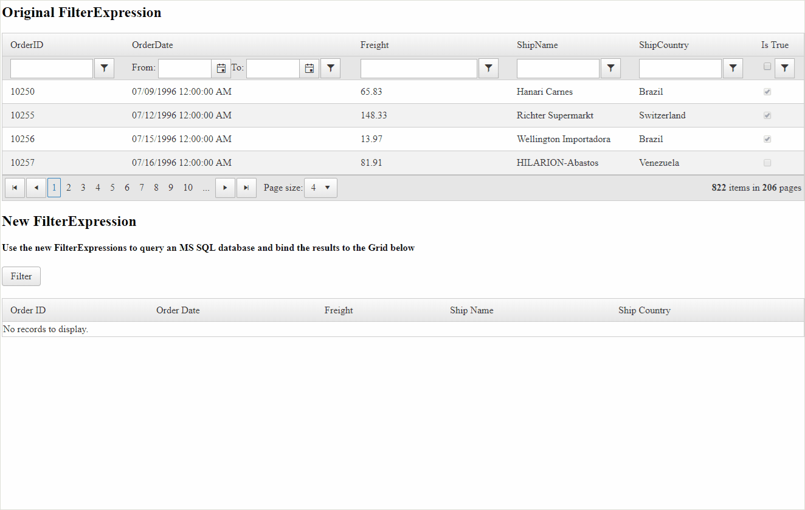

## DESCRIPTION

In some scenarios the developer would need to use the FilterExpressions generated by RadGrid to query an MSSQL database. Most of the time, the FilterExpressions are working, however, there are cases when they are not. The following two cases have been reported by users to be invalid.

1. [Boolean filter expression should contain apostrophes for valid SQL syntax when EnableLinqExpressions=false](https://feedback.telerik.com/Project/108/Feedback/Details/226777-boolean-filter-expression-should-contain-apostrophes-for-valid-sql-syntax-when-en "Boolean filter expression should contain apostrophes for valid SQL syntax when EnableLinqExpressions=false")
2. [String representation of dates in GridDateTimeColumn is wrong in the FilterExpression when using Between filter.](https://feedback.telerik.com/Project/108/Feedback/Details/208317-fix-string-representation-of-dates-in-griddatetimecolumn-is-wrong-in-the-filtere "String representation of dates in GridDateTimeColumn is wrong in the FilterExpression when using Between filter.")


For more information, you can check out the following Forum thread: [GridDateTimeColumn filtering localization issues](https://www.telerik.com/forums/griddatetimecolumn-filtering-localization-issues#k8bwUfk7vk-NzH2ihvfo6Q "GridDateTimeColumn filtering localization issues")

## SOLUTION

Access the Grid's FilterExpressions and correct them with a valid Syntax that will be accepted by the SQL Database.



Download the Sample from: [grid-get-sql-compliant-filterexpressions.zip](files/grid-get-sql-compliant-filterexpressions.zip) (Note: You will need to add the **Telerik.Web.UI.dll** to the **Bin** folder to be able to run the sample)

Below you can find a Property and a Function version of the logic.

The logic as a **Property**

````C#
public string SqlFilterExpression
{
    get
    {
        StringBuilder filterExpression = new StringBuilder();
        foreach (GridColumn column in RadGrid1.MasterTableView.RenderColumns)
        {
            if (!column.SupportsFiltering())
            {
                continue;
            }
 
            string filterText = column.EvaluateFilterExpression();
            if (String.IsNullOrEmpty(filterText))
            {
                continue;
            }
 
            GridDateTimeColumn dateTimeColumn = column as GridDateTimeColumn;
            if (dateTimeColumn != null && dateTimeColumn.EnableRangeFiltering)
            {
                filterText = filterText.Replace(",", " ");
            }
 
            filterText = filterText.Replace(" True", " 'True'").Replace(" False", " 'False'");
 
            if (filterExpression.Length > 0)
            {
                filterExpression.Append(" AND ");
            }
 
            filterExpression.AppendFormat("({0})", filterText);
        }
 
        return filterExpression.ToString();
    }
}
````
````VB
Public ReadOnly Property SqlFilterExpression As String
    Get
        Dim filterExpression As StringBuilder = New StringBuilder()
 
        For Each column As GridColumn In RadGrid1.MasterTableView.RenderColumns
 
            If Not column.SupportsFiltering() Then
                Continue For
            End If
 
            Dim filterText As String = column.EvaluateFilterExpression()
 
            If String.IsNullOrEmpty(filterText) Then
                Continue For
            End If
 
            Dim dateTimeColumn As GridDateTimeColumn = TryCast(column, GridDateTimeColumn)
 
            If dateTimeColumn IsNot Nothing AndAlso dateTimeColumn.EnableRangeFiltering Then
                filterText = filterText.Replace(",", " ")
            End If
 
            filterText = filterText.Replace(" True", " 'True'").Replace(" False", " 'False'")
 
            If filterExpression.Length > 0 Then
                filterExpression.Append(" AND ")
            End If
 
            filterExpression.AppendFormat("({0})", filterText)
        Next
 
        Return filterExpression.ToString()
    End Get
End Property
````

The logic as a **Function** that takes a RadGrid Object as a parameter 

````C#
private string GetSqlFilterExpression(RadGrid grid)
{
    StringBuilder filterExpression = new StringBuilder();
    foreach (GridColumn column in grid.MasterTableView.RenderColumns)
    {
        if (!column.SupportsFiltering())
        {
            continue;
        }
 
        string filterText = column.EvaluateFilterExpression();
        if (String.IsNullOrEmpty(filterText))
        {
            continue;
        }
 
        GridDateTimeColumn dateTimeColumn = column as GridDateTimeColumn;
        if (dateTimeColumn != null && dateTimeColumn.EnableRangeFiltering)
        {
            filterText = filterText.Replace(",", " ");
        }
 
        filterText = filterText.Replace(" True", " 'True'").Replace(" False", " 'False'");
 
        if (filterExpression.Length > 0)
        {
            filterExpression.Append(" AND ");
        }
 
        filterExpression.AppendFormat("({0})", filterText);
    }
 
    return filterExpression.ToString();
}
````
````VB
Public Function GetSqlFilterExpressions(ByVal grid As RadGrid) As String
    Dim filterExpression As StringBuilder = New StringBuilder()
 
    For Each column As GridColumn In grid.MasterTableView.RenderColumns
 
        If Not column.SupportsFiltering() Then
            Continue For
        End If
 
        Dim filterText As String = column.EvaluateFilterExpression()
 
        If String.IsNullOrEmpty(filterText) Then
            Continue For
        End If
 
        Dim dateTimeColumn As GridDateTimeColumn = TryCast(column, GridDateTimeColumn)
 
        If dateTimeColumn IsNot Nothing AndAlso dateTimeColumn.EnableRangeFiltering Then
            filterText = filterText.Replace(",", " ")
        End If
 
        filterText = filterText.Replace(" True", " 'True'").Replace(" False", " 'False'")
 
        If filterExpression.Length > 0 Then
            filterExpression.Append(" AND ")
        End If
 
        filterExpression.AppendFormat("({0})", filterText)
    Next
 
    Return filterExpression.ToString()
End Function
````
 
