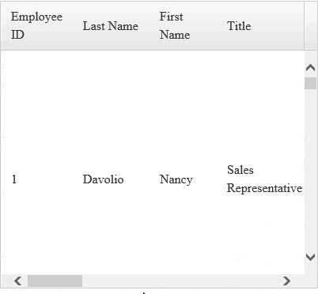
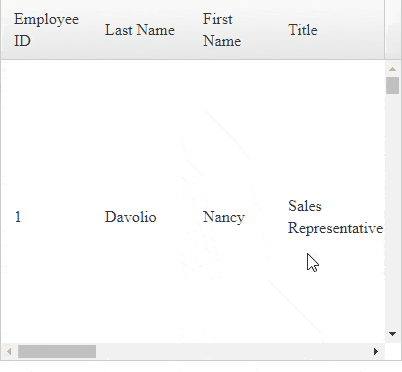

## PROBLEM

When the user clicks the bottom scrollbar in the Grid data area on either the left / right arrows or the grey space around the scroll handle, the scroll is not the expected speed, it is slow and moves little by little.


| IE | Chrome |
| --- | --- |
|  |  |


## DESCRIPTION

When **[UseStaticHeaders](https://docs.telerik.com/devtools/aspnet-ajax/controls/grid/functionality/scrolling/scroll-with-static-headers) **is set to **true**, the Grid uses two event handlers to synchronize its horizontal scrolling—one for the Grid data area and the other one for the headers. This approach is implemented to address some edge cases where the data cells and the header can get misaligned. This feature may cause the horizontal scrollbar to move slower and with smaller increments.

### SOLUTIONS

There are two options to improve this aspect of the scrolling behavior:

- Disable the static headers (set **ClientSettings.UseStaticHeaders.UseStaticHeaders** to **false**). You may also want to reduce the **PageSize **of the grid (e.g. to 10) so that vertical scrollbar is not present for most cases. You may also increase the height of the grid.
- [Use the Prev and Next buttons that the grid can generate for scrolling through frozen columns](https://demos.telerik.com/aspnet-ajax/grid/examples/columns-rows/columns/frozen-columns/defaultcs.aspx). If you do not want to have actual frozen columns, you can either add a dummy column at the beginning of the collection and set its Display property to false, or use the [OnGridCreated client-side event](https://docs.telerik.com/devtools/aspnet-ajax/controls/grid/client-side-programming/events/ongridcreated) to set the frozen columns count to 0. You can find attached samples of this [here](files/grid-prev-next-buttons-workaround.zip).
- Try adding the following code that removes an extra scroll handler from the header div. Workaround is provided by Grant Elliot of [Trimble](https://www.trimble.com/).
    
````JavaScript
$(document).ready(function () { //ensure you have window.$, or use window.$telerik.$ instead
    try {
        if ($(".RadGrid .rgDataDiv").length) {
            var headerDiv = $(".RadGrid .rgDataDiv").parent().find(".rgHeaderDiv");
            if (headerDiv.length && headerDiv.length > 0 && headerDiv[0]._events !== null && headerDiv[0]._events !== undefined && headerDiv[0]._events["scroll"] !== undefined && headerDiv[0]._events["scroll"].length > 0 && headerDiv[0]._events["scroll"][0].browserHandler !== undefined) {
                headerDiv[0].removeEventListener("scroll", headerDiv[0]._events["scroll"][0].browserHandler);
            }
        }
    }
    catch (ex) {
    }
});
````


 The faulty scrolling behavior, described in this KB article, is logged for fixing and you can subscribe and vote for the bug report at [Horizontal scroll speed is slow with static headers](https://feedback.telerik.com/Project/108/Feedback/Details/245441-horizontal-scroll-speed-is-slow-with-static-headers).

  