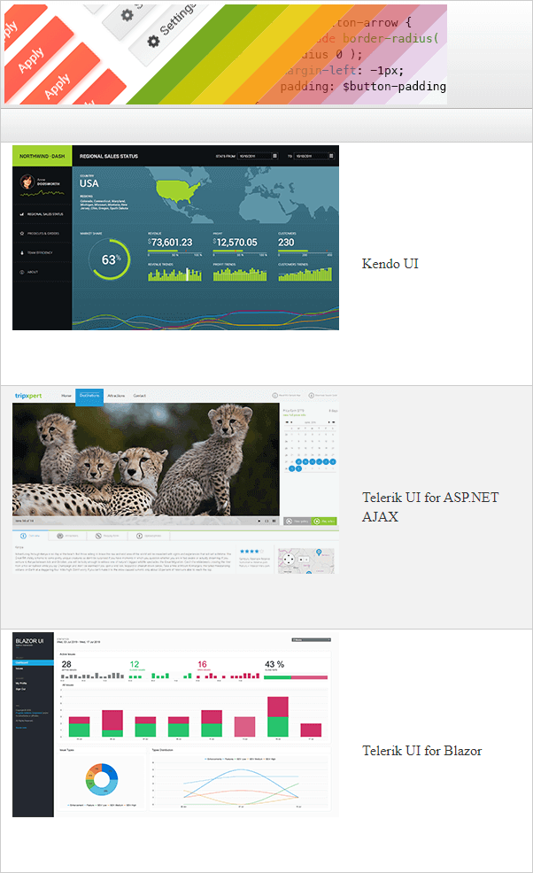

## Environment
<table>
	<tbody>
		<tr>
			<td>Product</td>
			<td>RadGrid for ASP.NET AJAX</td>
		</tr>
	</tbody>
</table>


## Description

Q: How to create an imagebutton inside the grid?


## Solution

One of the easiest way is to use Templates. The example below shows how ImageButtons are added into Template Columns as well as into Command Item Template.

Demo Screenshot:




Grid Markup

````ASP.NET
<telerik:RadGrid ID="RadGrid1" runat="server" Width="600px" OnNeedDataSource="RadGrid1_NeedDataSource" OnItemDataBound="RadGrid1_ItemDataBound">
    <MasterTableView CommandItemDisplay="Top" DataKeyNames="ID" AutoGenerateColumns="false">
        <CommandItemTemplate>
            <telerik:RadImageButton ID="RadImageButton1" runat="server" Image-Url="https://demos.telerik.com/aspnet-ajax/Common/Images/theme-builder.png" Height="113px" Width="500px" PostBackUrl="http://themebuilder.telerik.com/aspnet-ajax/?_ga=2.60748900.815688258.1574667336-2086774972.1538481513">
            </telerik:RadImageButton>
        </CommandItemTemplate>
        <Columns>
            <telerik:GridTemplateColumn UniqueName="MyTemplateColumn">
                <ItemTemplate>
                    <telerik:RadImageButton ID="RadImageButton2" runat="server" Height="269px" Width="369px">
                    </telerik:RadImageButton>
                </ItemTemplate>
            </telerik:GridTemplateColumn>
            <telerik:GridBoundColumn DataField="Desc"></telerik:GridBoundColumn>
        </Columns>
    </MasterTableView>
</telerik:RadGrid>
````

Server Side Code

````C#
protected void RadGrid1_NeedDataSource(object sender, Telerik.Web.UI.GridNeedDataSourceEventArgs e)
{
    (sender as RadGrid).DataSource = Enumerable.Range(1, 3).Select(x => new
    {
        ID = x,
        Desc = getTitleById(x)
    });
}

string getTitleById(int id)
{
    switch (id)
    {
        case 1:
            return "Kendo UI";
        case 2:
            return "Telerik UI for ASP.NET AJAX";
        case 3:
            return "Telerik UI for Blazor";
        default:
            return "No title";
    }

}

protected void RadGrid1_ItemDataBound(object sender, GridItemEventArgs e)
{
    if(e.Item is GridDataItem)
    {
        GridDataItem item = e.Item as GridDataItem;
        var imgButton = item["MyTemplateColumn"].FindControl("RadImageButton2") as RadImageButton;

        int ID = (int)item.GetDataKeyValue("ID");

        if(ID == 1) {
            imgButton.Image.Url = "https://d585tldpucybw.cloudfront.net/sfimages/default-source/labs/vibe/kendo-ui.png?sfvrsn=e837ffcd_3";
            imgButton.PostBackUrl = "https://demos.telerik.com/kendo-ui/?_ga=2.955256.815688258.1574667336-2086774972.1538481513";
        }
        if (ID == 2) {
            imgButton.Image.Url = "https://d585tldpucybw.cloudfront.net/sfimages/default-source/labs/vibe/aspnet-ajax.png?sfvrsn=83134310_3";
            imgButton.PostBackUrl = "https://demos.telerik.com/aspnet-ajax/?_ga=2.266886855.815688258.1574667336-2086774972.1538481513";
        }
        else if(ID == 3) {
            imgButton.Image.Url = "https://d585tldpucybw.cloudfront.net/sfimages/default-source/labs/ui-for-blazor-demo.png?sfvrsn=754b8a68_3";
            imgButton.PostBackUrl = "https://demos.telerik.com/blazor-ui/?_ga=2.30313590.815688258.1574667336-2086774972.1538481513";
        }
    }
}
````