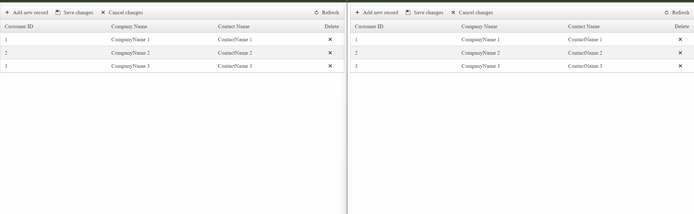

## Environment

<table>
	<tbody>
		<tr>
			<td>Product</td>
			<td>Telerik WebForms Grid for ASP.NET AJAX</td>
		</tr>
	</tbody>
</table>


## Description

The article illustrates how the Grid can be integrated with [SignalR](https://learn.microsoft.com/en-us/aspnet/signalr/overview/getting-started/introduction-to-signalr) so that its data on multiple clients can be updated automatically.



## Solution

To test the functionality, run the sample code snippet and open the page in multiple browsers. When you change the Grid data in one window, the data in other windows will be updated without a manual refresh.

````MainPage.aspx
<telerik:RadWindowManager ID="RadWindowManager1" runat="server"></telerik:RadWindowManager>

<telerik:RadGrid RenderMode="Lightweight" ID="RadGrid1" runat="server" ClientDataSourceID="RadClientDataSource1" AllowPaging="true">
    <MasterTableView ClientDataKeyNames="CustomerID" EditMode="Batch" CommandItemDisplay="Top" BatchEditingSettings-HighlightDeletedRows="true">
        <Columns>
            <telerik:GridBoundColumn DataField="CustomerID" HeaderText="Customer ID" ReadOnly="true" />
            <telerik:GridBoundColumn DataField="CompanyName" HeaderText="Company Name" ColumnEditorID="GridTextBoxEditor" />
            <telerik:GridBoundColumn DataField="ContactName" HeaderText="Contact Name" ColumnEditorID="GridTextBoxEditor" />
            <telerik:GridClientDeleteColumn HeaderText="Delete">
                <HeaderStyle Width="70px" />
            </telerik:GridClientDeleteColumn>
        </Columns>
    </MasterTableView>
    <ClientSettings AllowKeyboardNavigation="true">
        <KeyboardNavigationSettings />
        <ClientEvents OnGridCreated="OnGridCreated" />
    </ClientSettings>
</telerik:RadGrid>
<telerik:GridTextBoxColumnEditor ID="GridTextBoxEditor" runat="server" TextBoxStyle-Width="230px"></telerik:GridTextBoxColumnEditor>
<telerik:RadClientDataSource ID="RadClientDataSource1" runat="server" AllowBatchOperations="true">
    <ClientEvents OnCustomParameter="ParameterMap" OnDataParse="Parse" />
    <DataSource>
        <WebServiceDataSourceSettings BaseUrl="EditingWcfService.svc/">
            <Select Url="GetCustomers" DataType="JSON" />
            <Update Url="UpdateCustomers" DataType="JSON" />
            <Insert Url="InsertCustomers" DataType="JSON" />
            <Delete Url="DeleteCustomers" DataType="JSON" />
        </WebServiceDataSourceSettings>
    </DataSource>
    <Schema>
        <Model ID="CustomerID">
            <telerik:ClientDataSourceModelField FieldName="CustomerID" DataType="Number" />
            <telerik:ClientDataSourceModelField FieldName="CompanyName" DataType="String" />
            <telerik:ClientDataSourceModelField FieldName="ContactName" DataType="String" />
            <telerik:ClientDataSourceModelField FieldName="ContactTitle" DataType="String" />
        </Model>
    </Schema>
</telerik:RadClientDataSource>
````

````JavaScript
function ParameterMap(sender, args) {
    //If you want to send a parameter to the select call you can modify the if 
    //statement to check whether the request type is 'read':
    //if (args.get_type() == "read" && args.get_data()) {

    if (args.get_type() != "read" && args.get_data()) {
        args.set_parameterFormat({ customersJSON: kendo.stringify(args.get_data().models) });
    }
}

function Parse(sender, args) {
    var response = args.get_response().d;

    if (response) {
        args.set_parsedData(response.Data);
        if (response.Action != "Read") {
            alertHub.invoke("notifyOthers", JSON.stringify(response));
        }
    }
}

function IsJsonString(str) {
    try {
        JSON.parse(str);
    } catch (e) {
        return false;
    }
    return true;
}

function OnGridCreated(sender, args) {
    initializeChatHub(sender);
}

function initializeChatHub(grid) {
    window.alertHub = startHub(function (hub) { });

    alertHub.on("broadcast", function (message) {
        var broadcastData = JSON.parse(message);
        var updatedRecords = broadcastData.data;
        var boradcastMessage = broadcastData.message;

        var confirmText;

        switch (broadcastData.Action) {
            case "Create":
                confirmText = "New records have been added.";
                break;
            case "Update":
                confirmText = "Records have been modified.";
                break;
            case "Delete":
                confirmText = "Records have been deleted.";
                break;
            default:
        }
        radconfirm(confirmText + " Would you like to rebind the Grid now?", function (isConfirmed) {
            if (isConfirmed) {
                grid.get_masterTableView().rebind();
            }
        });
    });

    alertHub.on("NotifyMe", function (message) {
        alert(message);
    });

    $.support.cors = true;
}

function confirmCallBackFn(sender, args) {
    $find("<%= RadGrid1.ClientID %>").get_batchEditingManager().saveAllChanges();
    radconfirm(message);
}

function startHub(startCallback) {
    var host = window.location.origin;
    var con = $.hubConnection(host);
    var hub = con.createHubProxy("dataHub");

    con.start({ jsonp: true, transport: ['webSockets', 'longPolling'] }).done(function () {
        startCallback(hub)
    });

    return hub;
}
````

````MainPage.aspx.cs
protected void Page_Load(object sender, EventArgs e)
{
    if (!IsPostBack)
    {
        Session["MySessionKey"] = null;
    }
}
````
````Customer.cs
using System.Collections.Generic;
using System.Runtime.Serialization;

[DataContract]
public class Customer
{
    [DataMember]
    public int CustomerID { get; set; }
    [DataMember]
    public string CompanyName { get; set; }
    [DataMember]
    public string ContactName { get; set; }
    [DataMember]
    public string ContactTitle { get; set; }
    [DataMember]
    public string Address { get; set; }
    [DataMember]
    public string __type { get; set; }
}

[DataContract]
public class CustomersResult
{
    [DataMember]
    public List<Customer> Data { get; set; }
    [DataMember]
    public int Count { get; set; }
    [DataMember]
    public string Action { get; set; }
    [DataMember]
    public string __type { get; set; }
}
````
````DataHub.cs
using Microsoft.AspNet.SignalR;
using System.Web.Script.Serialization;

public class DataHub : Hub
{
    public void NotifyOthers(string message)
    {
        // Broadcast to everyone else
        Clients.Others.Broadcast(message);

        JavaScriptSerializer serializer = new JavaScriptSerializer();
        CustomersResult customerChanges = serializer.Deserialize<CustomersResult>(message);

        if(customerChanges.Action == "Create")
        {
            // Send message to myself
            Clients.Caller.NotifyMe("Everyone was notified about the newly created Item!");
        }
    }
}
````
````EditingWcfService.cs
using System;
using System.Collections.Generic;
using System.Linq;
using System.Runtime.Serialization;
using System.ServiceModel;
using System.ServiceModel.Activation;
using System.ServiceModel.Web;
using System.Web;
using System.Web.Script.Serialization;

[ServiceContract(Namespace = "")]
[AspNetCompatibilityRequirements(RequirementsMode = AspNetCompatibilityRequirementsMode.Allowed)]
public class EditingWcfService
{
    #region RadGrid Client-Side CRUD
    #region DataSource
    private string _sessionKey = "MySessionKey";
    public List<Customer> SessionDataSource
    {
        get
        {
            if (HttpContext.Current.Session[_sessionKey] == null)
            {
                HttpContext.Current.Session[_sessionKey] = Enumerable.Range(1, 3).Select(
                cu => new Customer
                {
                    CustomerID = cu,
                    Address = "Address " + cu,
                    CompanyName = "CompanyName " + cu,
                    ContactName = "ContactName " + cu,
                    ContactTitle = "ContactTitle " + cu
                }
                ).ToList();
            }
            return (List<Customer>)HttpContext.Current.Session[_sessionKey];
        }
    }
    #endregion

    #region CRUD methods
    [WebGet]
    public CustomersResult GetCustomers()
    {
        return new CustomersResult
        {
            Data = SessionDataSource,
            Count = SessionDataSource.Count(),
            Action = "Read"
        };
    }

    [WebGet]
    public CustomersResult UpdateCustomers(string customersJSON)
    {
        JavaScriptSerializer serializer = new JavaScriptSerializer();
        List<Customer> updatedCustomers = (List<Customer>)serializer.Deserialize(customersJSON, typeof(List<Customer>));

        foreach (Customer updatedCustomer in updatedCustomers)
        {
            Customer dbCustomer = SessionDataSource.FirstOrDefault(c => c.CustomerID == updatedCustomer.CustomerID);
            dbCustomer.CompanyName = updatedCustomer.CompanyName;
            dbCustomer.ContactName = updatedCustomer.ContactName;
            dbCustomer.ContactTitle = updatedCustomer.ContactTitle;
            dbCustomer.Address = updatedCustomer.Address;
        }

        return new CustomersResult()
        {
            Data = updatedCustomers,
            Count = updatedCustomers.Count,
            Action = "Update"
        };
    }

    [WebGet]
    public CustomersResult InsertCustomers(string customersJSON)
    {
        JavaScriptSerializer serializer = new JavaScriptSerializer();
        List<Customer> insertedCustomers = (List<Customer>)serializer.Deserialize(customersJSON, typeof(List<Customer>));

        var lastId = SessionDataSource.Count > 0 ? SessionDataSource.Max(cu => cu.CustomerID) : 0;

        foreach (Customer insertedCustomer in insertedCustomers)
        {
            Customer newCustomer = new Customer()
            {
                CustomerID = lastId + 1,
                CompanyName = insertedCustomer.CompanyName,
                ContactName = insertedCustomer.ContactName,
                ContactTitle = insertedCustomer.ContactTitle,
                Address = insertedCustomer.Address
            };
            insertedCustomer.CustomerID = newCustomer.CustomerID;

            SessionDataSource.Add(newCustomer);
        }

        return new CustomersResult
        {
            Data = insertedCustomers,
            Count = insertedCustomers.Count,
            Action = "Create"
        };
    }

    [WebGet]
    public CustomersResult DeleteCustomers(string customersJSON)
    {
        JavaScriptSerializer serializer = new JavaScriptSerializer();
        List<Customer> customers = (List<Customer>)serializer.Deserialize(customersJSON, typeof(List<Customer>));

        foreach (Customer removedCustomer in customers)
        {
            Customer customer = SessionDataSource.Find(c => c.CustomerID == removedCustomer.CustomerID);
            SessionDataSource.Remove(customer);
        }

        return new CustomersResult()
        {
            Data = customers,
            Count = customers.Count,
            Action = "Delete"
        };
    }
    #endregion
    #endregion
}
````
````Startup.cs
using Microsoft.AspNet.SignalR;
using Microsoft.Owin;
using Owin;

[assembly: OwinStartup(typeof(Startup))]
public class Startup
{
    public void Configuration(IAppBuilder app)
    {
        var config = new HubConfiguration();
        config.EnableJSONP = true;

        app.MapSignalR(config);
    }
}
````

All the required packages: 

````XML
<?xml version="1.0" encoding="utf-8"?>
<packages>
    <package id="jQuery" version="1.6.4" targetFramework="net45" />
    <package id="Microsoft.AspNet.SignalR" version="2.4.1" targetFramework="net45" />
    <package id="Microsoft.AspNet.SignalR.Core" version="2.4.1" targetFramework="net45" />
    <package id="Microsoft.AspNet.SignalR.JS" version="2.4.1" targetFramework="net45" />
    <package id="Microsoft.AspNet.SignalR.SystemWeb" version="2.4.1" targetFramework="net45" />
    <package id="Microsoft.Owin" version="2.1.0" targetFramework="net45" />
    <package id="Microsoft.Owin.Host.SystemWeb" version="2.1.0" targetFramework="net45" />
    <package id="Microsoft.Owin.Security" version="2.1.0" targetFramework="net45" />
    <package id="Newtonsoft.Json" version="6.0.4" targetFramework="net45" />
    <package id="Owin" version="1.0" targetFramework="net45" />
</packages>
````
 
**Download** the sample: [grid-integratipn-with-signalr.zip](files/grid-integration-with-signalr.zip)
    
     