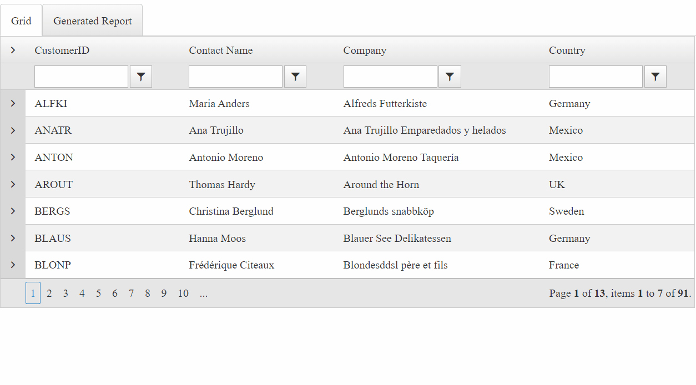

## Environment

<table>
    <tr>
        <td>Product</td>
        <td>Telerik WebForms Grid for ASP.NET AJAX</td>
    </tr>
</table>



## Description

This article demonstrates how to integrate the Grid with the [***Telerik Reporting***](https://www.telerik.com/products/reporting.aspx) product to embed reporting functionality in your ASP.NET app.  
The integration itself depends on external assemblies, such as:

- Latest version of the **Telerik.ReportViewer.Html5.WebForms.dll** (distributed with the Telerik Reporting product)
- **Newtonsoft.Json.dll** (version 12.0.0 or later)

If Telerik Reporting is not included in your license you can [download a free trial](https://www.telerik.com/try) or consider upgrading to [Telerik DevCraft Complete](https://www.telerik.com/devcraft).

## Solution

The code below covers the following main points:

- The components from both suites are defined in separate WebUserControl(s) and loaded in a RadTabStrip component. The first tab shows the RadGrid, loaded and populated with sample data. The second one opens a report viewer displaying the data obtained from the Grid.
- The RadGrid is configured with a three-level hierarchy and with enabled sorting, filtering, and paging.
- During the ReportViewer initialization, the data is gathered from the current state of the RadGrid and passed to a report definition in JSON format. The generated report provides interactivity features like sorting and collapsing, similarly to the Grid behavior.

Default.aspx

````ASP.NET
<%@ Page Language="C#" AutoEventWireup="true" CodeFile="Default.aspx.cs" Inherits="Default" %>
<%@ Register Src="~/GridUC_CS.ascx" TagPrefix="uc1" TagName="GridUC_CS" %>
<%@ Register Src="~/ReportViewerUC_CS.ascx" TagPrefix="uc1" TagName="ReportViewerUC_CS" %>

<!DOCTYPE html>

<html xmlns="http://www.w3.org/1999/xhtml">
<head runat="server">
    <title></title>
</head>
<body>
    <form id="form1" runat="server">
        <telerik:RadScriptManager ID="RadScriptManager1" runat="server">
            <Scripts>
                <asp:ScriptReference Assembly="Telerik.Web.UI" Name="Telerik.Web.UI.Common.Core.js" />
                <asp:ScriptReference Assembly="Telerik.Web.UI" Name="Telerik.Web.UI.Common.jQuery.js" />
                <asp:ScriptReference Assembly="Telerik.Web.UI" Name="Telerik.Web.UI.Common.jQueryInclude.js" />
            </Scripts>
        </telerik:RadScriptManager>

        <div class="demo-container no-bg">
            <telerik:RadTabStrip runat="server" ID="RadTabStrip1" MultiPageID="RadMultiPage1" SelectedIndex="0"
                OnTabClick="RadTabStrip1_TabClick" AutoPostBack="true">
                <Tabs>
                    <telerik:RadTab Text="Grid" Value="0"></telerik:RadTab>
                    <telerik:RadTab Text="Generated Report" Value="1"></telerik:RadTab>
                </Tabs>
            </telerik:RadTabStrip>
            <telerik:RadMultiPage runat="server" ID="RadMultiPage1" SelectedIndex="0">
                <telerik:RadPageView ID="RadPageView1" runat="server">
                    <telerik:RadAjaxPanel ID="RadAjaxPanel1" runat="server">
                        <uc1:griduc_cs runat="server" id="GridUC_CS" />
                    </telerik:RadAjaxPanel>
                </telerik:RadPageView>
                <telerik:RadPageView ID="RadPageView2" runat="server">
                    <uc1:reportvieweruc_cs runat="server" id="ReportViewerUC_CS" visible="false" />
                </telerik:RadPageView>
            </telerik:RadMultiPage>
        </div>
    </form>
</body>
</html>
````
````C#
using System;
using System.Collections;
using System.Collections.Generic;
using Telerik.ReportViewer.Html5.WebForms;
using Telerik.Web.UI;

public partial class Default : System.Web.UI.Page 
{
    protected void RadTabStrip1_TabClick(object sender, RadTabStripEventArgs e)
    {
        if (e.Tab.Value == "1")
        {
            var grid = (GridUC_CS.FindControl("RadGrid1") as RadGrid);
            ReportViewerUC_CS.Visible = true;
            var htmlReportViewer = (ReportViewerUC_CS.FindControl("ReportViewer1") as ReportViewer);
            ExtractGridDataToReport(grid, htmlReportViewer);
        }
    }

    private void ExtractGridDataToReport(RadGrid grid, ReportViewer htmlReportViewer)
    {
        var customers = new List<Customer>();
        foreach (GridDataItem parentItem in grid.MasterTableView.Items)
        {
            var customer = ExtractCustomerFromGridItem(parentItem);
            customers.Add(customer);
        }
        var ser = new AdvancedJavaScriptSerializer();
        var jsonGridCustomerData = ser.Serialize(customers);
        htmlReportViewer.ReportSource.Parameters.Add("JsonGridCustomerData", jsonGridCustomerData);
    }

    private Customer ExtractCustomerFromGridItem(GridDataItem gridDataItem)
    {
        var customerID = gridDataItem.GetDataKeyValue("CustomerID").ToString();
        var customer = new Customer(customerID);

        var table = new Hashtable();
        gridDataItem.ExtractValues(table);
        customer.ContactName = (string)table["ContactName"];
        customer.Company = (string)table["CompanyName"];
        customer.Country = (string)table["Country"];
        customer.City = (string)table["City"];
        customer.Address = (string)table["Address"];
        customer.HomePhone = (string)table["Phone"];
        customer.Orders = GetOrdersFromCustomerGridItem(gridDataItem);
        return customer;
    }

    private List<Order> GetOrdersFromCustomerGridItem(GridDataItem parentItem)
    {
        var orders = new List<Order>();
        if (parentItem.HasChildItems && parentItem.ChildItem.NestedTableViews[0].Items.Count > 0)
        {
            var nestedTableView = parentItem.ChildItem.NestedTableViews[0];

            foreach (GridDataItem childItem in nestedTableView.Items)
            {
                var orderID = (int)(childItem.GetDataKeyValue("OrderID"));
                var order = new Order(orderID, parentItem.GetDataKeyValue("CustomerID").ToString());

                var table = new Hashtable();
                childItem.ExtractValues(table);
                order.OrderDate = DateTime.Parse(table["OrderDate"].ToString());
                order.Freight = Double.Parse(table["Freight"].ToString());
                order.OrderDetails = GetOrdersDetailsFromOrderGridItem(childItem);
                orders.Add(order);
            }
        }
        return orders;
    }

    private List<OrderDetails> GetOrdersDetailsFromOrderGridItem(GridDataItem parentItem)
    {
        var ordersDetails = new List<OrderDetails>();
        if (parentItem.HasChildItems && parentItem.ChildItem.NestedTableViews[0].Items.Count > 0)
        {
            var nestedTableView = parentItem.ChildItem.NestedTableViews[0];

            foreach (GridDataItem childItem in nestedTableView.Items)
            {
                var table = new Hashtable();
                childItem.ExtractValues(table);
                var orderID = (int)(parentItem.GetDataKeyValue("OrderID"));
                var orderDetails = new OrderDetails(orderID)
                {
                    ProductID = int.Parse(table["ProductID"].ToString()),
                    Discount = Decimal.Parse(table["Discount"].ToString()),
                    Quantity = int.Parse(table["Quantity"].ToString()),
                    UnitPrice = Decimal.Parse(table["UnitPrice"].ToString())
                };
                ordersDetails.Add(orderDetails);
            }
        }
        return ordersDetails;
    }
}

public class Customer
{
    public Customer(string customerID)
    {
        this.CustomerID = customerID;
    }
    public string CustomerID { get; private set; }
    public string ContactName { get; set; }
    public string Company { get; set; }
    public string Country { get; set; }
    public string City { get; set; }
    public string Address { get; set; }
    public string HomePhone { get; set; }

    public List<Order> Orders { get; set; }
}

public class Order
{
    public Order(int orderID, string CustomerID)
    {
        this.OrderID = orderID;
        this.CustomerID = CustomerID;
    }
    public string CustomerID { get; private set; }
    public int OrderID { get; private set; }
    public DateTime OrderDate { get; set; }
    public Double Freight { get; set; }
    public List<OrderDetails> OrderDetails { get; set; }
}

public class OrderDetails
{
    public OrderDetails(int orderID)
    {
        this.OrderID = orderID;
    }
    public int OrderID { get; private set; }
    public int ProductID { get; set; }
    public int Quantity { get; set; }
    public Decimal UnitPrice { get; set; }
    public Decimal Discount { get; set; }
}
````

User controls

````GridUC_CS.ascx
<%@ Control Language="C#" ClassName="GridUC_CS" %>

<telerik:RadGrid RenderMode="Lightweight" ID="RadGrid1" ShowStatusBar="true" Width="1000px"
    DataSourceID="SqlDataSource1" runat="server" AutoGenerateColumns="False" PageSize="7"
    AllowSorting="True" AllowMultiRowSelection="False" AllowPaging="True" GridLines="None">
    <PagerStyle Mode="NumericPages"></PagerStyle>
    <MasterTableView Name="Customers" EnableHierarchyExpandAll="true" DataSourceID="SqlDataSource1" DataKeyNames="CustomerID" AllowMultiColumnSorting="True" AllowSorting="true" AllowFilteringByColumn="true">
        <DetailTables>
            <telerik:GridTableView Name="Orders" EnableHierarchyExpandAll="true" DataKeyNames="OrderID" DataSourceID="SqlDataSource2" Width="100%"
                runat="server">
                <ParentTableRelation>
                    <telerik:GridRelationFields DetailKeyField="CustomerID" MasterKeyField="CustomerID"></telerik:GridRelationFields>
                </ParentTableRelation>
                <DetailTables>
                    <telerik:GridTableView Name="OrdersDetails" EnableHierarchyExpandAll="true" DataKeyNames="OrderID" DataSourceID="SqlDataSource3" Width="100%"
                        runat="server">
                        <ParentTableRelation>
                            <telerik:GridRelationFields DetailKeyField="OrderID" MasterKeyField="OrderID"></telerik:GridRelationFields>
                        </ParentTableRelation>
                        <Columns>
                            <telerik:GridBoundColumn HeaderText="Product ID" DataField="ProductID"></telerik:GridBoundColumn>
                            <telerik:GridBoundColumn SortExpression="UnitPrice" HeaderText="Unit Price" HeaderButtonType="TextButton"
                                DataField="UnitPrice" UniqueName="UnitPrice">
                            </telerik:GridBoundColumn>
                            <telerik:GridBoundColumn SortExpression="Quantity" HeaderText="Quantity" HeaderButtonType="TextButton"
                                DataField="Quantity" UniqueName="Quantity">
                            </telerik:GridBoundColumn>
                            <telerik:GridBoundColumn SortExpression="Discount" HeaderText="Discount" HeaderButtonType="TextButton"
                                DataField="Discount" UniqueName="Discount">
                            </telerik:GridBoundColumn>
                        </Columns>
                    </telerik:GridTableView>
                </DetailTables>
                <Columns>
                    <telerik:GridBoundColumn SortExpression="OrderID" HeaderText="OrderID" HeaderButtonType="TextButton"
                        DataField="OrderID" UniqueName="OrderID">
                    </telerik:GridBoundColumn>
                    <telerik:GridBoundColumn SortExpression="OrderDate" HeaderText="Date Ordered" HeaderButtonType="TextButton"
                        DataField="OrderDate" UniqueName="OrderDate" DataFormatString="{0:D}">
                    </telerik:GridBoundColumn>
                    <telerik:GridBoundColumn SortExpression="Freight" HeaderText="Freight" HeaderButtonType="TextButton"
                        DataField="Freight" UniqueName="Freight">
                    </telerik:GridBoundColumn>
                </Columns>
            </telerik:GridTableView>
        </DetailTables>
        <Columns>
            <telerik:GridBoundColumn SortExpression="CustomerID" HeaderText="CustomerID" HeaderButtonType="TextButton"
                DataField="CustomerID" UniqueName="CustomerID">
            </telerik:GridBoundColumn>
            <telerik:GridBoundColumn SortExpression="ContactName" HeaderText="Contact Name" HeaderButtonType="TextButton"
                DataField="ContactName" UniqueName="ContactName">
            </telerik:GridBoundColumn>
            <telerik:GridBoundColumn SortExpression="CompanyName" HeaderText="Company" HeaderButtonType="TextButton"
                DataField="CompanyName" UniqueName="CompanyName">
            </telerik:GridBoundColumn>
            <telerik:GridBoundColumn SortExpression="Country" HeaderText="Country" HeaderButtonType="TextButton"
                DataField="Country" UniqueName="Country">
            </telerik:GridBoundColumn>
            <telerik:GridBoundColumn SortExpression="City" HeaderText="City" HeaderButtonType="TextButton" Display="false"
                DataField="City" UniqueName="City">
            </telerik:GridBoundColumn>
            <telerik:GridBoundColumn SortExpression="Address" HeaderText="Address" HeaderButtonType="TextButton" Display="false"
                DataField="Address" UniqueName="Address">
            </telerik:GridBoundColumn>
            <telerik:GridBoundColumn SortExpression="Phone" HeaderText="Home Phone" HeaderButtonType="TextButton" Display="false"
                DataField="Phone" UniqueName="Phone">
            </telerik:GridBoundColumn>
        </Columns>
    </MasterTableView>
</telerik:RadGrid>

<asp:SqlDataSource ID="SqlDataSource1" runat="server"
    ConnectionString="<%$ ConnectionStrings:NorthwindConnectionString %>"
    ProviderName="System.Data.SqlClient" SelectCommand="SELECT * FROM Customers" />

<asp:SqlDataSource ID="SqlDataSource2" ConnectionString="<%$ ConnectionStrings:NorthwindConnectionString %>"
    ProviderName="System.Data.SqlClient" SelectCommand="SELECT * FROM Orders Where CustomerID = @CustomerID"
    runat="server">
    <SelectParameters>
        <asp:SessionParameter Name="CustomerID" SessionField="CustomerID" Type="string"></asp:SessionParameter>
    </SelectParameters>
</asp:SqlDataSource>

<asp:SqlDataSource ID="SqlDataSource3" ConnectionString="<%$ ConnectionStrings:NorthwindConnectionString %>"
    ProviderName="System.Data.SqlClient" SelectCommand="SELECT * FROM [Order Details] where OrderID = @OrderID"
    runat="server">
    <SelectParameters>
        <asp:SessionParameter Name="OrderID" SessionField="OrderID" Type="Int32"></asp:SessionParameter>
    </SelectParameters>
</asp:SqlDataSource>
````
````ReportViewerUC_CS.ascx
<%@ Control Language="C#" ClassName="ReportViewerUC_CS" %>
<%@ Register Assembly="Telerik.ReportViewer.Html5.WebForms" Namespace="Telerik.ReportViewer.Html5.WebForms" TagPrefix="telerikRep" %>

<script src="https://demos.telerik.com/reporting/api/reports/resources/js/telerikReportViewer-kendo"></script>
<link href="https://kendo.cdn.telerik.com/2022.3.913/styles/kendo.common.min.css" rel="stylesheet" id="commonCss" />
<link href="https://kendo.cdn.telerik.com/2022.3.913/styles/kendo.default.min.css" rel="stylesheet" id="skinCss" />

<telerikRep:reportviewer id="ReportViewer1" runat="server" height="500px" Width="1000px"
    serviceurl="https://demos.telerik.com/reporting/api/reports/">
    <ReportSource IdentifierType="UriReportSource" Identifier="DataGridReportExample.trdp">
    </ReportSource>
    <ClientEvents Ready="reportViewerReady"/>
</telerikRep:reportviewer>

<telerik:RadScriptBlock ID="RadScriptBlock1" runat="server">
    <script>
        function reportViewerReady(sender, args) {
            var reportViewerElement = $('[id$=ReportViewer1]');
            if (reportViewerElement) {
                var reportViewerWidget = reportViewerElement.data("telerik_ReportViewer");
                if (reportViewerWidget) {
                    reportViewerWidget.refreshReport(true);
                    reportViewerWidget.scale({
                        scaleMode: 'SPECIFIC',
                        scale: 1.3
                    });
                }
            }
        }
    </script>
</telerik:RadScriptBlock>
````

**Optional:** Setting the version of the additional **Newtonsoft.Json.dll** in the dependentAssembly element in the **web.config**, e.g. version **13**:

````XML
<configuration>
    <runtime>
        <assemblyBinding xmlns="urn:schemas-microsoft-com:asm.v1">
            <dependentAssembly>
                <assemblyIdentity name="Newtonsoft.Json" publicKeyToken="30ad4fe6b2a6aeed" culture="neutral" />
                <bindingRedirect oldVersion="9.0.0.0-13.0.0.0" newVersion="13.0.0.0"/>
            </dependentAssembly>
        </assemblyBinding>
    </runtime>
</configuration>
````

   
