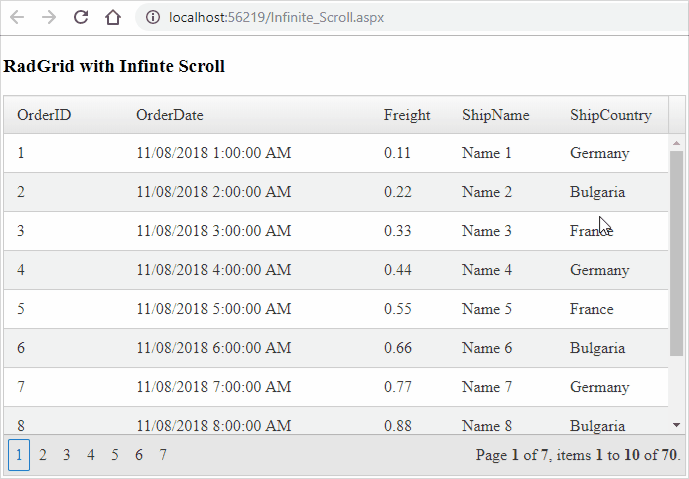

## Environment

<table>
    <tr>
        <td>Product</td>
        <td>Telerik WebForms Grid for ASP.NET AJAX</td>
    </tr>
</table>

## Description

Code sample to demonstrate the Grid with Lazy Loading and Infinite Scrolling.

>Note: RadGrid provides with a built-in functionality called Virtualization that serves as Infinite Scroll and it does callbacks which are much more lightweight than partial rendering. The example from this Code sample can be used to achieve scenarios the Virtualization does not support.
>




## Solution

Lazy Loading:

````ASP.NET
<telerik:RadAjaxManager ID="RadAjaxManager1" runat="server" OnAjaxRequest="RadAjaxManager1_AjaxRequest" DefaultLoadingPanelID="RadAjaxLoadingPanel1">
    <AjaxSettings>
        <telerik:AjaxSetting AjaxControlID="RadAjaxManager1">
            <UpdatedControls>
                <telerik:AjaxUpdatedControl ControlID="Panel1" />
            </UpdatedControls>
        </telerik:AjaxSetting>
        <telerik:AjaxSetting AjaxControlID="Panel1">
            <UpdatedControls>
                <telerik:AjaxUpdatedControl ControlID="Panel1" />
            </UpdatedControls>
        </telerik:AjaxSetting>
    </AjaxSettings>
</telerik:RadAjaxManager>

<telerik:RadAjaxLoadingPanel ID="RadAjaxLoadingPanel1" runat="server" BackColor="DimGray" Transparency="50">
    
</telerik:RadAjaxLoadingPanel>

<h2>RadListBox shown on initial load</h2>
<telerik:RadListBox ID="RadListBox1" runat="server">
    <Items>
        <telerik:RadListBoxItem Text="Item 1" />
        <telerik:RadListBoxItem Text="Item 2" />
        <telerik:RadListBoxItem Text="Item 3" />
        <telerik:RadListBoxItem Text="Item 4" />
    </Items>
</telerik:RadListBox>
<h2>Lazy loading of RadGrid</h2>

<asp:Panel ID="Panel1" runat="server">
    <telerik:RadGrid ID="RadGrid1" runat="server" 
        
        AllowPaging="True" Visible="false" PageSize="10" OnNeedDataSource="RadGrid1_NeedDataSource" >
        <MasterTableView AutoGenerateColumns="False" DataKeyNames="OrderID">
            <Columns>
                <telerik:GridBoundColumn DataField="OrderID" DataType="System.Int32"
                    FilterControlAltText="Filter OrderID column" HeaderText="OrderID"
                    ReadOnly="True" SortExpression="OrderID" UniqueName="OrderID">
                </telerik:GridBoundColumn>
                <telerik:GridNumericColumn DataField="Freight" DataType="System.Decimal"
                    FilterControlAltText="Filter Freight column" HeaderText="Freight"
                    SortExpression="Freight" UniqueName="Freight">
                </telerik:GridNumericColumn>
                <telerik:GridBoundColumn DataField="ShipName"
                    FilterControlAltText="Filter ShipName column" HeaderText="ShipName"
                    SortExpression="ShipName" UniqueName="ShipName">
                </telerik:GridBoundColumn>
                <telerik:GridBoundColumn DataField="ShipCountry"
                    FilterControlAltText="Filter ShipCountry column" HeaderText="ShipCountry"
                    SortExpression="ShipCountry" UniqueName="ShipCountry">
                </telerik:GridBoundColumn>
            </Columns>
        </MasterTableView>
    </telerik:RadGrid>
</asp:Panel>
````

````JavaScript
function pageLoad(sender, eventArgs) {
    if (!eventArgs.get_isPartialLoad()) {
        $find("<%= RadAjaxManager1.ClientID %>").ajaxRequest("InitialPageLoad");
    }
}
````

````C#
protected void Page_Load(object sender, EventArgs e)
{
    if (IsPostBack)
    {
        System.Threading.Thread.Sleep(600);
    }
}

protected void RadGrid1_NeedDataSource(object sender, GridNeedDataSourceEventArgs e)
{
    RadGrid1.DataSource = OrdersTable();
}

private DataTable OrdersTable()
{
    DataTable dt = new DataTable();

    dt.Columns.Add(new DataColumn("OrderID", typeof(int)));
    dt.Columns.Add(new DataColumn("OrderDate", typeof(DateTime)));
    dt.Columns.Add(new DataColumn("Freight", typeof(decimal)));
    dt.Columns.Add(new DataColumn("ShipName", typeof(string)));
    dt.Columns.Add(new DataColumn("ShipCountry", typeof(string)));

    dt.PrimaryKey = new DataColumn[] { dt.Columns["OrderID"] };

    for (int i = 0; i < 70; i++)
    {
        int index = i + 1;

        DataRow row = dt.NewRow();

        row["OrderID"] = index;
        row["OrderDate"] = new DateTime(DateTime.Now.Year, DateTime.Now.Month, DateTime.Now.Day, 0, 0, 0).AddHours(index);
        row["Freight"] = index * 0.1 + index * 0.01;
        row["ShipName"] = "Name " + index;
        if (i % 3 == 0)
        {
            row["ShipCountry"] = "Germany";
        }
        else if (i % 2 == 0)
        {
            row["ShipCountry"] = "France";
        }
        else
        {
            row["ShipCountry"] = "Bulgaria";
        }

        dt.Rows.Add(row);
    }

    return dt;
}

protected void RadAjaxManager1_AjaxRequest(object sender, AjaxRequestEventArgs e)
{
    if (e.Argument == "InitialPageLoad")
    {
        System.Threading.Thread.Sleep(1500);
        RadGrid1.Visible = true;
        RadGrid1.Rebind();
    }
}
````
````VB
Protected Sub Page_Load(ByVal sender As Object, ByVal e As EventArgs) Handles Me.Load
    If IsPostBack Then
        System.Threading.Thread.Sleep(600)
    End If
End Sub

Protected Sub RadGrid1_NeedDataSource(ByVal sender As Object, ByVal e As GridNeedDataSourceEventArgs)
    RadGrid1.DataSource = OrdersTable()
End Sub

Private Function OrdersTable() As DataTable
    Dim dt As DataTable = New DataTable()
    dt.Columns.Add(New DataColumn("OrderID", GetType(Integer)))
    dt.Columns.Add(New DataColumn("OrderDate", GetType(DateTime)))
    dt.Columns.Add(New DataColumn("Freight", GetType(Decimal)))
    dt.Columns.Add(New DataColumn("ShipName", GetType(String)))
    dt.Columns.Add(New DataColumn("ShipCountry", GetType(String)))
    dt.PrimaryKey = New DataColumn() {dt.Columns("OrderID")}

    For i As Integer = 0 To 70 - 1
        Dim index As Integer = i + 1
        Dim row As DataRow = dt.NewRow()
        row("OrderID") = index
        row("OrderDate") = New DateTime(DateTime.Now.Year, DateTime.Now.Month, DateTime.Now.Day, 0, 0, 0).AddHours(index)
        row("Freight") = index * 0.1 + index * 0.01
        row("ShipName") = "Name " & index

        If i Mod 3 = 0 Then
            row("ShipCountry") = "Germany"
        ElseIf i Mod 2 = 0 Then
            row("ShipCountry") = "France"
        Else
            row("ShipCountry") = "Bulgaria"
        End If

        dt.Rows.Add(row)
    Next

    Return dt
End Function

Protected Sub RadAjaxManager1_AjaxRequest(ByVal sender As Object, ByVal e As AjaxRequestEventArgs)
    If e.Argument = "InitialPageLoad" Then
        System.Threading.Thread.Sleep(1500)
        RadGrid1.Visible = True
        RadGrid1.Rebind()
    End If
End Sub
````

Infinite Scroll

````ASP.NET
<telerik:RadAjaxManager ID="RadAjaxManager1" runat="server" DefaultLoadingPanelID="RadAjaxLoadingPanel1">
    <AjaxSettings>
        <telerik:AjaxSetting AjaxControlID="RadGrid1">
            <UpdatedControls>
                <telerik:AjaxUpdatedControl ControlID="RadGrid1" />
            </UpdatedControls>
        </telerik:AjaxSetting>
    </AjaxSettings>
</telerik:RadAjaxManager>

<telerik:RadAjaxLoadingPanel ID="RadAjaxLoadingPanel1" runat="server" BackColor="DimGray" Transparency="50">
    
</telerik:RadAjaxLoadingPanel>

<asp:HiddenField ID="HiddenField1" runat="server" />

<h3>RadGrid with Infinte Scroll</h3>
<telerik:RadGrid ID="RadGrid1" runat="server" AllowPaging="True"
    AllowFilteringByColumn="true"
    AllowSorting="true"
    GroupingEnabled="true"
    OnNeedDataSource="RadGrid1_NeedDataSource">
    <ClientSettings>
        <ClientEvents OnGridCreated="OnGridCreated" OnScroll="OnScroll" />
        <Scrolling AllowScroll="true" UseStaticHeaders="true" />
    </ClientSettings>
    <MasterTableView AutoGenerateColumns="False" DataKeyNames="OrderID">
        <GroupByExpressions>
            <telerik:GridGroupByExpression>
                <SelectFields>
                    <telerik:GridGroupByField FieldName="ShipCountry" HeaderText="Country" />
                    <telerik:GridGroupByField FieldName="Freight" HeaderText="Price"
                        Aggregate="Sum" />
                </SelectFields>
                <GroupByFields>
                    <telerik:GridGroupByField FieldName="ShipCountry" SortOrder="Descending" />
                </GroupByFields>
            </telerik:GridGroupByExpression>
        </GroupByExpressions>
        <PagerStyle Mode="NumericPages" AlwaysVisible="true" />
        <Columns>
            <telerik:GridBoundColumn DataField="OrderID" DataType="System.Int32"
                FilterControlAltText="Filter OrderID column" HeaderText="OrderID"
                ReadOnly="True" SortExpression="OrderID" UniqueName="OrderID">
            </telerik:GridBoundColumn>
            <telerik:GridDateTimeColumn DataField="OrderDate" DataType="System.DateTime"
                FilterControlAltText="Filter OrderDate column" HeaderText="OrderDate"
                SortExpression="OrderDate" UniqueName="OrderDate">
            </telerik:GridDateTimeColumn>
            <telerik:GridNumericColumn DataField="Freight" DataType="System.Decimal"
                FilterControlAltText="Filter Freight column" HeaderText="Freight"
                SortExpression="Freight" UniqueName="Freight">
            </telerik:GridNumericColumn>
            <telerik:GridBoundColumn DataField="ShipName"
                FilterControlAltText="Filter ShipName column" HeaderText="ShipName"
                SortExpression="ShipName" UniqueName="ShipName">
            </telerik:GridBoundColumn>
            <telerik:GridBoundColumn DataField="ShipCountry"
                FilterControlAltText="Filter ShipCountry column" HeaderText="ShipCountry"
                SortExpression="ShipCountry" UniqueName="ShipCountry">
            </telerik:GridBoundColumn>
        </Columns>
    </MasterTableView>
</telerik:RadGrid>
````

````JavaScript
// When the grid created, we will adjust the scroll position to where it was left of before the postback
function OnGridCreated(sender, args) {
    if (scrollPosition() > 0) {
        var GridDataDiv = sender.GridDataDiv;
        GridDataDiv.scrollTop = scrollPosition();
    } else {
        scrollPosition(-1);
    }
}

function OnScroll(sender, args) {
    // if there are no remaining pages, do nothing.
    if (sender.get_masterTableView().get_pageCount() < 2) {
        return;
    }

    var MasterTableElem = sender.get_masterTableView().get_element();
    var GridDataDiv = sender.GridDataDiv;

    if ((GridDataDiv.scrollTop + GridDataDiv.clientHeight) == MasterTableElem.clientHeight) {
        var pageSize = sender.get_masterTableView().get_pageSize();
        scrollPosition(GridDataDiv.scrollTop + GridDataDiv.clientHeight);

        sender.get_masterTableView().set_pageSize(pageSize + 10);
    }
}

function scrollPosition(value) {
    var hiddenField = document.getElementById("<%= HiddenField1.ClientID %>");

    if (!value) {
        return hiddenField.value = parseInt(hiddenField.value) != NaN ? parseInt(hiddenField.value) : 0;
    }

    if (value && parseInt(value) != NaN) {
        hiddenField.value = value;
    }
}
````

````C#
protected void Page_Load(object sender, EventArgs e)
{
    if (IsPostBack)
    {
        System.Threading.Thread.Sleep(600);
    }
}

protected void RadGrid1_NeedDataSource(object sender, GridNeedDataSourceEventArgs e)
{
    RadGrid1.DataSource = OrdersTable(); 
}

private DataTable OrdersTable()
{
    DataTable dt = new DataTable();

    dt.Columns.Add(new DataColumn("OrderID", typeof(int)));
    dt.Columns.Add(new DataColumn("OrderDate", typeof(DateTime)));
    dt.Columns.Add(new DataColumn("Freight", typeof(decimal)));
    dt.Columns.Add(new DataColumn("ShipName", typeof(string)));
    dt.Columns.Add(new DataColumn("ShipCountry", typeof(string)));

    dt.PrimaryKey = new DataColumn[] { dt.Columns["OrderID"] };

    for (int i = 0; i < 70; i++)
    {
        int index = i + 1;

        DataRow row = dt.NewRow();

        row["OrderID"] = index;
        row["OrderDate"] = new DateTime(DateTime.Now.Year, DateTime.Now.Month, DateTime.Now.Day, 0, 0, 0).AddHours(index);
        row["Freight"] = index * 0.1 + index * 0.01;
        row["ShipName"] = "Name " + index;

        if (i % 3 == 0) {
            row["ShipCountry"] = "Germany";
        }
        else if (i % 2 == 0) {
            row["ShipCountry"] = "France";
        }
        else {
            row["ShipCountry"] = "Bulgaria";
        }

        

        dt.Rows.Add(row);
    }

    return dt;
}
````
````VB
Protected Sub Page_Load(ByVal sender As Object, ByVal e As EventArgs) Handles Me.Load
    If IsPostBack Then
        System.Threading.Thread.Sleep(600)
    End If
End Sub

Protected Sub RadGrid1_NeedDataSource(ByVal sender As Object, ByVal e As GridNeedDataSourceEventArgs)
    RadGrid1.DataSource = OrdersTable()
End Sub

Private Function OrdersTable() As DataTable
    Dim dt As DataTable = New DataTable()
    dt.Columns.Add(New DataColumn("OrderID", GetType(Integer)))
    dt.Columns.Add(New DataColumn("OrderDate", GetType(DateTime)))
    dt.Columns.Add(New DataColumn("Freight", GetType(Decimal)))
    dt.Columns.Add(New DataColumn("ShipName", GetType(String)))
    dt.Columns.Add(New DataColumn("ShipCountry", GetType(String)))
    dt.PrimaryKey = New DataColumn() {dt.Columns("OrderID")}

    For i As Integer = 0 To 70 - 1
        Dim index As Integer = i + 1
        Dim row As DataRow = dt.NewRow()
        row("OrderID") = index
        row("OrderDate") = New DateTime(DateTime.Now.Year, DateTime.Now.Month, DateTime.Now.Day, 0, 0, 0).AddHours(index)
        row("Freight") = index * 0.1 + index * 0.01
        row("ShipName") = "Name " & index

        If i Mod 3 = 0 Then
            row("ShipCountry") = "Germany"
        ElseIf i Mod 2 = 0 Then
            row("ShipCountry") = "France"
        Else
            row("ShipCountry") = "Bulgaria"
        End If

        dt.Rows.Add(row)
    Next

    Return dt
End Function
````
  