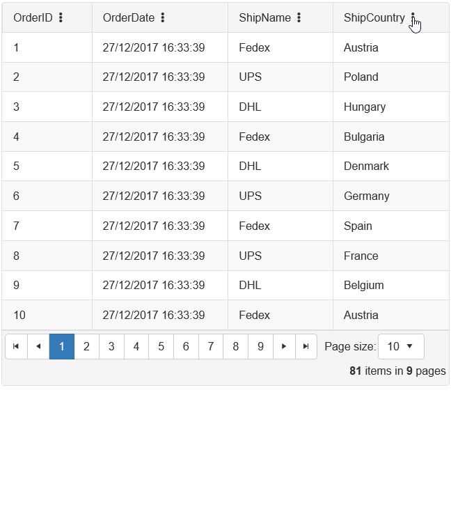

## Environment

<table>
	<tbody>
		<tr>
			<td>Product</td>
			<td>Telerik WebForms Grid for ASP.NET AJAX</td>
		</tr>
	</tbody>
</table>

## Description

Clicking on "Check All" checkbox will check only displayed items when [CheckList Filtering]() is enabled.



## Solution

>Note: This sample project is a custom solution that is beyond the RadGrid's built-in functionality. This was intended to be a demonstration for customizing the RadGrid control. Further customization or improvement of this example will not be guaranteed.
>

Sample markup of the Grid.

````ASP.NET
<telerik:RadGrid ID="RadGrid1" runat="server" AllowPaging="True" Width="800px"
    AllowFilteringByColumn="true"
    FilterType="HeaderContext"
    EnableHeaderContextMenu="true"
    EnableHeaderContextFilterMenu="true"
    OnFilterCheckListItemsRequested="RadGrid1_FilterCheckListItemsRequested"
    OnNeedDataSource="RadGrid1_NeedDataSource">
    <HeaderContextMenu OnClientShown="showLoadingSign" OnClientHidden="OnClientHidden" ExpandAnimation-Duration="0" />
    <MasterTableView AutoGenerateColumns="False" DataKeyNames="OrderID" EnableColumnsViewState="false">
        <Columns>
            <telerik:GridBoundColumn DataField="OrderID" DataType="System.Int32" FilterCheckListEnableLoadOnDemand="true"
                FilterControlAltText="Filter OrderID column" HeaderText="OrderID"
                ReadOnly="True" SortExpression="OrderID" UniqueName="OrderID">
            </telerik:GridBoundColumn>
            <telerik:GridDateTimeColumn DataField="OrderDate" DataType="System.DateTime" FilterCheckListEnableLoadOnDemand="true"
                FilterControlAltText="Filter OrderDate column" HeaderText="OrderDate"
                SortExpression="OrderDate" UniqueName="OrderDate">
            </telerik:GridDateTimeColumn>
            <telerik:GridNumericColumn DataField="Freight" DataType="System.Decimal" FilterCheckListEnableLoadOnDemand="true"
                FilterControlAltText="Filter Freight column" HeaderText="Freight"
                SortExpression="Freight" UniqueName="Freight">
            </telerik:GridNumericColumn>
            <telerik:GridBoundColumn DataField="ShipName"
                FilterControlAltText="Filter ShipName column" HeaderText="ShipName" FilterCheckListEnableLoadOnDemand="true"
                SortExpression="ShipName" UniqueName="ShipName">
            </telerik:GridBoundColumn>
            <telerik:GridBoundColumn DataField="ShipCountry"
                FilterControlAltText="Filter ShipCountry column" HeaderText="ShipCountry" FilterCheckListEnableLoadOnDemand="true"
                SortExpression="ShipCountry" UniqueName="ShipCountry">
            </telerik:GridBoundColumn>
        </Columns>
    </MasterTableView>
    <ClientSettings AllowColumnHide="false">
    </ClientSettings>
</telerik:RadGrid>
````

In the code behind, using the **PreRender** event of the Page, bind two event handlers to **RadListBox** holding the checkbox items.

````C#
protected void Page_PreRender(object sender, EventArgs e)
{
    var lb = RadGrid1.FindControl("filterCheckList") as RadListBox;
    lb.OnClientLoad = "listBoxLoad";
}

protected void RadGrid1_FilterCheckListItemsRequested(object sender, GridFilterCheckListItemsRequestedEventArgs e)
{
    string DataField = (e.Column as IGridDataColumn).GetActiveDataField();

    e.ListBox.DataSource = OrdersTable().DefaultView.ToTable(true, DataField);
    e.ListBox.DataKeyField = DataField;
    e.ListBox.DataTextField = DataField;
    e.ListBox.DataValueField = DataField;
    e.ListBox.DataBind();
}

protected void RadGrid1_NeedDataSource(object sender, Telerik.Web.UI.GridNeedDataSourceEventArgs e)
{
    RadGrid1.DataSource = OrdersTable();
}

private DataTable OrdersTable()
{
    DataTable dt = new DataTable();

    dt.Columns.Add(new DataColumn("OrderID", typeof(int)));
    dt.Columns.Add(new DataColumn("OrderDate", typeof(DateTime)));
    dt.Columns.Add(new DataColumn("Freight", typeof(decimal)));
    dt.Columns.Add(new DataColumn("ShipName", typeof(string)));
    dt.Columns.Add(new DataColumn("ShipCountry", typeof(string)));

    dt.PrimaryKey = new DataColumn[] { dt.Columns["OrderID"] };

    for (int i = 0; i < 4000; i++)
    {
        int index = i + 1;

        DataRow row = dt.NewRow();

        row["OrderID"] = index;
        row["OrderDate"] = new DateTime(DateTime.Now.Year, DateTime.Now.Month, DateTime.Now.Day, 0, 0, 0).AddHours(index);
        row["Freight"] = index * 0.1 + index * 0.01;
        row["ShipName"] = "Name " + index;

        if(index % 5 == 0) { row["ShipCountry"] = "Cola Champagne 216"; }
        else if (index % 4 == 0) { row["ShipCountry"] = "Nat. Flavor \"White Chocolate\" Type 7544"; }
        else if (index % 3 == 0) { row["ShipCountry"] = "'COLA'"; }
        else if (index % 2 == 0) { row["ShipCountry"] = "\"COLA\""; }
        else { row["ShipCountry"] = "Country " + index; }

        dt.Rows.Add(row);
    }

    return dt;

````

In order to improve performance of this functionality, we have overridden few internal functions, so to use jQuery to do the job instead of accessing and iterating through Object classes.

With this change, now selection works almost instantly with even 2-3 thousand records. An Updated version of the project is attached.

Client side code to manipulate the checklist items.

````JavaScript
function listBoxLoad(sender, args) {
    // reference to the ListBox
    var listBoxElement = $telerik.$(sender.get_element());
    //listBoxElement.find('input[id$="filterCheckListSearch"]').on('keyup', function () {
    //    debugger;
    //});
    // reference to the List Group
    var listBoxGroup = listBoxElement.find('.rlbGroup');
    // create a custom Check All Checkbox and add it to the list group
    listBoxGroup.prepend('<div class="myChekAllCheckBox" style="display: none;"><label><input type="checkbox" class="customCheckAll">Check All</label></div>');

    // wire up the change event to the Custom Check All Checkbox.
    // when changed, execute the script inside the function
    listBoxGroup.find('.customCheckAll').change(function (e) {
        // find only the visible listbox items (li)
        var lbItems = listBoxGroup.find('.rlbList li:visible');
        // find the checkboxes within the visible listbox items and check/uncheck them based on the Check All Checkbox state
        lbItems.find('input').prop('checked', this.checked);

        if (this.checked) {
            // uncheck other items
            listBoxGroup.find('.rlbList li:hidden input').prop('checked', false);
        }
    });

    // attach the following two events - For the Show Loading indicator functionality
    sender.add_itemsRequested(hideLbLoadingSign);
    sender.add_itemsRequestFailed(hideLbLoadingSign);
}

function hideLbLoadingSign(sender, args) {
    //remove the custom loading sign class
    $telerik.$(sender.get_element()).find(".rlbGroup").first().removeClass("lbLoadingSign");
    // show the check all checkbox
    $telerik.$(sender.get_element()).find(".rlbGroup .myChekAllCheckBox").first().show();
}

function showLoadingSign(sender, args) {
    //add the custom loading sign class
    $telerik.$(sender.get_childListElement()).find(".rlbGroup").first().addClass("lbLoadingSign");
}

function OnClientHidden(sender, args) {
    // Optional: hide the Check All checkbox when the menu closed

    // selector to select all occurences of .RadMenu.myCheckAllCheckBox on the page
    $telerik.$(".RadMenu .rgHCMFilter .RadListBox .myChekAllCheckBox").hide();

    // get reference to RadGrid this ContextMenu belongs.
    var currentRadGrid = sender.get_parent();

    // selector to select only the myCheckAllCheckBox that belongs to the current RadGrid firing opening this ContextMenu.
    $telerik.$(".RadMenu[id^='" + currentRadGrid.ClientID + "'] .rgHCMFilter .RadListBox .myChekAllCheckBox").hide();
}
// handle filtering
Telerik.Web.UI.Grid.FilterSearch = function (grid, input) {
    var ListBox = $telerik.$('#' + grid._filterCheckListClientID)
    // hide all as soon as start searching
    ListBox.find('.rlbList li').hide();
    // show only search results


    var visibleItems = ListBox.find('.rlbList li').filter(function (index) {
        return $(this).text().toLowerCase().indexOf(input.value.toLowerCase()) > -1;
        //return index % 3 === 2;
    })

    visibleItems.show();


    //var visibleItems = ListBox.find('.rlbList li:contains(' + input.value.toLowerCase() + ')').show();

    var visibleItemsCount = visibleItems.length;
    var checkedItemsCount = visibleItems.find('input[type="checkbox"]:checked').length;
    // Check/Uncheck the CheckAll checkbox whether all visible items on the list are checked
    ListBox.find('.myChekAllCheckBox input[type="checkbox"]').prop('checked', visibleItemsCount > 0 && visibleItemsCount == checkedItemsCount);
}

// handle per item check
// store a reference to the original method
var original = Telerik.Web.UI.RadListBox.prototype._onCheck;
// override the original method
Telerik.Web.UI.RadListBox.prototype._onCheck = function (e, targetItem) {
    var ListBox = $(this.get_element());

    // condition check if ListBox is part of the HeaderContextFilterMenu of RadGrid
    if (ListBox.closest('.rgHCMFilter').length < 1) {
        // if not, call the original method stored above
        original.call(this, e, targetItem);
        // exit the function to prevent the excution of further logic
        return;
    }

    // logic below will only be executed if the ListBox is part of the HeaderContextFilterMenu of RadGrid.

    var visibleItems = ListBox.find('.rlbList li:visible');

    var visibleItemsCount = visibleItems.length;
    var checkedItemsCount = visibleItems.find('input[type="checkbox"]:checked').length;

    // Check/Uncheck the CheckAll checkbox whether all visible items on the list are checked
    ListBox.find('.myChekAllCheckBox input[type="checkbox"]').prop('checked', visibleItemsCount > 0 && visibleItemsCount == checkedItemsCount);
}
````
 
  
    