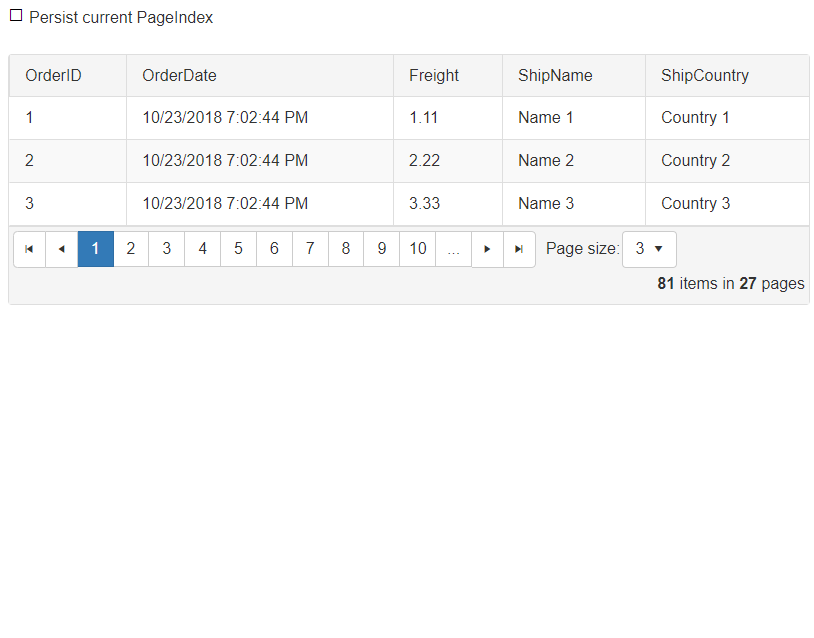
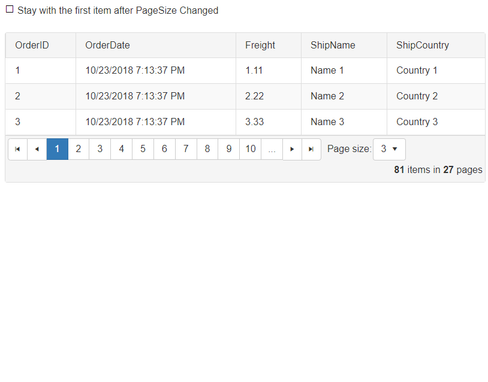

## DESCRIPTION

By default RadGrid will jump to the first page when the PageSize is changing. Sometimes, you might want to persist the current PageIndex or stay on the same page with the first item of the current page after the PageSize is changed in RadGrid. This article will show you the way you can achieve that.

#### Example showing  the persisting of current page index after PageSize changed



#### Example showing that the user stays on the same page with the first item after PageSize has changed




## SOLUTION

**DOWNLOAD** the sample: [radgrid_radfilter_rendering_problem.zip](files/radgrid_radfilter_rendering_problem.zip)


**OR**

Copy the code

The following Markup works with both scenarios. Subscribe the Grid to **PageIndexChanged** and **PageSizeChanged** events.

````XML
<telerik:RadGrid ID="RadGrid1" runat="server" AllowPaging="True" PageSize="3"
    OnPageIndexChanged="RadGrid1_PageIndexChanged"
    OnPageSizeChanged="RadGrid1_PageSizeChanged">
</telerik:RadGrid>
````

### Persist CurrentPageIndex on PageSizeChange

**SessionPageIndex** property, **PageIndexChanged** and **PageSizeChanged** event handlers

````C#
public int SessionPageIndex
{
    get
    {
        if (Session["CurrentPageIndex"] == null)
        {
            Session["CurrentPageIndex"] = RadGrid1.CurrentPageIndex;
        }
 
        return (int)Session["CurrentPageIndex"];
    }
    set
    {
        Session["CurrentPageIndex"] = value;
    }
}
 
protected void RadGrid1_PageSizeChanged(object sender, GridPageSizeChangedEventArgs e)
{
    if (RadCheckBox1.Checked == true)
    {
        RadGrid1.CurrentPageIndex = SessionPageIndex;
    }
}
 
protected void RadGrid1_PageIndexChanged(object sender, GridPageChangedEventArgs e)
{
    SessionPageIndex = e.NewPageIndex;
}
````
````VB
Public Property SessionPageIndex() As Integer
    Get
        If Session("CurrentPageIndex") Is Nothing Then
            Session("CurrentPageIndex") = RadGrid1.CurrentPageIndex
        End If
 
        Return DirectCast(Session("CurrentPageIndex"), Integer)
    End Get
    Set(ByVal value As Integer)
        Session("CurrentPageIndex") = value
    End Set
End Property
Protected Sub RadGrid1_PageSizeChanged(sender As Object, e As GridPageSizeChangedEventArgs)
    If RadCheckBox1.Checked = True Then
        RadGrid1.CurrentPageIndex = SessionPageIndex
    End If
End Sub
Protected Sub RadGrid1_PageIndexChanged(sender As Object, e As GridPageChangedEventArgs)
    SessionPageIndex = e.NewPageIndex
End Sub
````

### Stay with the first item on the same page after PageSizeChange

**OldPageIndex** and **OldPageSize** properties +  **PageIndexChanged** and **PageSizeChanged** event handlers

````C#
public int OldPageIndex
{
    get
    {
        if (Session["OldPageIndex"] == null)
        {
            Session["OldPageIndex"] = RadGrid1.CurrentPageIndex;
        }
 
        return (int)Session["OldPageIndex"];
    }
    set
    {
        Session["OldPageIndex"] = value;
    }
}
 
public int OldPageSize
{
    get
    {
        if (Session["OldPageSize"] == null)
        {
            Session["OldPageSize"] = RadGrid1.PageSize;
        }
 
        return (int)Session["OldPageSize"];
    }
    set
    {
        Session["OldPageSize"] = value;
    }
}
 
protected void Page_Load(object sender, EventArgs e)
{
    if (!IsPostBack)
    {
        OldPageIndex = RadGrid1.CurrentPageIndex;
        OldPageSize = RadGrid1.PageSize;
    }
}
 
protected void RadGrid1_PageSizeChanged(object sender, GridPageSizeChangedEventArgs e)
{
     
    if (OldPageSize != e.NewPageSize)
    {
        // var newPageIndex = (int)Math.Floor((OldPageIndex * OldPageSize + 1) / (decimal)e.NewPageSize);
        int newPageIndex = (OldPageIndex * OldPageSize + 1) / e.NewPageSize;
 
        if(RadCheckBox2.Checked == true)
        {
            RadGrid1.CurrentPageIndex = newPageIndex;
        }
         
        OldPageSize = e.NewPageSize;
        OldPageIndex = newPageIndex;
    }
}
 
protected void RadGrid1_PageIndexChanged(object sender, GridPageChangedEventArgs e)
{
    OldPageIndex = e.NewPageIndex;
}
````
````VB
Public Property OldPageIndex() As Integer
    Get
        If Session("OldPageIndex") Is Nothing Then
            Session("OldPageIndex") = RadGrid1.CurrentPageIndex
        End If
 
        Return DirectCast(Session("OldPageIndex"), Integer)
    End Get
    Set(ByVal value As Integer)
        Session("OldPageIndex") = value
    End Set
End Property
Public Property OldPageSize() As Integer
    Get
        If Session("OldPageSize") Is Nothing Then
            Session("OldPageSize") = RadGrid1.CurrentPageIndex
        End If
 
        Return DirectCast(Session("OldPageSize"), Integer)
    End Get
    Set(ByVal value As Integer)
        Session("OldPageSize") = value
    End Set
End Property
Protected Sub Page_Load(sender As Object, e As EventArgs)
    If Not IsPostBack Then
        OldPageIndex = RadGrid1.CurrentPageIndex
        OldPageSize = RadGrid1.PageSize
    End If
End Sub
Protected Sub RadGrid1_PageSizeChanged(sender As Object, e As GridPageSizeChangedEventArgs)
    If OldPageSize <> e.NewPageSize Then
        Dim newPageIndex As Integer = (OldPageIndex * OldPageSize + 1) / e.NewPageSize
 
        If RadCheckBox2.Checked = True Then
            RadGrid1.CurrentPageIndex = newPageIndex
        End If
 
        OldPageSize = e.NewPageSize
        OldPageIndex = newPageIndex
    End If
End Sub
Protected Sub RadGrid1_PageIndexChanged(sender As Object, e As GridPageChangedEventArgs)
    OldPageIndex = e.NewPageIndex
End Sub
````
 
