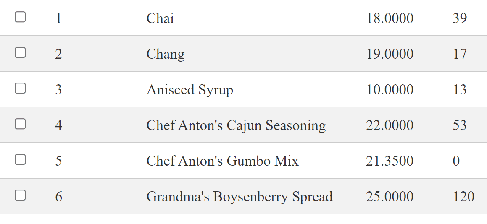

## Environment

<table>
	<tbody>
		<tr>
			<td>Product</td>
			<td>Telerik WebForms Grid for ASP.NET AJAX</td>
		</tr>
	</tbody>
</table>

## Description

If you have enabled a [`Row Context Menu`]() and also set the `AllowRowSelect` property to **true**, you can select a row with right click and open the row context menu at the same time.
One might want to disable 



## Solution

To do that, you can utilize the [`OnRowSelecting`]() event, and in the event handler, check which button of the mouse has been clicked.

If the `mouseButton` value is **2**, it means that the right-mouse button has been clicked (the same button will show the row context menu), and if clicked, cancel the selection of the row, and after that reset the value of the variable. 

````JavaScript
    var mouseButton; // Global variable to track which mouse button has been clicked

    function onRowSelecting(sender, args) {
        if (mouseButton === 2) {
            args.set_cancel(true); // Cancel the selecting of the row
        } else {
            args.set_cancel(false); 
        }

        mouseButton = undefined;
    }

    function RowContextMenu(sender, eventArgs) {
        var domEvent = eventArgs.get_domEvent(); 
        mouseButton = domEvent.button; // It will be 2 (right mouse button)
        
        var menu = $find("<%=RadMenu1.ClientID %>");
        var evt = eventArgs.get_domEvent();

        if (evt.target.tagName == "INPUT" || evt.target.tagName == "A") {
            return;
        }

        var index = eventArgs.get_itemIndexHierarchical();
        document.getElementById("radGridClickedRowIndex").value = index;

        sender.get_masterTableView().selectItem(sender.get_masterTableView().get_dataItems()[index].get_element(), true);

        menu.show(evt);

        evt.cancelBubble = true;
        evt.returnValue = false;

        if (evt.stopPropagation) {
            evt.stopPropagation();
            evt.preventDefault();
        }
    }
````
 
````ASP.NET
<telerik:RadGrid RenderMode="Lightweight" ID="RadGrid1" runat="server" Width="100%"
    DataSourceID="SqlDataSource1" AllowAutomaticDeletes="true" AllowAutomaticInserts="true"
    AllowAutomaticUpdates="true" OnPreRender="RadGrid1_PreRender">
    <MasterTableView AllowSorting="False" PageSize="10" AllowPaging="True" Width="100%"
        DataKeyNames="ProductID" DataSourceID="SqlDataSource1" EditMode="InPlace">
        <Columns>
            <telerik:GridEditCommandColumn UniqueName="EditCommandColumn" Visible="false" />
        </Columns>
    </MasterTableView>
    <ClientSettings>
        <ClientEvents OnRowContextMenu="RowContextMenu"></ClientEvents>
        <Selecting AllowRowSelect="true" />
    </ClientSettings>
    <PagerStyle Mode="NextPrevAndNumeric" />
</telerik:RadGrid>
````
    
      
