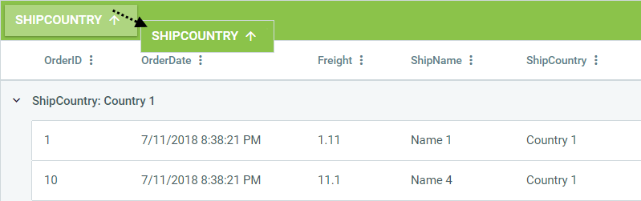

## DESCRIPTION

Usually, implementing grouping for RadGrid goes along with enabling the **ShowGroupPanel** property. This container functions as the placeholder where the user can drag columns inside or outside in order to group or ungroup the grid content by the corresponding field: [GridGroupPanel](https://docs.telerik.com/devtools/aspnet-ajax/controls/grid/functionality/grouping/overview#gridgrouppanel)   
  
The groups can also be set initially on the [mark-up](https://docs.telerik.com/devtools/aspnet-ajax/controls/grid/functionality/grouping/group-by-expressions/declarative-definition) or in the [code-behind](https://docs.telerik.com/devtools/aspnet-ajax/controls/grid/functionality/grouping/group-by-expressions/programmatic-definition). You can prefer this grouping structure to remain unchanged and hence the user shouldn't be able to drag a field from the group panel to ungroup.  
  


  
Currently, even if the following properties remain disabled, the user can drag a column and ungroup the grid content:  

````XML
<ClientSettings AllowDragToGroup="false">
</ClientSettings>
<GroupingSettings ShowUnGroupButton="false" />
````

  
## SOLUTION

Override the built-in drag handler to remove the ungrouping functionality

````JavaScript
<script type="text/javascript">
    Telerik.Web.UI.GridGroupPanelItem.prototype._onMouseDownHandler = function (e) { }
    function pageLoad(app, args) {
        // this part is to remove the dragging message and cursor
        $(".rgGroupItem").removeAttr("title style");
    }
</script>
````
 
