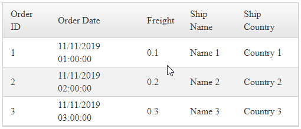

## Environment
<table>
	<tbody>
		<tr>
			<td>Product</td>
			<td>RadMenu for ASP.NET AJAX</td>
		</tr>
	</tbody>
</table>


## Description




## Solution


Markup and JavaScript

JavaScript

````JavaScript
function GridRowContextMenu(sender, args) {
    var menu = $find('<%= RadContextMenu1.ClientID %>');

    var evt = args.get_domEvent();
    if (evt.target.tagName == "INPUT" || evt.target.tagName == "A") {
        return;
    }

    var index = args.get_itemIndexHierarchical();

    sender.get_masterTableView().selectItem(sender.get_masterTableView().get_dataItems()[index].get_element(), true);

    menu.show(evt);
    evt.cancelBubble = true;
    evt.returnValue = false;

    if (evt.stopPropagation) {
        evt.stopPropagation();
        evt.preventDefault();
    }
}

function ContextMenuShowing(sender, args) {
    var $currentRow = $(args.get_targetElement()).closest('tr');
    var gridElement = $currentRow.closest('.RadGrid')[0];

    if (gridElement && gridElement.control) {
        var menu = sender;
        var grid = gridElement.control;

        // Instantiate the GridDataItems collection class to be able to cast rows (TR elements) to GridDataItem objects
        grid.get_masterTableView().get_dataItems();

        var gridDataItem = $currentRow[0].control;
        var OrderID = gridDataItem.getDataKeyValue("OrderID");

        menu.trackChanges();

        // access one specific item and add a custom Attribute to it
        var targetMenuItem = menu.findItemByValue("orderid");
        if (targetMenuItem) {
            targetMenuItem.get_attributes().setAttribute("OrderID", OrderID);
        }


        //// loop through all items and add custom attributes to them
        //var allMenuItems = sender.get_allItems();
        //for (var i = 0; i < allMenuItems.length; i++) {
        //    var menuItem = allMenuItems[i];

        //    menuItem.get_attributes().setAttribute("OrderID", OrderID);
        //}

        menu.commitChanges();
    }
}
````

Markup

````ASP.NET
<telerik:RadGrid ID="RadGrid1" runat="server" AllowPaging="True" Width="500px" OnNeedDataSource="RadGrid1_NeedDataSource">
    <ClientSettings>
        <ClientEvents OnRowContextMenu="GridRowContextMenu" />
    </ClientSettings>
    <MasterTableView ClientDataKeyNames="OrderID">
    </MasterTableView>
</telerik:RadGrid>

<telerik:RadContextMenu ID="RadContextMenu1" runat="server" OnClientShowing="ContextMenuShowing" OnItemClick="RadContextMenu1_ItemClick">
    <Items>
        <telerik:RadMenuItem Text="Get OrderID Key" Value="orderid"></telerik:RadMenuItem>
        <telerik:RadMenuItem Text="Item 2">
            <Items>
                <telerik:RadMenuItem Text="Item 1.2"></telerik:RadMenuItem>
                <telerik:RadMenuItem Text="Item 2.2"></telerik:RadMenuItem>
            </Items>
        </telerik:RadMenuItem>
        <telerik:RadMenuItem Text="Item 3"></telerik:RadMenuItem>
    </Items>
</telerik:RadContextMenu>

<telerik:RadWindowManager ID="RadWindowManager1" runat="server"></telerik:RadWindowManager>
````

Code Behind

````C#
protected void RadGrid1_NeedDataSource(object sender, GridNeedDataSourceEventArgs e)
{
    RadGrid1.DataSource = Enumerable.Range(1, 3).Select(x => new
    {
        OrderID = x,
        OrderDate = DateTime.Now.Date.AddHours(x),
        Freight = x * .1,
        ShipName = "Name " + x,
        ShipCountry = "Country " + x
    });
}

protected void RadContextMenu1_ItemClick(object sender, RadMenuEventArgs e)
{
    var OrderID = e.Item.Attributes["OrderID"];

    var textMessage = string.Format("OrderID: {0}", OrderID);
    RadWindowManager1.RadAlert(textMessage, 300, 150, "RowContextMenu Alert", "null");
}
````
````VB
Protected Sub RadGrid1_NeedDataSource(ByVal sender As Object, ByVal e As GridNeedDataSourceEventArgs)
    TryCast(sender, RadGrid).DataSource = Enumerable.Range(1, 3).Select(Function(x) New With {
		Key .OrderID = x,
		Key .OrderDate = DateTime.Now.Date.AddHours(x),
		Key .Freight = x * 0.1,
		Key .ShipName = "Name " & x,
		Key .ShipCountry = "Country " & x
	})
End Sub

Protected Sub RadContextMenu1_ItemClick(ByVal sender As Object, ByVal e As RadMenuEventArgs)
    Dim OrderID = e.Item.Attributes("OrderID")
    Dim textMessage = String.Format("OrderID: {0}", OrderID)
    RadWindowManager1.RadAlert(textMessage, 300, 150, "RowContextMenu Alert", "null")
End Sub
````

## See Also

- [Grid - OnRowContextMenu](https://docs.telerik.com/devtools/aspnet-ajax/controls/grid/client-side-programming/events/onrowcontextmenu)
- [Grid - Context Menu Demo](https://demos.telerik.com/aspnet-ajax/grid/examples/columns-rows/columns/context-menu/defaultcs.aspx)
- [Grid - Accessing Cells and Rows](https://docs.telerik.com/devtools/aspnet-ajax/controls/grid/rows/accessing-cells-and-rows)
- [ContextMenu - OnClientShowing](https://docs.telerik.com/devtools/aspnet-ajax/controls/menu/client-side-programming/events/onclientshowing)
- [ContextMenu - Custom Attributes](https://docs.telerik.com/devtools/aspnet-ajax/controls/menu/radmenu-items/custom-attributes)
- [ContextMenu - ItemClick](https://docs.telerik.com/devtools/aspnet-ajax/controls/menu/server-side-programming/itemclick)
