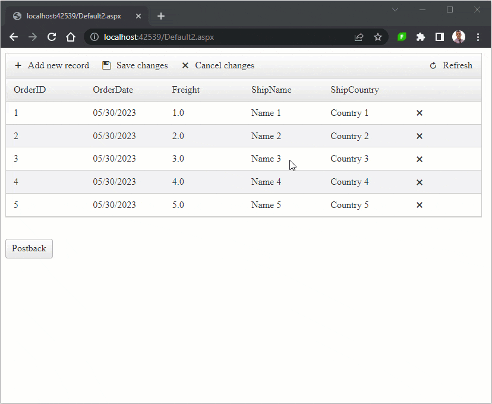

## DESCRIPTION

Example JavaScript code to save and restore the changes on PostBack with EditMode="Batch"



The Batch edit (`EditMode="Batch"`) is a Client-side editing functionality that allows users to edit/update/delete records in batch without making round-trips to the server, thus greatly improving the application performance. 

One downside of this is that the changes are not persisted by the `ViewState` and will be lost upon making PostBacks except when saving the changes. To work around this problem, you can use the Batch Editing Client-side APIs to access the changes, store them in the Browser's local storage (see [Window: localStorage property](https://developer.mozilla.org/en-US/docs/Web/API/Window/localStorage)) and restore the changes after the PostBack is over.

## SOLUTION

First off, create a few helper functions to store, access & clear the changes in the [`localStorage`](https://developer.mozilla.org/en-US/docs/Web/API/Window/localStorage).

````JavaScript
// HELPER FUNCTIONS
// key used as the identifier for the storage
const StorageKey = "BatchEditChanges";

// To store the changes in the localStorage
function storeChanges(grid) {
    var batchManager = grid.get_batchEditingManager();
    var changes = batchManager._changes[grid.get_masterTableView().get_id()];
    localStorage.setItem(StorageKey, JSON.stringify(changes || {}));
}
// To store the changes from the localStorage
function removeChanges() {
    localStorage.removeItem(StorageKey);
}
// To access the changes from the localStorage
function getChanges() {
    return JSON.parse(localStorage.getItem(StorageKey) || '{}');
}
// End HELPER FUNCTIONS
````

Next, create a function that will restore the changes in the Grid.

````JavaScript
// To restore the changes into the Grid
function restoreChangesInGrid(grid) {
    // timeOut used only to ensure code execution in an order (e.g. execute it after the grid finished its tasks and not before)
    setTimeout(() => {
        var batchManager = grid.get_batchEditingManager();
        var tableView = grid.get_masterTableView();
        var changes = getChanges();

        // iterate through the changes
        Object.keys(changes).forEach((index) => {
            var rowIndex = parseInt(index);
            var changedRow = changes[index];

            // access the row by index
            var targetItem = tableView.get_dataItems().filter(item => item.get_itemIndex() == rowIndex)[0];

            
            if (typeof changedRow === 'string' || changedRow.markedForDeleting) { 
                // delete - applies for both HighlightDeletedRows="true" and HighlightDeletedRows="false"
                batchManager.deleteRecord(tableView, targetItem.get_element());
            } else { 
                // insert or update
                if (rowIndex < 0) { 
                    // for inserting only
                    // create a new row
                    batchManager.addNewRecord(tableView);
                    // reference the newly created row
                    targetItem = tableView.get_dataItems().filter(item => item.get_itemIndex() == rowIndex)[0];
                }
                // for each field in the collection, fill the row with data
                Object.keys(changedRow).forEach((field) => {
                    // access the new row's cell by field name
                    var targetCell = targetItem.get_cell(field);
                    var fieldValues = changedRow[field];
                    // populate the cell with values
                    batchManager.changeCellValue(targetCell, fieldValues.value);
                });
                // close the editing - to prevent leaving the row/cell in edit mode
                batchManager._tryCloseEdits(tableView);
            }
        });
    }, 15);
}
````

Last but not least, you would need to call these functions at certain Client-side events (e.g. click, Grid events, etc.). To make things automatic, you can use the following events of the Grid.

To store the changes in the `localStorage`

````JavaScript
// when a row is deleted/marked as deleted
function OnRowDeleted(sender, args) {
    // store the new changes
    storeChanges(sender);
}

// When a Cell value has changed
function OnBatchEditCellValueChanged(sender, args) {
    // store the new changes
    storeChanges(sender);
}
````

To clear the changes from the `localStorage` or restore changes in the Grid

````JavaScript
// When the Grid has been initialized
function OnGridCreated(sender, args) {
    // is postback or initial load
    var isPostBack = Boolean.parse('<%= Page.IsPostBack %>');

    // if initial load
    if (!isPostBack) {
        // clear the changes
        removeChanges();
    } else {
        // restore the changes
        restoreChangesInGrid(sender);
    }
}
````

### Complete Code

Markup

````ASP.NET
<telerik:RadGrid ID="RadGrid1" runat="server" AllowPaging="True" Width="800px" OnNeedDataSource="RadGrid1_NeedDataSource" OnPreRender="RadGrid1_PreRender">
    <MasterTableView AutoGenerateColumns="False" DataKeyNames="OrderID" ClientDataKeyNames="OrderID" EditMode="Batch" CommandItemDisplay="Top">
        <BatchEditingSettings HighlightDeletedRows="true" EditType="Row" />
        <Columns>
            <telerik:GridBoundColumn DataField="OrderID" DataType="System.Int32"
                FilterControlAltText="Filter OrderID column" HeaderText="OrderID"
                ReadOnly="True" SortExpression="OrderID" UniqueName="OrderID">
            </telerik:GridBoundColumn>
            <telerik:GridDateTimeColumn DataField="OrderDate" DataType="System.DateTime" DataFormatString="{0:MM/dd/yyyy}"
                FilterControlAltText="Filter OrderDate column" HeaderText="OrderDate"
                SortExpression="OrderDate" UniqueName="OrderDate">
            </telerik:GridDateTimeColumn>
            <telerik:GridNumericColumn DataField="Freight" DataType="System.Decimal"
                FilterControlAltText="Filter Freight column" HeaderText="Freight"
                SortExpression="Freight" UniqueName="Freight">
            </telerik:GridNumericColumn>

            <telerik:GridBoundColumn DataField="ShipName" DataType="System.String"
                FilterControlAltText="Filter ShipName column" HeaderText="ShipName"
                SortExpression="ShipName" UniqueName="ShipName">
            </telerik:GridBoundColumn>

            <telerik:GridTemplateColumn DataField="ShipCountry"
                FilterControlAltText="Filter ShipCountry column" HeaderText="ShipCountry"
                SortExpression="ShipCountry" UniqueName="ShipCountry">
                <ItemTemplate>
                    <%# Eval("ShipCountry") %>
                </ItemTemplate>
                <EditItemTemplate>
                    <telerik:RadDropDownList ID="RadDropDownList1" runat="server" DataTextField="ShipCountry" DataValueField="ShipCountry"></telerik:RadDropDownList>
                </EditItemTemplate>
            </telerik:GridTemplateColumn>
            <telerik:GridClientDeleteColumn></telerik:GridClientDeleteColumn>
        </Columns>
    </MasterTableView>
    <ClientSettings>
        <ClientEvents OnBatchEditCellValueChanged="OnBatchEditCellValueChanged" OnGridCreated="OnGridCreated" OnRowDeleted="OnRowDeleted" />
    </ClientSettings>
</telerik:RadGrid>
<br />
<br />
<telerik:RadButton runat="server" ID="RadButton1" Text="Postback" AutoPostBack="true" />

<telerik:RadScriptBlock ID="RadScriptBlock1" runat="server">
    <script>
        // HELPER FUNCTIONS
        // key used as the identifier for the storage
        const StorageKey = "BatchEditChanges";

        // To store the changes in the localStorage
        function storeChanges(grid) {
            var batchManager = grid.get_batchEditingManager();
            var changes = batchManager._changes[grid.get_masterTableView().get_id()];
            localStorage.setItem(StorageKey, JSON.stringify(changes || {}));
        }
        // To store the changes from the localStorage
        function removeChanges() {
            localStorage.removeItem(StorageKey);
        }
        // To access the changes from the localStorage
        function getChanges() {
            return JSON.parse(localStorage.getItem(StorageKey) || '{}');
        }
        // End HELPER FUNCTIONS

        // To restore the changes into the Grid
        function restoreChangesInGrid(grid) {
            setTimeout(() => {
                var batchManager = grid.get_batchEditingManager();
                var tableView = grid.get_masterTableView();
                var changes = getChanges();


                Object.keys(changes).forEach((index) => {
                    var rowIndex = parseInt(index);
                    var changedRow = changes[index];

                    // access the row by index
                    var targetItem = tableView.get_dataItems().filter(item => item.get_itemIndex() == rowIndex)[0];

                    if (typeof changedRow === 'string' || changedRow.markedForDeleting) { // delete - applies for both HighlightDeletedRows="true" and HighlightDeletedRows="false"
                        // delete the row
                        batchManager.deleteRecord(tableView, targetItem.get_element());
                    } else { // insert & update
                        if (rowIndex < 0) { // for inserting only
                            // create a new row
                            batchManager.addNewRecord(tableView);
                            // reference the newly created row
                            targetItem = tableView.get_dataItems().filter(item => item.get_itemIndex() == rowIndex)[0];
                        }

                        // for each field in the collection fill the row with data
                        Object.keys(changedRow).forEach((field) => {
                            // access the new row's cell by field name
                            var targetCell = targetItem.get_cell(field);
                            var fieldValues = changedRow[field];

                            // populate the cell with values
                            batchManager.changeCellValue(targetCell, fieldValues.value);
                        });

                        // close the editing
                        batchManager._tryCloseEdits(tableView);
                    }
                });
            }, 15);
        }

        // when a row is deleted/marked as deleted
        function OnRowDeleted(sender, args) {
            // store the new changes
            storeChanges(sender);
        }

        // When a Cell value has changed
        function OnBatchEditCellValueChanged(sender, args) {
            // store the new changes
            storeChanges(sender);
        }

        // When the Grid has been initialized
        function OnGridCreated(sender, args) {
            // is postback or initial load
            var isPostBack = Boolean.parse('<%= Page.IsPostBack %>');

            // if initial load
            if (!isPostBack) {
                // clear the changes
                removeChanges();
            } else {
                // restore the changes
                restoreChangesInGrid(sender);
            }
        }
    </script>
</telerik:RadScriptBlock>
````

Backend code for data binding

````C#
protected void RadGrid1_NeedDataSource(object sender, GridNeedDataSourceEventArgs e)
{
    (sender as RadGrid).DataSource = GetSource();
}

private IEnumerable<dynamic> GetSource()
{
    return Enumerable.Range(1, 5).Select(x => new
    {
        OrderID = x,
        OrderDate = DateTime.Now.Date.AddHours(x),
        Freight = x * 1.0m,
        ShipName = "Name " + x,
        ShipCountry = "Country " + x
    });
}

protected void RadGrid1_PreRender(object sender, EventArgs e)
{
    RadGrid grid = (RadGrid)sender;
    RadDropDownList ddl = grid.MasterTableView.GetBatchEditorContainer("ShipCountry").FindControl("RadDropDownList1") as RadDropDownList;
    ddl.DataSource = GetSource();
    ddl.DataBind();
}
````
````VB
Protected Sub RadGrid1_NeedDataSource(ByVal sender As Object, ByVal e As GridNeedDataSourceEventArgs)
    CType(sender, RadGrid).DataSource = GetSource()
End Sub

Private Function GetSource() As IEnumerable(Of Object)
    Return Enumerable.Range(1, 5).Select(Function(x) New With {
        .OrderID = x,
        .OrderDate = DateTime.Now.Date.AddHours(x),
        .Freight = x * 1D,
        .ShipName = "Name " & x,
        .ShipCountry = "Country " & x
    })
End Function

Protected Sub RadGrid1_PreRender(ByVal sender As Object, ByVal e As EventArgs)
    Dim grid As RadGrid = CType(sender, RadGrid)
    Dim ddl As RadDropDownList = TryCast(grid.MasterTableView.GetBatchEditorContainer("ShipCountry").FindControl("RadDropDownList1"), RadDropDownList)
    ddl.DataSource = GetSource()
    ddl.DataBind()
End Sub
````


## See Also

- [Client-side API - RadGrid]()
- [Client-Side Events - RadGrid](#radgrid-events)
- [Client-side API - Batch Edit]()

