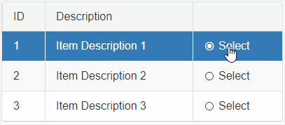

## Environment
<table>
	<tbody>
		<tr>
			<td>Product</td>
			<td>RadGrid for ASP.NET AJAX</td>
		</tr>
	</tbody>
</table>


## Description

Use Radio button to select rows in RadGrid and only select one at a time.

For example:



## Solution

````JavaScript
<script type="text/javascript">
    // When RadioButton is Checked
    function RadioButtonCheckedChanged(sender, args) {
        if (args.get_checked() == true) {
            var radioButton = sender.get_element();
            var currentRow = $telerik.$(radioButton).closest('tr')[0];

            if (currentRow) {
                var table = $telerik.$(currentRow).closest('table')[0];

                if (table && table.control) {
                    var masterTable = table.control;
                    // select the row
                    masterTable.selectItem(currentRow)
                }
            }
        }
    }
    // When a row is about to be selected
    function OnRowSelecting(sender, args) {
        // if the select event fires due to clicking on the row
        if (args.get_domEvent().type && args.get_domEvent().type == "click") {
            // cancel the event
            args.set_cancel(true);
        }
    }
    // When a row is about to be deselected, uncheck its RadioButton in it
    function OnRowDeselecting(sender, args) {
        // if the select event fires due to clicking on the row
        if (args.get_domEvent().type && args.get_domEvent().type == "click") {
            // cancel the event
            args.set_cancel(true);
        } else {
            // access the RadioButton
            var radioButton = $telerik.findControl(args.get_gridDataItem().get_cell("RadioButtonColumn"), "RadRadioButton1");
            // Unchecked the RadioButton
            radioButton.set_checked(false);
        }
    }
</script>
````
````CSS
<style type="text/css">
    .rgSelectedRow .RadRadioButton .rbText,
    .rgSelectedRow .RadRadioButton .rbToggleRadioChecked {
        color: white;
    }
</style>
````
````ASP.NET
<telerik:RadGrid ID="RadGrid1" runat="server" OnNeedDataSource="RadGrid1_NeedDataSource" Width="400px">
    <ClientSettings>
        <Selecting AllowRowSelect="true" />
        <ClientEvents OnRowSelecting="OnRowSelecting" OnRowDeselecting="OnRowDeselecting" />
    </ClientSettings>
    <MasterTableView AutoGenerateColumns="false">
        <Columns>
            <telerik:GridNumericColumn DataField="ID" HeaderText="ID"></telerik:GridNumericColumn>
            <telerik:GridNumericColumn DataField="Description" HeaderText="Description"></telerik:GridNumericColumn>
            <telerik:GridTemplateColumn UniqueName="RadioButtonColumn">
                <ItemTemplate>
                    <telerik:RadRadioButton ID="RadRadioButton1" runat="server" Text="Select" AutoPostBack="false" OnClientCheckedChanged="RadioButtonCheckedChanged"></telerik:RadRadioButton>
                </ItemTemplate>
            </telerik:GridTemplateColumn>
        </Columns>
    </MasterTableView>
</telerik:RadGrid>
````
````C#
protected void RadGrid1_NeedDataSource(object sender, GridNeedDataSourceEventArgs e)
{
    (sender as RadGrid).DataSource = Enumerable.Range(1, 3).Select(x => new
    {
        ID = x,
        Description = "Item Description " + x
    });
}
````
````VB
Protected Sub RadGrid1_NeedDataSource(sender As Object, e As GridNeedDataSourceEventArgs)
    DirectCast(sender, RadGrid).DataSource = Enumerable.Range(1, 3).Select(Function(x) New With {
        Key .ID = x,
            .Description = "Item Description " + x
    })
End Sub
````

## See Also
