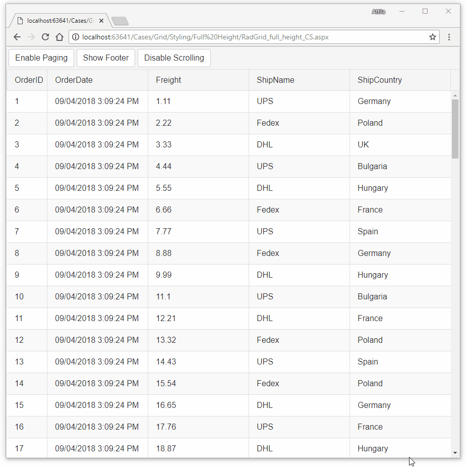

## Environment

<table>
	<tbody>
		<tr>
			<td>Product</td>
			<td>Telerik WebForms Grid for ASP.NET AJAX</td>
		</tr>
	</tbody>
</table>

## Description

Sometimes you might want to resize the Grid while resizing the browser.



## Solution

To achieve the desired result, we can use the [`window.resize`](https://api.jquery.com/resize/) event to calculate the Grid's height when resizing the browser:

````ASP.NET
<telerik:RadGrid ID="RadGrid1" runat="server" OnNeedDataSource="RadGrid1_NeedDataSource"
    AllowPaging="false" CellSpacing="0" PageSize="50" OnItemDataBound="RadGrid1_ItemDataBound"
    ShowFooter="false" GridLines="None" Width="100%">
    <MasterTableView AutoGenerateColumns="False" DataKeyNames="OrderID" CommandItemDisplay="Top">
        <CommandItemTemplate>
            <telerik:RadButton ID="btnPaging" runat="server" Text="" OnClick="btnPaging_Click"></telerik:RadButton>
            <telerik:RadButton ID="btnFooter" runat="server" Text="" OnClick="btnFooter_Click"></telerik:RadButton>
            <telerik:RadButton ID="btnScrolling" runat="server" Text="" OnClick="btnScrolling_Click"></telerik:RadButton>
        </CommandItemTemplate>
        <Columns>
            <telerik:GridBoundColumn DataField="OrderID" DataType="System.Int32"
                FilterControlAltText="Filter OrderID column" HeaderText="OrderID"
                ReadOnly="True" SortExpression="OrderID" UniqueName="OrderID">
            </telerik:GridBoundColumn>
            <telerik:GridDateTimeColumn DataField="OrderDate" DataType="System.DateTime"
                FilterControlAltText="Filter OrderDate column" HeaderText="OrderDate"
                SortExpression="OrderDate" UniqueName="OrderDate">
            </telerik:GridDateTimeColumn>
            <telerik:GridNumericColumn DataField="Freight" DataType="System.Decimal"
                FilterControlAltText="Filter Freight column" HeaderText="Freight"
                SortExpression="Freight" UniqueName="Freight">
            </telerik:GridNumericColumn>
            <telerik:GridBoundColumn DataField="ShipName"
                FilterControlAltText="Filter ShipName column" HeaderText="ShipName"
                SortExpression="ShipName" UniqueName="ShipName">
            </telerik:GridBoundColumn>
            <telerik:GridBoundColumn DataField="ShipCountry"
                FilterControlAltText="Filter ShipCountry column" HeaderText="ShipCountry"
                SortExpression="ShipCountry" UniqueName="ShipCountry">
            </telerik:GridBoundColumn>
        </Columns>
    </MasterTableView>
    <ClientSettings>
        <Scrolling AllowScroll="true" UseStaticHeaders="true" />
        <ClientEvents OnGridCreated="GridCreated" />
    </ClientSettings>
</telerik:RadGrid>
````

````C#
protected void RadGrid1_NeedDataSource(object sender, GridNeedDataSourceEventArgs e)
{
    (sender as RadGrid).DataSource = OrdersTable(); 
}

protected void RadGrid1_ItemDataBound(object sender, GridItemEventArgs e)
{
    if (e.Item is GridCommandItem)
    {
        GridCommandItem commandItem = e.Item as GridCommandItem;
        RadButton btnPaging = commandItem.FindControl("btnPaging") as RadButton;
        btnPaging.Text = (RadGrid1.AllowPaging) ? "Disable Paging" : "Enable Paging";

        RadButton btnFooter = commandItem.FindControl("btnFooter") as RadButton;
        btnFooter.Text = (RadGrid1.ShowFooter) ? "Hide Footer" : "Show Footer";

        RadButton btnScrolling = commandItem.FindControl("btnScrolling") as RadButton;
        btnScrolling.Text = (RadGrid1.ClientSettings.Scrolling.AllowScroll) ? "Disable Scrolling" : "Enable Scrolling";
    }
}

protected void btnPaging_Click(object sender, EventArgs e)
{
    RadGrid1.AllowPaging = !RadGrid1.AllowPaging;
    RadGrid1.Rebind();
}

protected void btnFooter_Click(object sender, EventArgs e)
{
    RadGrid1.ShowFooter = !RadGrid1.ShowFooter;
    RadGrid1.Rebind();
}

protected void btnScrolling_Click(object sender, EventArgs e)
{
    RadGrid1.ClientSettings.Scrolling.AllowScroll = !RadGrid1.ClientSettings.Scrolling.AllowScroll;
    RadGrid1.Rebind();
}

private DataTable OrdersTable()
{
    DataTable dt = new DataTable();

    dt.Columns.Add(new DataColumn("OrderID", typeof(int)));
    dt.Columns.Add(new DataColumn("OrderDate", typeof(DateTime)));
    dt.Columns.Add(new DataColumn("Freight", typeof(double)));
    dt.Columns.Add(new DataColumn("ShipName", typeof(string)));
    dt.Columns.Add(new DataColumn("ShipCountry", typeof(string)));

    dt.PrimaryKey = new DataColumn[] { dt.Columns["OrderID"] };

    for (int i = 0; i < 100; i++)
    {
        int index = i + 1;

        DataRow row = dt.NewRow();

        row["OrderID"] = index;
        row["OrderDate"] = DateTime.Now.Date.AddDays(index);
        row["Freight"] = index * 0.01;
        row["ShipName"] = "Name " + index;
        row["ShipCountry"] = "Country " + index;

        dt.Rows.Add(row);
    }

    return dt;
}

````
````VB
Protected Sub RadGrid1_NeedDataSource(ByVal sender As Object, ByVal e As GridNeedDataSourceEventArgs)
    CType(sender, RadGrid).DataSource = OrdersTable()
End Sub

Protected Sub RadGrid1_ItemDataBound(ByVal sender As Object, ByVal e As GridItemEventArgs)
    If TypeOf e.Item Is GridCommandItem Then
        Dim commandItem As GridCommandItem = TryCast(e.Item, GridCommandItem)
        Dim btnPaging As RadButton = TryCast(commandItem.FindControl("btnPaging"), RadButton)
        btnPaging.Text = If((RadGrid1.AllowPaging), "Disable Paging", "Enable Paging")
        Dim btnFooter As RadButton = TryCast(commandItem.FindControl("btnFooter"), RadButton)
        btnFooter.Text = If((RadGrid1.ShowFooter), "Hide Footer", "Show Footer")
        Dim btnScrolling As RadButton = TryCast(commandItem.FindControl("btnScrolling"), RadButton)
        btnScrolling.Text = If((RadGrid1.ClientSettings.Scrolling.AllowScroll), "Disable Scrolling", "Enable Scrolling")
    End If
End Sub

Protected Sub btnPaging_Click(ByVal sender As Object, ByVal e As EventArgs)
    RadGrid1.AllowPaging = Not RadGrid1.AllowPaging
    RadGrid1.Rebind()
End Sub

Protected Sub btnFooter_Click(ByVal sender As Object, ByVal e As EventArgs)
    RadGrid1.ShowFooter = Not RadGrid1.ShowFooter
    RadGrid1.Rebind()
End Sub

Protected Sub btnScrolling_Click(ByVal sender As Object, ByVal e As EventArgs)
    RadGrid1.ClientSettings.Scrolling.AllowScroll = Not RadGrid1.ClientSettings.Scrolling.AllowScroll
    RadGrid1.Rebind()
End Sub

Private Function OrdersTable() As DataTable
    Dim dt As DataTable = New DataTable()
    dt.Columns.Add(New DataColumn("OrderID", GetType(Integer)))
    dt.Columns.Add(New DataColumn("OrderDate", GetType(DateTime)))
    dt.Columns.Add(New DataColumn("Freight", GetType(Double)))
    dt.Columns.Add(New DataColumn("ShipName", GetType(String)))
    dt.Columns.Add(New DataColumn("ShipCountry", GetType(String)))
    dt.PrimaryKey = New DataColumn() {dt.Columns("OrderID")}

    For i As Integer = 0 To 100 - 1
        Dim index As Integer = i + 1
        Dim row As DataRow = dt.NewRow()
        row("OrderID") = index
        row("OrderDate") = DateTime.Now.Date.AddDays(index)
        row("Freight") = index * 0.01
        row("ShipName") = "Name " & index
        row("ShipCountry") = "Country " & index
        dt.Rows.Add(row)
    Next

    Return dt
End Function

````

````JavaScript
$(window).resize(function () {
    GridCreated($find('<%= RadGrid1.ClientID %>')); // Resize the grid on Window resize
});

function GridCreated(sender, args) {
    var parentHeight = $(window).height(); // Make grid fit the Window height
    //var parentHeight = sender.get_element().parentElement.offsetHeight; // make grid fit its parent container height
    var scrollArea = sender.GridDataDiv;
    var gridHeaderHeight = (sender.GridHeaderDiv) ? sender.GridHeaderDiv.offsetHeight : 0;
    var gridTopPagerHeight = (sender.TopPagerControl) ? sender.TopPagerControl.offsetHeight : 0;
    var gridDataHeight = sender.get_masterTableView().get_element().offsetHeight;
    var gridFooterHeight = (sender.GridFooterDiv) ? sender.GridFooterDiv.offsetHeight : 0;
    var gridPagerHeight = (sender.PagerControl) ? sender.PagerControl.offsetHeight : 0;

    if (!scrollArea) { // Do nothing if scrolling is not enabled
        return;
    }
    if (gridDataHeight < 350 || parentHeight > (gridDataHeight + gridHeaderHeight + gridPagerHeight + gridTopPagerHeight + gridFooterHeight)) {
        scrollArea.style.height = gridDataHeight + "px";
    } else {
        scrollArea.style.height = (parentHeight - gridHeaderHeight - gridPagerHeight - gridTopPagerHeight - gridFooterHeight - 2) + "px"
    }
}
````

````CSS
html,
body,
form {
    padding: 0;
    margin: 0;
    height: 100%;
}

.container-for-grid {
    height: 50%;
    padding-right: 2px;
}
````
  
   