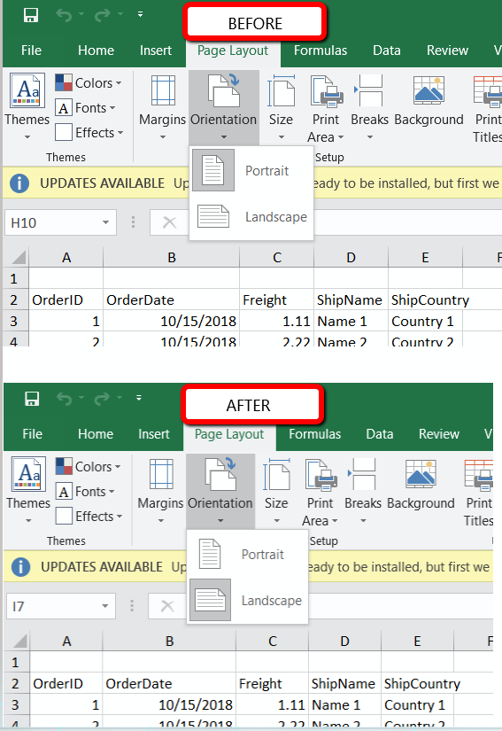

## Problem

How can I set the Page Orientation of Excel Export to Landscape in XLSX mode?

## Description

The Landscape orientation could be set by using the WorkSheetPageSetup of the WorkBook. By default, the page orientation is set to Portrait.

## Solution

 - Subscribe to the OnGridExporting event of the RadGrid control.

 - Get a reference to the XlsxFormatProvider, Workbook, and WorksheetPageSetup.
 
 ````C#
if (e.ExportType == ExportType.ExcelXlsx)
 {
     XlsxFormatProvider xlsxProvider = new XlsxFormatProvider();
     Workbook workBook = xlsxProvider.Import(Encoding.Default.GetBytes(e.ExportOutput));
     WorksheetPageSetup pageSetup = workBook.ActiveWorksheet.WorksheetPageSetup;
 } 
 ````

 - Set the PageOrientation property to Landscape:
 
 ````C#
 pageSetup.PageOrientation = PageOrientation.Landscape;
 ````

 - Send the data in the response to be downloaded on the client:
 
 ````C#
byte[] data = null;
using (MemoryStream ms = new MemoryStream())
 {
     xlsxProvider.Export(workBook, ms);
     data = ms.ToArray(); // get the byte data of the document
 }
// send the data in the response for download
Response.Clear();
Response.ContentType = "application/vnd.openxmlformats-officedocument.spreadsheetml.sheet";
Response.Headers.Remove("Content-Disposition");
Response.AppendHeader("Content-Disposition", "attachment; filename=" + RadGrid1.ExportSettings.FileName + ".xlsx");
Response.BinaryWrite(data);
Response.End();
 ````

A screenshot representing before and after implementing the abovementioned approach:

 

