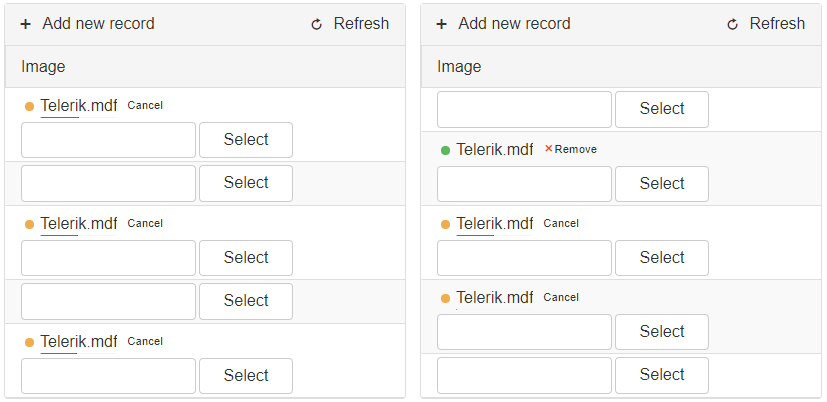

## Environment

<table>
	<tbody>
		<tr>
			<td>Product</td>
			<td>Telerik WebForms Grid for ASP.NET AJAX</td>
		</tr>
	</tbody>
</table>


## Description

This sample demonstrates the manual upload operation using **AsyncUpload** implemented in the **Grid**. 
There are two scenarios in this example, those are uploading all asynchronously and uploading one after the other.




## Solution

Select the desired files, and start the upload on button click. 

````ASP.NET
<div class="gridContainer">
    <telerik:RadGrid RenderMode="Lightweight" runat="server" ID="RadGrid1" AllowSorting="True"
        Width="100%" AutoGenerateColumns="False" GridLines="None"
        OnNeedDataSource="RadGrid_NeedDataSource">
        <MasterTableView CommandItemDisplay="Top" DataKeyNames="OrderID">
            <Columns>
                <telerik:GridTemplateColumn DataField="OrderID" HeaderText="Image" UniqueName="Upload">
                    <ItemTemplate>
                        <telerik:RadAsyncUpload RenderMode="Lightweight" runat="server" ID="AsyncUpload1" ManualUpload="true">
                        </telerik:RadAsyncUpload>
                    </ItemTemplate>
                    <EditItemTemplate>
                    </EditItemTemplate>
                </telerik:GridTemplateColumn>
            </Columns>
        </MasterTableView>
    </telerik:RadGrid>
    <br />
    <br />
    <telerik:RadButton ID="RadButton1" runat="server" Text="Upload All Asynchronously" AutoPostBack="false" OnClientClicked="uploadAllAsync">
    </telerik:RadButton>
</div>
<div class="gridContainer">
    <telerik:RadGrid RenderMode="Lightweight" runat="server" ID="RadGrid2" AllowSorting="True"
        Width="100%"
        AutoGenerateColumns="False" GridLines="None"
        OnNeedDataSource="RadGrid_NeedDataSource">
        <MasterTableView CommandItemDisplay="Top" DataKeyNames="OrderID">
            <Columns>
                <telerik:GridTemplateColumn DataField="OrderID" HeaderText="Image" UniqueName="Upload">
                    <ItemTemplate>
                        <telerik:RadAsyncUpload RenderMode="Lightweight" runat="server" ID="AsyncUpload1" ManualUpload="true">
                        </telerik:RadAsyncUpload>
                    </ItemTemplate>
                    <EditItemTemplate>
                    </EditItemTemplate>
                </telerik:GridTemplateColumn>
            </Columns>
        </MasterTableView>
    </telerik:RadGrid>
    <br />
    <br />
    <telerik:RadButton ID="RadButton2" runat="server" Text="Upload One After The Other" AutoPostBack="false" OnClientClicked="uploadPerRow">
    </telerik:RadButton>
</div>
````

````JavaScript
// Upload All Async
function uploadAllAsync(sender, args) {
    var grid = $find('<%=RadGrid1.ClientID %>');
    var masterTable = grid.get_masterTableView();
    traverseUploadAll(masterTable);
}

function traverseUploadAll(gridTableView) {
    var dataItems = gridTableView.get_dataItems();
    for (var i = 0; i < dataItems.length; i++) {
        dataItems[i].findControl("AsyncUpload1").startUpload();
    }
}

// Upload Items one by one (per row)
function uploadPerRow(sender, args) {
    var grid = $find('<%=RadGrid2.ClientID %>');
    var masterTable = grid.get_masterTableView();
    startRowUpload(masterTable, 0);
}
function startRowUpload(masterTable, index) {
    var item = masterTable.get_dataItems()[index];
    var asyncUpload = item.findControl("AsyncUpload1");

    if (asyncUpload._selectedFilesCount < 1) {
        startRowUpload(masterTable, ++index)
        return false;
    }

    function filesUploaded() { /* Event handler for AsyncUpload after file upload has finished */
        for (var i = ++index; i < masterTable.get_dataItems().length; i++) {
            var nextItem = masterTable.get_dataItems()[i];
            if (nextItem.findControl("AsyncUpload1")._selectedFilesCount > 0) {
                startRowUpload(masterTable, i);
                break;
            }
        }
    }
    asyncUpload.startUpload();
    asyncUpload.add_filesUploaded(filesUploaded);
}
````

````C#
protected void RadGrid_NeedDataSource(object sender, GridNeedDataSourceEventArgs e)
{
    (sender as RadGrid).DataSource = OrdersTable(); 
}

private DataTable OrdersTable()
{
    DataTable dt = new DataTable();

    dt.Columns.Add(new DataColumn("OrderID", typeof(int)));

    dt.PrimaryKey = new DataColumn[] { dt.Columns["OrderID"] };

    for (int i = 0; i < 4; i++)
    {
        int index = i + 1;

        DataRow row = dt.NewRow();

        row["OrderID"] = index;

        dt.Rows.Add(row);
    }

    return dt;
}
````
````VB
Protected Sub RadGrid1_NeedDataSource(sender As Object, e As GridNeedDataSourceEventArgs)
    CType(sender, RadGrid).DataSource = OrdersTable()
End Sub

Private Function OrdersTable() As DataTable
    Dim dt As New DataTable()

    dt.Columns.Add(New DataColumn("OrderID", GetType(Int32)))

    Dim PrimaryKeyColumns As DataColumn() = New DataColumn(0) {}

    PrimaryKeyColumns(0) = dt.Columns("OrderID")

    dt.PrimaryKey = PrimaryKeyColumns

    For i As Integer = 0 To 100 - 1
        Dim index As Integer = i + 1
        Dim row As DataRow = dt.NewRow()

        row("OrderID") = index

        dt.Rows.Add(row)
    Next

    Return dt
End Function
````


    
     