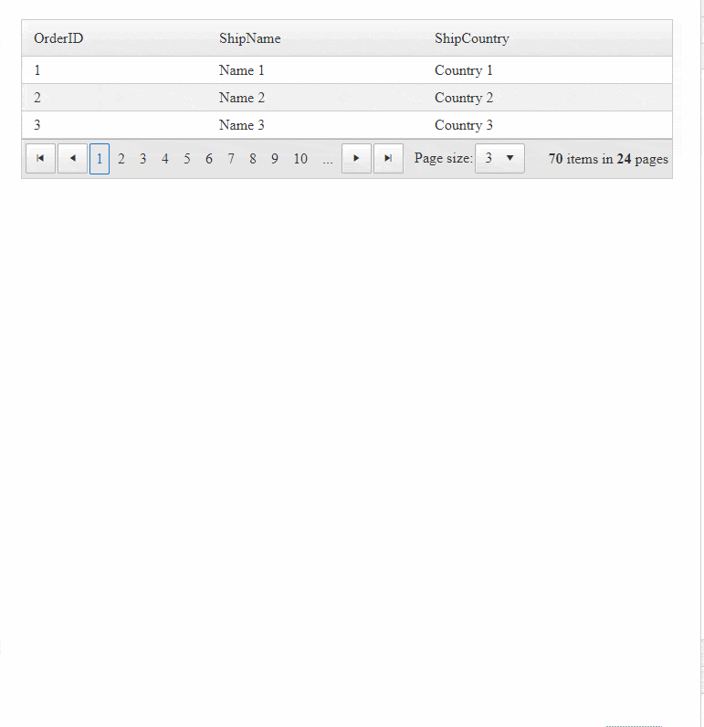

### HOW TO

Make the Grid more responsive by stacking the columns on small screens.



### DESCRIPTION

This example is using CSS and further improved with hints from the [Joshua Hibbert](https://codepen.io/joshnh/)'s Code Pen [Getting Responsive Tables to Behave](https://codepen.io/joshnh/pen/vOxxQX).

### SOLUTION

**Note**: This example hides the Grid header row, and so functionalities such as *Sorting*, *Filtering* and *Grouping* will not be available on small screens.

Example **RadGrid** definition

````XML
<telerik:RadGrid ID="RadGrid1" runat="server" AllowPaging="True" PageSize="3" OnItemDataBound="RadGrid1_ItemDataBound"
    GridLines="None" Width="100%" MasterTableView-TableLayout="Auto"
    OnNeedDataSource="RadGrid1_NeedDataSource">
    <MasterTableView AutoGenerateColumns="False" DataKeyNames="OrderID">
        <Columns>
            <telerik:GridBoundColumn DataField="OrderID" DataType="System.Int32"
                HeaderText="OrderID"
                ReadOnly="True" UniqueName="OrderID">
            </telerik:GridBoundColumn>
            <telerik:GridBoundColumn DataField="ShipName" HeaderText="ShipName"
                UniqueName="ShipName">
            </telerik:GridBoundColumn>
            <telerik:GridBoundColumn DataField="ShipCountry"
                HeaderText="ShipCountry"
                UniqueName="ShipCountry">
            </telerik:GridBoundColumn>
        </Columns>
    </MasterTableView>
</telerik:RadGrid>
````

**CSS** styles to make the **Columns Responsive**

````CSS
<style>
    body {
        color: #333;
        padding: 1.5em;
    }
 
    .RadGrid {
        min-width: fit-content;
    }
 
        .RadGrid table {
            border-collapse: collapse;
            width: 100%;
        }
 
        .RadGrid th {
            background-color: #eee;
            font-weight: bold;
        }
 
        .RadGrid th,
        .RadGrid td {
            border: 0.125em solid #333;
            line-height: 1.5;
            padding: 0.75em;
            text-align: left;
        }
 
 
    html body .RadGrid .rgRow,
    html body .RadGrid .rgAltRow,
    html body .RadGrid .rgEditRow,
    html body .RadGrid .rgFooter,
    html body .RadGrid .rgGroupHeader {
        height: auto;
    }
 
    /* Stack rows vertically on small screens */
    @media (max-width: 30em) {
        /* Hide column labels */
        .RadGrid thead tr {
            position: absolute;
            top: -9999em;
            left: -9999em;
        }
 
        .RadGrid tr {
            border: 0.125em solid #333;
        }
            /* Leave a space between table rows and rows and pager */
            .RadGrid tr + tr,
            .RadGrid .rgPager {
                margin-top: 0.5em;
            }
 
        /* Get table cells to act like rows */
        .RadGrid tr,
        .RadGrid td {
            display: block;
        }
 
        .RadGrid td {
            border: none;
            border-bottom: 0.125em solid #333;
            /* Leave a space for data labels */
            padding-left: 50%;
        }
            /* Add data labels */
            .RadGrid td:before {
                content: attr(data-label);
                display: inline-block;
                font-weight: bold;
                line-height: 1.5;
                margin-left: 0;
                width: 50%;
            }
        /* Show only the current page number*/
        .RadGrid .rgWrap.rgNumPart a:not(.rgCurrentPage) {
            display: none;
        }
 
        .RadGrid .rgWrap.rgAdvPart {
            margin-top: 10px;
        }
    }
    /* Stack labels vertically on smaller screens */
    @media (max-width: 20em) {
        .RadGrid td {
            padding-left: 0.75em;
        }
 
            .RadGrid td:before {
                display: block;
                margin-bottom: 0.75em;
                margin-left: 0;
            }
    }
</style>
````

The following code is **OPTIONAL**. Bind dummy data to the Grid in this example.

````C#

protected void RadGrid1_NeedDataSource(object sender, GridNeedDataSourceEventArgs e)
{
    (sender as RadGrid).DataSource = GetGridSource();
}
 
private DataTable GetGridSource()
{
    DataTable dataTable = new DataTable();
 
    dataTable.Columns.Add(new DataColumn("OrderID", typeof(int)));
    dataTable.Columns.Add(new DataColumn("OrderDate", typeof(DateTime)));
    dataTable.Columns.Add(new DataColumn("Freight", typeof(decimal)));
    dataTable.Columns.Add(new DataColumn("ShipName", typeof(string)));
    dataTable.Columns.Add(new DataColumn("ShipCountry", typeof(string)));
 
    dataTable.PrimaryKey = new DataColumn[] { dataTable.Columns["OrderID"] };
 
    for (int i = 0; i < 70; i++)
    {
        DataRow row = dataTable.NewRow();
        row["OrderID"] = i + 1;
        row["ShipName"] = "Name " + (i + 1);
        row["ShipCountry"] = "Country " + (i + 1);
 
        dataTable.Rows.Add(row);
    }
 
    return dataTable;
}
 
protected void RadGrid1_ItemDataBound(object sender, GridItemEventArgs e)
{
    if (e.Item is GridDataItem &&!e.Item.IsInEditMode )
    {
        var item = e.Item as GridDataItem;
        foreach (GridColumn col in RadGrid1.MasterTableView.RenderColumns)
        {
            if (!(col is GridExpandColumn) && !(col is GridRowIndicatorColumn))
            {
                string colText = string.IsNullOrEmpty(col.HeaderText) ? col.UniqueName : col.HeaderText;
                item[col.UniqueName].Attributes.Add("data-label", colText);
            }
        }
    }
}
````

For further customization, you can follow the suggestions in the first two points of the [Improve Your Debugging Skills with Chrome DevTools](https://www.telerik.com/blogs/improve-your-debugging-skills-with-chrome-devtools) blog post. 

Once you know the styles you need to override, you can use the same style selector and add "html body " in front of it to make it more specific, "stronger". 

More information on CSS specificity you can find here: 

- [Specifics on CSS Specificity](https://css-tricks.com/specifics-on-css-specificity)
- [CSS Specificity: Things You Should Know](https://www.smashingmagazine.com/2007/07/css-specificity-things-you-should-know/)
- [Specificity - CSS | MSDN](https://developer.mozilla.org/en/docs/Web/CSS/Specificity)

## See also

- [RadGrid Mobile Rendering Overview](https://docs.telerik.com/devtools/aspnet-ajax/controls/grid/mobile-support/mobile-rendering/overview)
