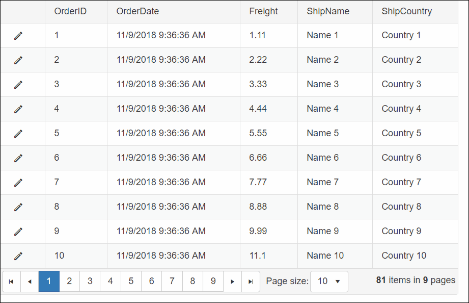

## DESCRIPTION

When in browser mode, the GridNumericColumn looks and behaves like a standard GridBoundColumn. When in edit mode, however, it displays a RadNumericTextBox control. This column type is for numeric values. Hence, non-numeric characters are not allowed.

In case of an invalid character, there is a red exclamation mark shown for a blink of a moment. This error indication is not very talkative and does not provide a clearly stated message why the input is not accepted. Showing a tooltip describing the error would provide a better user experience.

  

## SOLUTION

Here is one example of using RadToolTipManager for creating a Tooltip that gives feedback about the error.

**Note:** The steps below are targeting the RadNumericTextBox in a GridNumericColumn but the approach is applicable for all input controls.

1. Attach the *onError*and *onKeyPress*Client-side events to the RadNumeriTextBox in the ItemDataBound event handler of the RadGrid control.
````C#
protected void RadGrid1_ItemDataBound(object sender, GridItemEventArgs e)
{
    if (e.Item.IsInEditMode)
    {
        GridEditFormItem dataItem = e.Item as GridEditFormItem;
        RadNumericTextBox numericTextBox = dataItem["Freight"].Controls[0] as RadNumericTextBox;
        numericTextBox.ClientEvents.OnError = "onError";
        numericTextBox.ClientEvents.OnKeyPress = "onKeyPress";
    }
}
````

1. Set up the RadToolTipManager in the markup according to your needs.
````XML
<telerik:RadToolTipManager ID="RadToolTipManager1" runat="server" Position="MiddleRight" RelativeTo="Element"
    Animation="Fade" ShowEvent="FromCode" HideEvent="FromCode">
</telerik:RadToolTipManager>
````

1. Create the tooltip in the *onError*event handler and show it.
````JavaScript
function onError(sender, args) {
    tooltipManager = $find("<%= RadToolTipManager1.ClientID %>");
    tooltip = tooltipManager.createToolTip(sender.get_element());
    var message = 'Invalid input! Use only digits!';
    tooltip.set_content(message);
    tooltip.show();
}
````

1. Hide the Tooltip in the OnKeyPress event handler.
````JavaScript
function onKeyPress(sender, args) {
    HideTooltip();
}
function HideTooltip() {
    var tip = Telerik.Web.UI.RadToolTip.getCurrent();
    if (tip) tip.hide();
}
````
 

