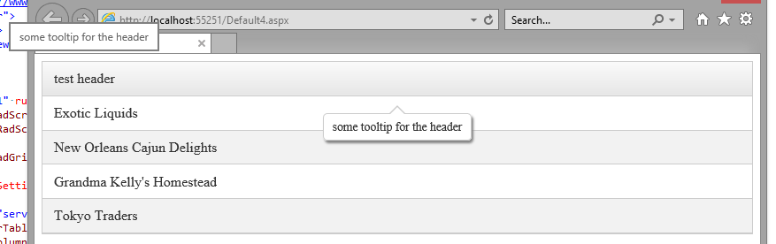

## Problem

The RadGrid header is showing two tooltips when RadToolTipManager is used to show its tooltip.

This happens when column resizing is enabled for the grid (ClientSettings-Resizing-AllowColumnResize="true") and automatic tooltip generation is used for the tooltip manager (Autotooltipify="true").



## Description

The tooltip manager attaches a mousever handler for the target (the header cell in this case) and removes its title attribute so the browser tooltip is not shown. When column resizing is enabled, however, moving the mouse over the header cell updates it and, among other things, sets its title attribute again. This causes the browser to show a tooltip.

## Solution

There are two ways to avoid this:
 - disable column resizing if this is an option for you: **ClientSettings-Resizing-AllowColumnResize="true"**
 
 - override the function that sets the tittle attribute and remove it after it runs:  

 ````ASPX
 <telerik:RadGrid
     ClientSettings-Resizing-AllowColumnResize="true"
     runat="server" ID="rg1" OnNeedDataSource="rg1_NeedDataSource" RenderMode="Lightweight"  AutoGenerateColumns="false">
     <MasterTableView>
         <Columns>
             <telerik:GridBoundColumn DataField="someField" HeaderText="test header" HeaderTooltip="some  tooltip for the header"></telerik:GridBoundColumn>
         </Columns>
     </MasterTableView>
 </telerik:RadGrid>
 
 <telerik:RadToolTipManager RenderMode="Lightweight" ID="DisplayContentTooltip"
      runat="server" CssClass="tooltipStyle" AutoTooltipify="true" AutoCloseDelay="0"  RelativeTo="Element"
     Position="BottomCenter">
 </telerik:RadToolTipManager>
  
 <script>
     var oldHandler = Telerik.Web.UI.GridColumn.prototype._onLocalMouseMoveHandler;
     Telerik.Web.UI.GridColumn.prototype._onLocalMouseMoveHandler = function (e)
     {
         oldHandler.call(this, e);
         this.get_element().title = "";
     }
 </script>
 ````

 ````C#
 protected DataTable GetDummyData()
 {
     DataTable tbl = new DataTable();
     tbl.Columns.Add(new DataColumn("id", typeof(decimal)));
     tbl.Columns.Add(new DataColumn("someField", typeof(string)));
     tbl.Columns.Add(new DataColumn("moreData", typeof(bool)));
     tbl.Columns.Add(new DataColumn("someColumn", typeof(string)));
     tbl.Rows.Add(new object[] { 1, "Exotic Liquids", false, "firstRecord4" });
     tbl.Rows.Add(new object[] { 2, "New Orleans Cajun Delights", true, "secondRecord4" });
     tbl.Rows.Add(new object[] { 3, "Grandma Kelly's Homestead", true, "thirdRecord4" });
     tbl.Rows.Add(new object[] { 4, "Tokyo Traders", false, "fourthRecord4" });
  
     return tbl;
 }
  
 protected void rg1_NeedDataSource(object sender, GridNeedDataSourceEventArgs e)
 {
     (sender as RadGrid).DataSource = GetDummyData();
 }
 ````

 