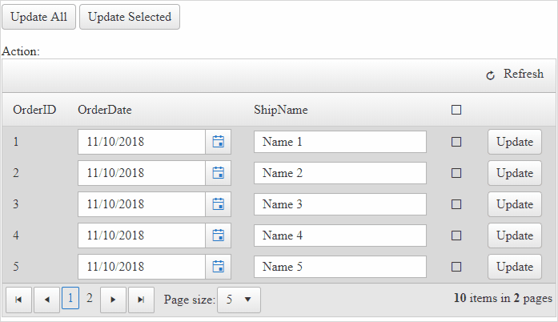

## DESCRIPTION

For bulk data-editing, RadGrid has a built-in functionality called [Batch Editing](https://demos.telerik.com/aspnet-ajax/grid/examples/data-editing/batch-editing/defaultcs.aspx) which is using client-side operation. In some scenarios, one would like to use bulk editing using server-side operations.

## SOLUTION

The following approach uses [InPlace EditMode (server-side data editing)](https://docs.telerik.com/devtools/aspnet-ajax/controls/grid/data-editing/edit-mode/in-place) to do bulk updates on grid items.

This scenario, covers the following options:

- Update individual rows
- Update selected rows
- Update all rows


#### Demo



Click the following link to **Download** a runnable sample: [radgrid_update_bulk_conditional_inplace.zip](files/radgrid_update_bulk_conditional_inplace.zip) (Note: You will need to add the **Telerik.Web.UI.dll** to the **Bin** folder to be able to run the sample)

OR 

Copy the **Code Snippets** below

````JavaScript
<script type="text/javascript">
    // Client-Side logic executed when the HeaderCheckBox selection is toggled
    // Checks/Unchecks the checkboxes in the Grid rows
    function checkAllChanged(sender, args) {
        // jQuery code to find all the checkboxes
        var checkboxes = $('.RadGrid .rgMasterTable .rgEditRow td .RadCheckBox').each(function (e) {
            // this.control casts the jQuery object to RadCheckBox object, then using its API, setting its checked state
            this.control.set_checked(sender.get_checked());
        })
    }
</script>
````

**Grid definition**

````XML
<%--Enable AJAX for all control by wrapping the controls in a Panel and add the panel to the AjaxSettings of RadAjaxManager--%>
<telerik:RadAjaxManager ID="RadAjaxManager1" runat="server" DefaultLoadingPanelID="RadAjaxLoadingPanel1">
    <AjaxSettings>
        <telerik:AjaxSetting AjaxControlID="Panel1">
            <UpdatedControls>
                <telerik:AjaxUpdatedControl ControlID="Panel1" />
            </UpdatedControls>
        </telerik:AjaxSetting>
    </AjaxSettings>
</telerik:RadAjaxManager>
<telerik:RadAjaxLoadingPanel ID="RadAjaxLoadingPanel1" runat="server" Skin="Default"></telerik:RadAjaxLoadingPanel>

<asp:Panel ID="Panel1" runat="server">
    <%--Update Button--%>
    <telerik:RadButton ID="btnUpdateAll" runat="server" Text="Update All" OnClick="btnUpdateAll_Click"></telerik:RadButton>
    <%--Update Selected Button--%>
    <telerik:RadButton ID="btnUpdateSelected" runat="server" Text="Update Selected" OnClick="btnUpdateSelected_Click"></telerik:RadButton>
    <br />
    <br />
    <asp:Label ID="Label1" runat="server" Text="Action:"></asp:Label>
    <telerik:RadGrid ID="RadGrid1" runat="server" AllowPaging="True" AutoGenerateColumns="false" PageSize="5"
        AllowMultiRowEdit="true"
        OnNeedDataSource="RadGrid1_NeedDataSource"
        OnInsertCommand="RadGrid1_InsertCommand"
        OnUpdateCommand="RadGrid1_UpdateCommand"
        OnDeleteCommand="RadGrid1_DeleteCommand"
        OnPreRender="RadGrid1_PreRender">
        <MasterTableView
            CommandItemDisplay="Top"
            DataKeyNames="OrderID"
            InsertItemDisplay="Top"
            InsertItemPageIndexAction="ShowItemOnLastPage"
            EditMode="InPlace"
            RetainExpandStateOnRebind="true">
            <CommandItemSettings ShowAddNewRecordButton="false" />
            <Columns>
                <telerik:GridBoundColumn DataField="OrderID" DataType="System.Int32"
                    FilterControlAltText="Filter OrderID column" HeaderText="OrderID"
                    ReadOnly="True" SortExpression="OrderID" UniqueName="OrderID">
                </telerik:GridBoundColumn>
                <telerik:GridDateTimeColumn DataField="OrderDate" DataType="System.DateTime"
                    FilterControlAltText="Filter OrderDate column" HeaderText="OrderDate"
                    SortExpression="OrderDate" UniqueName="OrderDate">
                </telerik:GridDateTimeColumn>
                <telerik:GridBoundColumn DataField="ShipName"
                    FilterControlAltText="Filter ShipName column" HeaderText="ShipName"
                    SortExpression="ShipName" UniqueName="ShipName">
                </telerik:GridBoundColumn>
                <%--Template column is best choice for custom implementations--%>
                <telerik:GridTemplateColumn UniqueName="TemplateCheckboxColumn" DataField="IsChecked">
                    <HeaderTemplate>
                        <%--RadCheckBox that will appear in the Column header, bound to OnClientCheckedChanged client-side event--%>
                        <telerik:RadCheckBox ID="CheckAllCheckBox" runat="server" AutoPostBack="false" OnClientCheckedChanged="checkAllChanged"></telerik:RadCheckBox>
                    </HeaderTemplate>
                    <EditItemTemplate>
                        <%--RadCheckBox that will appear in each row--%>
                        <telerik:RadCheckBox ID="RowCheckBox" runat="server" AutoPostBack="false" Checked='<%# Bind("IsChecked") %>'></telerik:RadCheckBox>
                    </EditItemTemplate>
                </telerik:GridTemplateColumn>
                <telerik:GridTemplateColumn>
                    <EditItemTemplate>
                        <%--Update button that will appear in each row--%>
                        <telerik:RadButton ID="bntUpdate" runat="server" Text="Update" CommandName="Update"></telerik:RadButton>
                    </EditItemTemplate>
                </telerik:GridTemplateColumn>
            </Columns>
        </MasterTableView>
    </telerik:RadGrid>
</asp:Panel>
````

**Backend Code**

````C#
public DataTable SessionDataSource
{
    get
    {
        string sessionKey = "SessionDataSource";
 
        if (Session[sessionKey] == null || !IsPostBack)
        {
            Session[sessionKey] = OrdersTable();
        }
        return (DataTable)Session[sessionKey];
    }
}
 
// READ (data binding)
protected void RadGrid1_NeedDataSource(object sender, GridNeedDataSourceEventArgs e)
{
    RadGrid1.DataSource = SessionDataSource;
}
 
// UPDATE
protected void RadGrid1_UpdateCommand(object sender, GridCommandEventArgs e)
{
    GridEditableItem editedItem = e.Item as GridEditableItem;
 
    if (!UpdateRow(editedItem))
    {
        e.Canceled = true;
    }
}
private bool UpdateRow(GridEditableItem editableItem)
{
    //Locate the changed row in the DataSource
    DataRow[] changedRows = SessionDataSource.Select(string.Format("OrderID = {0}", editableItem.GetDataKeyValue("OrderID")));
 
    if (changedRows.Length != 1)
    {
        this.Label1.Text += "Unable to locate the Order for updating.";
        return false;
    }
 
    //Update new values
    Hashtable newValues = new Hashtable();
    editableItem.OwnerTableView.ExtractValuesFromItem(newValues, editableItem);
    changedRows[0].BeginEdit();
    try
    {
        foreach (DictionaryEntry entry in newValues)
        {
            changedRows[0][(string)entry.Key] = entry.Value;
        }
        changedRows[0].EndEdit();
    }
    catch (Exception ex)
    {
        changedRows[0].CancelEdit();
        Label1.Text += string.Format("Unable to update Orders. Reason: {0}", ex.Message);
        return false;
    }
 
    return true;
}
 
private DataTable OrdersTable()
{
    DataTable dt = new DataTable();
 
    dt.Columns.Add(new DataColumn("OrderID", typeof(int)));
    dt.Columns.Add(new DataColumn("OrderDate", typeof(DateTime)));
    dt.Columns.Add(new DataColumn("Freight", typeof(decimal)));
    dt.Columns.Add(new DataColumn("ShipName", typeof(string)));
    dt.Columns.Add(new DataColumn("ShipCountry", typeof(string)));
    dt.Columns.Add(new DataColumn("IsChecked", typeof(bool)));
 
    dt.PrimaryKey = new DataColumn[] { dt.Columns["OrderID"] };
 
    for (int i = 0; i < 10; i++)
    {
        int index = i + 1;
 
        DataRow row = dt.NewRow();
 
        row["OrderID"] = index;
        row["OrderDate"] = new DateTime(DateTime.Now.Year, DateTime.Now.Month, DateTime.Now.Day, 0, 0, 0).AddHours(index);
        row["Freight"] = index * 0.1 + index * 0.01;
        row["ShipName"] = "Name " + index;
        row["ShipCountry"] = "Country " + index;
        row["IsChecked"] = i % 3 == 0;
 
        dt.Rows.Add(row);
    }
 
    return dt;
}
// Putt all items in edit mode
protected void RadGrid1_PreRender(object sender, EventArgs e)
{
    foreach (GridItem item in RadGrid1.MasterTableView.Items)
    {
        if (item is GridEditableItem)
        {
            GridEditableItem editableItem = item as GridDataItem;
            editableItem.Edit = true;
        }
    }
    RadGrid1.Rebind();
}
 
// Button to update all records
protected void btnUpdateAll_Click(object sender, EventArgs e)
{
    // Loop through the grid items
    foreach (GridEditableItem item in RadGrid1.Items)
    {
        // Check whether the item is in edit mode
        if (item.IsInEditMode)
        {
            // update the item
            UpdateRow(item);
        }
    }
}
 
protected void btnUpdateSelected_Click(object sender, EventArgs e)
{
    // Loop through the grid items
    foreach (GridEditableItem item in RadGrid1.Items)
    {
        // Check whether the item is in edit mode
        if (item.IsInEditMode)
        {
            // get reference to the checkbox from the Template column
            RadCheckBox rCheckBox = item["TemplateCheckboxColumn"].FindControl("RowCheckBox") as RadCheckBox;
 
            // Check if the checkbox is checked
            if (rCheckBox.Checked == true)
            {
                // update the item
                UpdateRow(item);
            }
        }
    }
}
````
````VB
Public ReadOnly Property SessionDataSource As DataTable
    Get
        Dim sessionKey As String = "SessionDataSource"
 
        If Session(sessionKey) Is Nothing OrElse Not IsPostBack Then
            Session(sessionKey) = OrdersTable()
        End If
 
        Return CType(Session(sessionKey), DataTable)
    End Get
End Property
 
Protected Sub RadGrid1_NeedDataSource(ByVal sender As Object, ByVal e As GridNeedDataSourceEventArgs)
    RadGrid1.DataSource = SessionDataSource
End Sub
 
Protected Sub RadGrid1_UpdateCommand(ByVal sender As Object, ByVal e As GridCommandEventArgs)
    Dim editedItem As GridEditableItem = TryCast(e.Item, GridEditableItem)
 
    If Not UpdateRow(editedItem) Then
        e.Canceled = True
    End If
End Sub
 
Private Function UpdateRow(ByVal editableItem As GridEditableItem) As Boolean
    Dim changedRows As DataRow() = SessionDataSource.[Select](String.Format("OrderID = {0}", editableItem.GetDataKeyValue("OrderID")))
 
    If changedRows.Length <> 1 Then
        Me.Label1.Text += "Unable to locate the Order for updating."
        Return False
    End If
 
    Dim newValues As Hashtable = New Hashtable()
    editableItem.OwnerTableView.ExtractValuesFromItem(newValues, editableItem)
    changedRows(0).BeginEdit()
 
    Try
 
        For Each entry As DictionaryEntry In newValues
            changedRows(0)(CStr(entry.Key)) = entry.Value
        Next
 
        changedRows(0).EndEdit()
    Catch ex As Exception
        changedRows(0).CancelEdit()
        Label1.Text += String.Format("Unable to update Orders. Reason: {0}", ex.Message)
        Return False
    End Try
 
    Return True
End Function
 
Private Function OrdersTable() As DataTable
    Dim dt As DataTable = New DataTable()
    dt.Columns.Add(New DataColumn("OrderID", GetType(Integer)))
    dt.Columns.Add(New DataColumn("OrderDate", GetType(DateTime)))
    dt.Columns.Add(New DataColumn("Freight", GetType(Decimal)))
    dt.Columns.Add(New DataColumn("ShipName", GetType(String)))
    dt.Columns.Add(New DataColumn("ShipCountry", GetType(String)))
    dt.Columns.Add(New DataColumn("IsChecked", GetType(Boolean)))
    dt.PrimaryKey = New DataColumn() {dt.Columns("OrderID")}
 
    For i As Integer = 0 To 10 - 1
        Dim index As Integer = i + 1
        Dim row As DataRow = dt.NewRow()
        row("OrderID") = index
        row("OrderDate") = New DateTime(DateTime.Now.Year, DateTime.Now.Month, DateTime.Now.Day, 0, 0, 0).AddHours(index)
        row("Freight") = index * 0.1 + index * 0.01
        row("ShipName") = "Name " & index
        row("ShipCountry") = "Country " & index
        row("IsChecked") = i Mod 3 = 0
        dt.Rows.Add(row)
    Next
 
    Return dt
End Function
 
Protected Sub RadGrid1_PreRender(ByVal sender As Object, ByVal e As EventArgs)
    For Each item As GridItem In RadGrid1.MasterTableView.Items
 
        If TypeOf item Is GridEditableItem Then
            Dim editableItem As GridEditableItem = TryCast(item, GridDataItem)
            editableItem.Edit = True
        End If
    Next
 
    RadGrid1.Rebind()
End Sub
 
Protected Sub btnUpdateAll_Click(ByVal sender As Object, ByVal e As EventArgs)
    For Each item As GridEditableItem In RadGrid1.Items
 
        If item.IsInEditMode Then
            UpdateRow(item)
        End If
    Next
End Sub
 
Protected Sub btnUpdateSelected_Click(ByVal sender As Object, ByVal e As EventArgs)
    For Each item As GridEditableItem In RadGrid1.Items
 
        If item.IsInEditMode Then
            Dim rCheckBox As RadCheckBox = TryCast(item("TemplateCheckboxColumn").FindControl("RowCheckBox"), RadCheckBox)
 
            If rCheckBox.Checked = True Then
                UpdateRow(item)
            End If
        End If
    Next
End Sub
````
 
