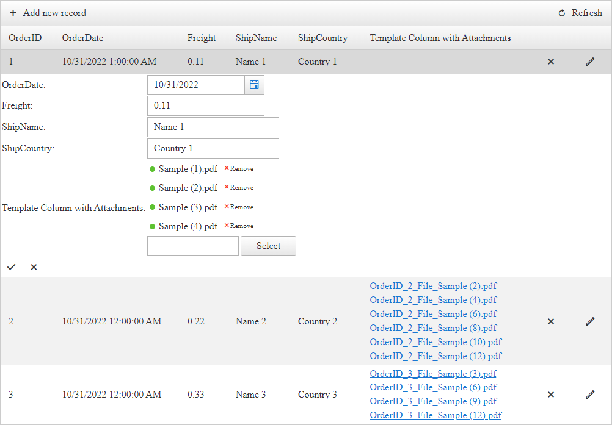

## DESCRIPTION

Upload and display multiple attachments in RadGrid using a GridTemplateColumn with RadAsyncUpload.



The built-in [GridAttachmentColumn](#gridattachmentcolumn) only uploads and displays one attachment at the time, see [Grid - Column Types](https://demos.telerik.com/aspnet-ajax/grid/examples/columns-rows/columns/column-types/defaultcs.aspx).

However, a solution to upload and display multiple attachments can be implemented additionally.

## SOLUTION

For this scenario, you will need to have the [Manual CRUD Operations](https://demos.telerik.com/aspnet-ajax/grid/examples/data-editing/manual-crud-operations/defaultcs.aspx) implemented for RadGrid.

Moving on, adjust the Grid markup as follows:

1. Add a GridTemplateColumn to RadGrid - This will contain the custom Controls to Upload and display the attachments
2. Add an [asp:PlaceHolder](https://learn.microsoft.com/en-us/dotnet/api/system.web.ui.webcontrols.placeholder) to the Column's **ItemTemplate** - A WebForms Control that will act as placeholder for the attachments' HyperLinks we add programmatically
3. Add a [RadAsyncUpload]() Control to the **EditItemTemplate** - This is required to Upload the files to the server

>caption Example TemplateColumn definition

````ASP.NET
<telerik:GridTemplateColumn HeaderText="Template Column with Attachments" DataField="Attachments">
    <ItemTemplate>
        <asp:PlaceHolder ID="PlaceHolder1" runat="server"></asp:PlaceHolder>
    </ItemTemplate>
    <EditItemTemplate>
        <telerik:RadAsyncUpload ID="RadAsyncUpload1" runat="server" MultipleFileSelection="Automatic" OnFileUploaded="RadAsyncUpload1_FileUploaded">
        </telerik:RadAsyncUpload>
    </EditItemTemplate>
</telerik:GridTemplateColumn>
````

**THE MAGIC**

When inserting or updating, access the AsyncUpload in the Grid's Insert/Edit form and loop through the Uploaded Files collecting their names. Using the collection of file names, create a string containing all the file names separated by a coma.

>caption Example

````C#
// Access the AsyncUpload control
RadAsyncUpload asyncUpload = editedItem.FindControl("RadAsyncUpload1") as RadAsyncUpload;

// Get the Uploaded files
UploadedFileCollection uploadedFiles = asyncUpload.UploadedFiles;

// Create a new list of strings
List<string> fileNamesList = new List<string>();

// Loop through each uploaded file
foreach (UploadedFile fileToUpload in uploadedFiles)
{
    // add the filename to the list of strings
    fileNamesList.Add(GetNewFileName(fileToUpload.FileName, orderId));
}

// Finally, concatenate all values separated by a coma and update the database field with the new string
newValues["Attachments"] = string.Join(",", fileNamesList.ToArray()); // Result: File1,File2,File3, etc
````
````VB
'Access the AsyncUpload control
Dim asyncUpload As RadAsyncUpload = TryCast(editedItem.FindControl("RadAsyncUpload1"), RadAsyncUpload)

'Get the Uploaded files
Dim uploadedFiles As UploadedFileCollection = asyncUpload.UploadedFiles

'Create a new list of strings
Dim fileNamesList As List(Of String) = New List(Of String)()

'Loop through each uploaded file
For Each fileToUpload As UploadedFile In uploadedFiles
    'add the filename to the list of strings
    fileNamesList.Add(GetNewFileName(fileToUpload.FileName, orderId))
Next

'Finally, concatenate all values separated by a coma and update the database field with the new string
newValues("Attachments") = String.Join(",", fileNamesList.ToArray()) 'Result: File1,File2,File3, etc
````

When displaying, fetch the data from the database, split the string by the coma to get a collection of file names. After that, loop through each filename and create a HyperLink for it. That HyperLink will be added to the PlaceHolder's Controls collection.

>caption Example

````C#
protected void RadGrid1_ItemDataBound(object sender, GridItemEventArgs e)
{
    // ItemTemplate
    if (e.Item is GridDataItem)
    {
        GridDataItem item = (GridDataItem)e.Item;

        // Get the data key value
        int orderId = (int)item.GetDataKeyValue("OrderID");

        // find the related row in the database
        DataRow foundItem = SessionDataSource.Select(String.Format("OrderID = '{0}'", orderId)).FirstOrDefault();

        // get the list of file paths by splitting the values separated by coma
        List<string> filePaths = foundItem["Attachments"].ToString().Split(',').Select(path => path.Trim())
                                                                        .Where(path => !string.IsNullOrEmpty(path)).ToList();

        if (filePaths.Count > 0)
        {
            // access the placeholder 
            PlaceHolder ph1 = item.FindControl("PlaceHolder1") as PlaceHolder;

            // loop through each path
            foreach (string filePath in filePaths)
            {
                // Check if the file exists on the specific path
                if (File.Exists(Server.MapPath("~/Attachments/" + filePath)))
                {
                    // if so create Hyperlinks pointing to the Path
                    HyperLink link = new HyperLink();

                    link.NavigateUrl = "/Attachments/" + filePath;
                    link.Text = filePath;
                    link.Target = "_blank";

                    // add the hyperlink to the PlaceHolder
                    ph1.Controls.Add(link);
                }
                else
                {
                    // Notify user the file is missing from server
                    ph1.Controls.Add(new Literal() { Text = filePath + " (missing)" });
                }

                // add line breaks to display each record in a new line
                ph1.Controls.Add(new Literal() { Text = "</br>" });
            }
        }
    }
}
````
````VB
Protected Sub RadGrid1_ItemDataBound(ByVal sender As Object, ByVal e As GridItemEventArgs)
    'ItemTemplate
    If TypeOf e.Item Is GridDataItem Then
        Dim item As GridDataItem = CType(e.Item, GridDataItem)

        'Get the data key value
        Dim orderId As Integer = CInt(item.GetDataKeyValue("OrderID"))

        'find the related row in the database
        Dim foundItem As DataRow = SessionDataSource.Select(String.Format("OrderID = '{0}'", orderId)).FirstOrDefault()

        'get the list of file paths by splitting the values separated by coma
        Dim filePaths As List(Of String) = foundItem("Attachments").ToString().Split(","c).[Select](Function(path) path.Trim()).Where(Function(path) Not String.IsNullOrEmpty(path)).ToList()

        If filePaths.Count > 0 Then
            'access the placeholder 
            Dim ph1 As PlaceHolder = TryCast(item.FindControl("PlaceHolder1"), PlaceHolder)

            'loop through each path
            For Each filePath As String In filePaths

                'Check if the file exists on the specific path
                If File.Exists(Server.MapPath("~/Attachments/" & filePath)) Then
                    'if so create Hyperlinks pointing to the Path
                    Dim link As HyperLink = New HyperLink()

                    link.NavigateUrl = "/Attachments/" & filePath
                    link.Text = filePath
                    link.Target = "_blank"

                    'add the hyperlink to the PlaceHolder
                    ph1.Controls.Add(link)
                Else
                    'Notify user the file is missing from server
                    ph1.Controls.Add(New Literal() With {
                    .Text = filePath & " (missing)"
                })
                End If

                'add line breaks to display each record in a new line
                ph1.Controls.Add(New Literal() With {
                .Text = "</br>"
            })
            Next
        End If
    End If
End Sub
````

Last, but not least, handling the actual file upload. We want to customize the destination the files will be uploaded to as well as the names we want to use for the uploaded files.

````C#
// Upload the Files to a Specific Directory
protected void RadAsyncUpload1_FileUploaded(object sender, FileUploadedEventArgs e)
{
    RadAsyncUpload asyncUpload = (RadAsyncUpload)sender;

    // NamingContainer is the Grid's EditForm since the AsyncUpload is located inside the EditItemTemplate
    GridEditFormItem editFormItem = asyncUpload.NamingContainer as GridEditFormItem;

    int orderId = 1;

    // If Inserting there is no existing records for which we can extract the DataKeyValue
    if (editFormItem is GridEditFormInsertItem)
    {
        // This example demonstrates in-memory editing to avoid setting up a database.
        // In case of databases a new primary key value will be generated for inserted record
        DataRow[] allValues = SessionDataSource.Select("OrderID = MAX(OrderID)");

        if (allValues.Length > 0)
        {
            orderId = int.Parse(allValues[0]["OrderID"].ToString()) + 1;
        }
    }
    else
    {
        // For existing records, we can access the DataKeyValue
        orderId = (int)editFormItem.GetDataKeyValue("OrderID");
    }

    // Set the path where the Files will be uploaded to
    string newFilePath = string.Format("{0}/{1}", Server.MapPath("~/Attachments"), GetNewFileName(e.File.FileName, orderId));

    e.File.SaveAs(newFilePath); // Save the File to the new path/directory
}

// Helper function to format the File name.
private string GetNewFileName(string fileName, int orderId)
{
    // Include OrderID in the Filename
    return string.Format("OrderID_{0}_File_{1}", orderId, fileName);
}
````
````VB
'Upload the Files to a Specific Directory
Protected Sub RadAsyncUpload1_FileUploaded(ByVal sender As Object, ByVal e As FileUploadedEventArgs)
    Dim asyncUpload As RadAsyncUpload = CType(sender, RadAsyncUpload)

    'NamingContainer is the Grid's EditForm since the AsyncUpload is located inside the EditItemTemplate
    Dim editFormItem As GridEditFormItem = TryCast(asyncUpload.NamingContainer, GridEditFormItem)

    Dim orderId As Integer = 1

    'If Inserting there is no existing records for which we can extract the DataKeyValue
    If TypeOf editFormItem Is GridEditFormInsertItem Then
        'This example demonstrates in-memory editing to avoid setting up a database.
        'In case of databases a new primary key value will be generated for inserted record
        Dim allValues As DataRow() = SessionDataSource.Select("OrderID = MAX(OrderID)")

        If allValues.Length > 0 Then
            orderId = Integer.Parse(allValues(0)("OrderID").ToString()) + 1
        End If
    Else
        'For existing records, we can access the DataKeyValue
        orderId = CInt(editFormItem.GetDataKeyValue("OrderID"))
    End If

    'Set the path where the Files will be uploaded to
    Dim newFilePath As String = String.Format("{0}/{1}", Server.MapPath("~/Attachments"), GetNewFileName(e.File.FileName, orderId))
    e.File.SaveAs(newFilePath) 'Save the File to the new path/directory
End Sub
'Helper function to format the File name.
Private Function GetNewFileName(ByVal fileName As String, ByVal orderId As Integer) As String
    'Include OrderID in the Filename
    Return String.Format("OrderID_{0}_File_{1}", orderId, fileName)
End Function
````


### Complete Code

Add the following code snippets to a WebForms page and you'll be ready to run it.

>caption ASPX markup

````ASP.NET
<asp:Label ID="Label1" runat="server" Text="Action:"></asp:Label>
<telerik:RadGrid ID="RadGrid1" runat="server" AllowPaging="True" Width="1000px"
    AutoGenerateEditColumn="true"
    AutoGenerateDeleteColumn="true"
    OnNeedDataSource="RadGrid1_NeedDataSource"
    OnInsertCommand="RadGrid1_InsertCommand"
    OnUpdateCommand="RadGrid1_UpdateCommand"
    OnDeleteCommand="RadGrid1_DeleteCommand"
    OnItemDataBound="RadGrid1_ItemDataBound">

    <MasterTableView AutoGenerateColumns="False" DataKeyNames="OrderID" CommandItemDisplay="Top" InsertItemDisplay="Top" InsertItemPageIndexAction="ShowItemOnLastPage">
        <Columns>
            <telerik:GridBoundColumn DataField="OrderID" DataType="System.Int32"
                FilterControlAltText="Filter OrderID column" HeaderText="OrderID"
                ReadOnly="True" SortExpression="OrderID" UniqueName="OrderID">
            </telerik:GridBoundColumn>
            <telerik:GridDateTimeColumn DataField="OrderDate" DataType="System.DateTime"
                FilterControlAltText="Filter OrderDate column" HeaderText="OrderDate"
                SortExpression="OrderDate" UniqueName="OrderDate">
            </telerik:GridDateTimeColumn>
            <telerik:GridNumericColumn DataField="Freight" DataType="System.Decimal"
                FilterControlAltText="Filter Freight column" HeaderText="Freight"
                SortExpression="Freight" UniqueName="Freight">
            </telerik:GridNumericColumn>
            <telerik:GridBoundColumn DataField="ShipName"
                FilterControlAltText="Filter ShipName column" HeaderText="ShipName"
                SortExpression="ShipName" UniqueName="ShipName">
            </telerik:GridBoundColumn>
            <telerik:GridBoundColumn DataField="ShipCountry"
                FilterControlAltText="Filter ShipCountry column" HeaderText="ShipCountry"
                SortExpression="ShipCountry" UniqueName="ShipCountry">
            </telerik:GridBoundColumn>
            <telerik:GridTemplateColumn HeaderText="Template Column with Attachments" DataField="Attachments">
                <ItemTemplate>
                    <asp:PlaceHolder ID="PlaceHolder1" runat="server"></asp:PlaceHolder>
                </ItemTemplate>
                <EditItemTemplate>
                    <telerik:RadAsyncUpload ID="RadAsyncUpload1" runat="server" MultipleFileSelection="Automatic" OnFileUploaded="RadAsyncUpload1_FileUploaded">
                    </telerik:RadAsyncUpload>
                </EditItemTemplate>
            </telerik:GridTemplateColumn>
        </Columns>
    </MasterTableView>
</telerik:RadGrid>
````

>caption C#/VB CodeBehind

````C#
#region Properties for CRUD Operations
public DataTable SessionDataSource
{
    get
    {
        string sessionKey = "SessionDataSource";

        if (Session[sessionKey] == null || !IsPostBack)
        {
            Session[sessionKey] = OrdersTable();
        }
        return (DataTable)Session[sessionKey];
    }
}
#endregion

#region RadGrid Events for CRUD Operations

// CREATE (Add New Record)
protected void RadGrid1_InsertCommand(object sender, GridCommandEventArgs e)
{
    GridEditableItem editedItem = e.Item as GridEditableItem;

    DataRow newRow = SessionDataSource.NewRow();

    //As this example demonstrates only in-memory editing, a new primary key value should be generated
    //This should not be applied when updating directly the database
    DataRow[] allValues = SessionDataSource.Select("OrderID = MAX(OrderID)");

    int orderId = 1;

    if (allValues.Length > 0)
    {
        orderId = int.Parse(allValues[0]["OrderID"].ToString()) + 1;
    }

    // OrderID is either 1 (if no records in the Datasource) or an incremented ID (if records exists)
    newRow["OrderID"] = orderId;

    //Set new values
    Hashtable newValues = new Hashtable();
    //The GridTableView will fill the values from all editable columns in the hash
    e.Item.OwnerTableView.ExtractValuesFromItem(newValues, editedItem);

    // Access the AsyncUpload control
    RadAsyncUpload asyncUpload = editedItem.FindControl("RadAsyncUpload1") as RadAsyncUpload;

    // Get the Uploaded files
    UploadedFileCollection uploadedFiles = asyncUpload.UploadedFiles;

    // Create a new list of strings
    List<string> fileNamesList = new List<string>();

    // Loop through each uploaded file
    foreach (UploadedFile fileToUpload in uploadedFiles)
    {
        // add the filename to the list of strings
        fileNamesList.Add(GetNewFileName(fileToUpload.FileName, orderId));
    }

    // Finally, concatenate all values separated by a coma and update the database field with the new string
    newValues["Attachments"] = string.Join(",", fileNamesList.ToArray());
    // Result: File1,File2,File3, etc

    try
    {
        foreach (DictionaryEntry entry in newValues)
        {
            newRow[(string)entry.Key] = entry.Value;
        }
    }
    catch (Exception ex)
    {
        Label1.Text += string.Format("<br />Unable to insert into Orders. Reason: {0}", ex.Message);
        e.Canceled = true;
        return;
    }

    SessionDataSource.Rows.Add(newRow);
    //Code for updating the database ca go here...
    Label1.Text += string.Format("<br />Order {0} inserted", newRow["OrderID"]);
}

// READ (data binding)
protected void RadGrid1_NeedDataSource(object sender, GridNeedDataSourceEventArgs e)
{
    (sender as RadGrid).DataSource = SessionDataSource;
}

// UPDATE
protected void RadGrid1_UpdateCommand(object sender, GridCommandEventArgs e)
{
    // EditForm item
    GridEditableItem editedItem = e.Item as GridEditableItem;

    // Get the Data key value
    int orderId = (int)editedItem.GetDataKeyValue("OrderID");

    //Locate the changed row in the DataSource
    DataRow[] changedRows = SessionDataSource.Select(string.Format("OrderID = {0}", editedItem.GetDataKeyValue("OrderID")));

    if (changedRows.Length != 1)
    {
        this.Label1.Text += "Unable to locate the Order for updating.";
        e.Canceled = true;
        return;
    }

    //Create a Hashtable
    Hashtable newValues = new Hashtable();

    // Extract values of current edited item
    e.Item.OwnerTableView.ExtractValuesFromItem(newValues, editedItem);

    // Access the AsyncUpload control
    RadAsyncUpload asyncUpload = editedItem.FindControl("RadAsyncUpload1") as RadAsyncUpload;

    // Get the Uploaded files
    UploadedFileCollection uploadedFiles = asyncUpload.UploadedFiles;

    // Create a new list of strings
    List<string> fileNamesList = new List<string>();

    // Loop through each uploaded file
    foreach (UploadedFile fileToUpload in uploadedFiles)
    {
        // add the filename to the list of strings
        fileNamesList.Add(GetNewFileName(fileToUpload.FileName, orderId));
    }

    // Finally, concatenate all values separated by a coma and update the database field with the new string
    newValues["Attachments"] = string.Join(",", fileNamesList.ToArray()); // Output: File1,File2,File3, etc


    changedRows[0].BeginEdit();
    try
    {
        foreach (DictionaryEntry entry in newValues)
        {
            changedRows[0][(string)entry.Key] = entry.Value;
        }
        changedRows[0].EndEdit();
    }
    catch (Exception ex)
    {
        changedRows[0].CancelEdit();
        Label1.Text += string.Format("Unable to update Orders. Reason: {0}", ex.Message);
        e.Canceled = true;
        return;
    }
}

// DELETE
protected void RadGrid1_DeleteCommand(object sender, GridCommandEventArgs e)
{
    GridDataItem dataItem = e.Item as GridDataItem;
    string ID = dataItem.GetDataKeyValue("OrderID").ToString();

    if (SessionDataSource.Rows.Find(ID) != null)
    {
        SessionDataSource.Rows.Find(ID).Delete();
    }
}
#endregion

#region DataSource
private DataTable OrdersTable()
{
    DataTable dt = new DataTable();

    dt.Columns.Add(new DataColumn("OrderID", typeof(int)));
    dt.Columns.Add(new DataColumn("OrderDate", typeof(DateTime)));
    dt.Columns.Add(new DataColumn("Freight", typeof(decimal)));
    dt.Columns.Add(new DataColumn("ShipName", typeof(string)));
    dt.Columns.Add(new DataColumn("ShipCountry", typeof(string)));
    dt.Columns.Add(new DataColumn("Attachments", typeof(string)));

    dt.PrimaryKey = new DataColumn[] { dt.Columns["OrderID"] };

    for (int i = 0; i < 3; i++)
    {
        int index = i + 1;

        DataRow row = dt.NewRow();

        row["OrderID"] = index;
        row["OrderDate"] = new DateTime(DateTime.Now.Year, DateTime.Now.Month, DateTime.Now.Day, 0, 0, 0).AddHours(index);
        row["Freight"] = index * 0.1 + index * 0.01;
        row["ShipName"] = "Name " + index;
        row["ShipCountry"] = "Country " + index;

        dt.Rows.Add(row);
    }

    return dt;
}
#endregion


protected string GetLinks(string filePaths)
{
    string[] paths = filePaths.Split(',');

    List<string> links = new List<string>();

    foreach (string path in paths)
    {
        links.Add(string.Format("<a href='{0}'>{1}</a>", "link", "filename"));
    }

    return string.Empty;
}

protected void RadGrid1_ItemDataBound(object sender, GridItemEventArgs e)
{
    // ItemTemplate
    if (e.Item is GridDataItem)
    {
        GridDataItem item = (GridDataItem)e.Item;

        // Get the data key value
        int orderId = (int)item.GetDataKeyValue("OrderID");

        // find the related row in the database
        DataRow foundItem = SessionDataSource.Select(String.Format("OrderID = '{0}'", orderId)).FirstOrDefault();

        // get the list of file paths by splitting the values separated by coma
        List<string> filePaths = foundItem["Attachments"].ToString().Split(',').Select(path => path.Trim())
                                                                        .Where(path => !string.IsNullOrEmpty(path)).ToList();

        if (filePaths.Count > 0)
        {
            // access the placeholder 
            PlaceHolder ph1 = item.FindControl("PlaceHolder1") as PlaceHolder;

            // loop through each path
            foreach (string filePath in filePaths)
            {
                // Check if the file exists on the specific path
                if (File.Exists(Server.MapPath("~/Attachments/" + filePath)))
                {
                    // if so create Hyperlinks pointing to the Path
                    HyperLink link = new HyperLink();

                    link.NavigateUrl = "/Attachments/" + filePath;
                    link.Text = filePath;
                    link.Target = "_blank";

                    // add the hyperlink to the PlaceHolder
                    ph1.Controls.Add(link);
                }
                else
                {
                    // Notify user the file is missing from server
                    ph1.Controls.Add(new Literal() { Text = filePath + " (missing)" });
                }

                // add line breaks to display each record in a new line
                ph1.Controls.Add(new Literal() { Text = "</br>" });
            }
        }
    }
}
// Upload the Files to a Specific Directory
protected void RadAsyncUpload1_FileUploaded(object sender, FileUploadedEventArgs e)
{
    RadAsyncUpload asyncUpload = (RadAsyncUpload)sender;

    // NamingContainer is the Grid's EditForm since the AsyncUpload is located inside the EditItemTemplate
    GridEditFormItem editFormItem = asyncUpload.NamingContainer as GridEditFormItem;

    int orderId = 1;

    // If Inserting there is no existing records for which we can extract the DataKeyValue
    if (editFormItem is GridEditFormInsertItem)
    {
        // This example demonstrates in-memory editing to avoid setting up a database.
        // In case of databases a new primary key value will be generated for inserted record
        DataRow[] allValues = SessionDataSource.Select("OrderID = MAX(OrderID)");

        if (allValues.Length > 0)
        {
            orderId = int.Parse(allValues[0]["OrderID"].ToString()) + 1;
        }
    }
    else
    {
        // For existing records, we can access the DataKeyValue
        orderId = (int)editFormItem.GetDataKeyValue("OrderID");
    }

    // Set the path where the Files will be uploaded to
    string newFilePath = string.Format("{0}/{1}", Server.MapPath("~/Attachments"), GetNewFileName(e.File.FileName, orderId));

    e.File.SaveAs(newFilePath); // Save the File to the new path/directory
}

// Helper function to format the File name.
private string GetNewFileName(string fileName, int orderId)
{
    // Include OrderID in the Filename
    return string.Format("OrderID_{0}_File_{1}", orderId, fileName);
}
````
````VB
Public ReadOnly Property SessionDataSource As DataTable
    Get
        Dim sessionKey As String = "SessionDataSource"

        If Session(sessionKey) Is Nothing OrElse Not IsPostBack Then
            Session(sessionKey) = OrdersTable()
        End If

        Return CType(Session(sessionKey), DataTable)
    End Get
End Property

'CREATE (Add New Record)
Protected Sub RadGrid1_InsertCommand(ByVal sender As Object, ByVal e As GridCommandEventArgs)
    Dim editedItem As GridEditableItem = TryCast(e.Item, GridEditableItem)
    Dim newRow As DataRow = SessionDataSource.NewRow()

    'As this example demonstrates only in-memory editing, a new primary key value should be generated
    'This should not be applied when updating directly the database
    Dim allValues As DataRow() = SessionDataSource.Select("OrderID = MAX(OrderID)")

    Dim orderId As Integer = 1

    If allValues.Length > 0 Then
        orderId = Integer.Parse(allValues(0)("OrderID").ToString()) + 1
    End If

    'OrderID is either 1 (if no records in the Datasource) or an incremented ID (if records exists)
    newRow("OrderID") = orderId

    'Set new values
    Dim newValues As Hashtable = New Hashtable()

    'The GridTableView will fill the values from all editable columns in the hash
    e.Item.OwnerTableView.ExtractValuesFromItem(newValues, editedItem)

    'Access the AsyncUpload control
    Dim asyncUpload As RadAsyncUpload = TryCast(editedItem.FindControl("RadAsyncUpload1"), RadAsyncUpload)

    'Get the Uploaded files
    Dim uploadedFiles As UploadedFileCollection = asyncUpload.UploadedFiles

    'Create a new list of strings
    Dim fileNamesList As List(Of String) = New List(Of String)()

    'Loop through each uploaded file
    For Each fileToUpload As UploadedFile In uploadedFiles
        'add the filename to the list of strings
        fileNamesList.Add(GetNewFileName(fileToUpload.FileName, orderId))
    Next

    'Finally, concatenate all values separated by a coma and update the database field with the new string
    newValues("Attachments") = String.Join(",", fileNamesList.ToArray()) 'Result: File1,File2,File3, etc

    Try

        For Each entry As DictionaryEntry In newValues
            newRow(CStr(entry.Key)) = entry.Value
        Next

    Catch ex As Exception
        'Code for updating the database ca go here...
        Label1.Text += String.Format("<br />Unable to insert into Orders. Reason: {0}", ex.Message)
        e.Canceled = True
        Return
    End Try

    SessionDataSource.Rows.Add(newRow)
    Label1.Text += String.Format("<br />Order {0} inserted", newRow("OrderID"))
End Sub

'READ (data binding)
Protected Sub RadGrid1_NeedDataSource(ByVal sender As Object, ByVal e As GridNeedDataSourceEventArgs)
    TryCast(sender, RadGrid).DataSource = SessionDataSource
End Sub

'UPDATE
Protected Sub RadGrid1_UpdateCommand(ByVal sender As Object, ByVal e As GridCommandEventArgs)
    'EditForm item
    Dim editedItem As GridEditableItem = TryCast(e.Item, GridEditableItem)

    'Get the Data key value
    Dim orderId As Integer = CInt(editedItem.GetDataKeyValue("OrderID"))

    'Locate the changed row in the DataSource
    Dim changedRows As DataRow() = SessionDataSource.Select(String.Format("OrderID = {0}", editedItem.GetDataKeyValue("OrderID")))

    If changedRows.Length <> 1 Then
        Me.Label1.Text += "Unable to locate the Order for updating."
        e.Canceled = True
        Return
    End If

    'Create a Hashtable
    Dim newValues As Hashtable = New Hashtable()

    'Extract values of current edited item
    e.Item.OwnerTableView.ExtractValuesFromItem(newValues, editedItem)

    'Access the AsyncUpload control
    Dim asyncUpload As RadAsyncUpload = TryCast(editedItem.FindControl("RadAsyncUpload1"), RadAsyncUpload)

    'Get the Uploaded files
    Dim uploadedFiles As UploadedFileCollection = asyncUpload.UploadedFiles

    'Create a new list of strings
    Dim fileNamesList As List(Of String) = New List(Of String)()

    'Loop through each uploaded file
    For Each fileToUpload As UploadedFile In uploadedFiles
        'add the filename to the list of strings
        fileNamesList.Add(GetNewFileName(fileToUpload.FileName, orderId))
    Next

    'Finally, concatenate all values separated by a coma and update the database field with the new string
    newValues("Attachments") = String.Join(",", fileNamesList.ToArray()) 'Output: File1,File2,File3, etc

    changedRows(0).BeginEdit()
    Try
        For Each entry As DictionaryEntry In newValues
            changedRows(0)(CStr(entry.Key)) = entry.Value
        Next
        changedRows(0).EndEdit()
    Catch ex As Exception
        changedRows(0).CancelEdit()
        Label1.Text += String.Format("Unable to update Orders. Reason: {0}", ex.Message)
        e.Canceled = True
        Return
    End Try
End Sub

'DELETE
Protected Sub RadGrid1_DeleteCommand(ByVal sender As Object, ByVal e As GridCommandEventArgs)
    Dim dataItem As GridDataItem = TryCast(e.Item, GridDataItem)
    Dim ID As String = dataItem.GetDataKeyValue("OrderID").ToString()

    If SessionDataSource.Rows.Find(ID) IsNot Nothing Then
        SessionDataSource.Rows.Find(ID).Delete()
    End If
End Sub

Private Function OrdersTable() As DataTable
    Dim dt As DataTable = New DataTable()

    dt.Columns.Add(New DataColumn("OrderID", GetType(Integer)))
    dt.Columns.Add(New DataColumn("OrderDate", GetType(DateTime)))
    dt.Columns.Add(New DataColumn("Freight", GetType(Decimal)))
    dt.Columns.Add(New DataColumn("ShipName", GetType(String)))
    dt.Columns.Add(New DataColumn("ShipCountry", GetType(String)))
    dt.Columns.Add(New DataColumn("Attachments", GetType(String)))
    dt.PrimaryKey = New DataColumn() {dt.Columns("OrderID")}

    For i As Integer = 0 To 3 - 1
        Dim index As Integer = i + 1
        Dim row As DataRow = dt.NewRow()

        row("OrderID") = index
        row("OrderDate") = New DateTime(DateTime.Now.Year, DateTime.Now.Month, DateTime.Now.Day, 0, 0, 0).AddHours(index)
        row("Freight") = index * 0.1 + index * 0.01
        row("ShipName") = "Name " & index
        row("ShipCountry") = "Country " & index

        dt.Rows.Add(row)
    Next

    Return dt
End Function

Protected Function GetLinks(ByVal filePaths As String) As String
    Dim paths As String() = filePaths.Split(","c)
    Dim links As List(Of String) = New List(Of String)()

    For Each path As String In paths
        links.Add(String.Format("<a href='{0}'>{1}</a>", "link", "filename"))
    Next

    Return String.Empty
End Function

Protected Sub RadGrid1_ItemDataBound(ByVal sender As Object, ByVal e As GridItemEventArgs)
    'ItemTemplate
    If TypeOf e.Item Is GridDataItem Then
        Dim item As GridDataItem = CType(e.Item, GridDataItem)

        'Get the data key value
        Dim orderId As Integer = CInt(item.GetDataKeyValue("OrderID"))

        'find the related row in the database
        Dim foundItem As DataRow = SessionDataSource.Select(String.Format("OrderID = '{0}'", orderId)).FirstOrDefault()

        'get the list of file paths by splitting the values separated by coma
        Dim filePaths As List(Of String) = foundItem("Attachments").ToString().Split(","c).[Select](Function(path) path.Trim()).Where(Function(path) Not String.IsNullOrEmpty(path)).ToList()

        If filePaths.Count > 0 Then
            'access the placeholder 
            Dim ph1 As PlaceHolder = TryCast(item.FindControl("PlaceHolder1"), PlaceHolder)

            'loop through each path
            For Each filePath As String In filePaths

                'Check if the file exists on the specific path
                If File.Exists(Server.MapPath("~/Attachments/" & filePath)) Then
                    'if so create Hyperlinks pointing to the Path
                    Dim link As HyperLink = New HyperLink()

                    link.NavigateUrl = "/Attachments/" & filePath
                    link.Text = filePath
                    link.Target = "_blank"

                    'add the hyperlink to the PlaceHolder
                    ph1.Controls.Add(link)
                Else
                    'Notify user the file is missing from server
                    ph1.Controls.Add(New Literal() With {
                        .Text = filePath & " (missing)"
                    })
                End If

                'add line breaks to display each record in a new line
                ph1.Controls.Add(New Literal() With {
                    .Text = "</br>"
                })
            Next
        End If
    End If
End Sub

'Upload the Files to a Specific Directory
Protected Sub RadAsyncUpload1_FileUploaded(ByVal sender As Object, ByVal e As FileUploadedEventArgs)
    Dim asyncUpload As RadAsyncUpload = CType(sender, RadAsyncUpload)

    'NamingContainer is the Grid's EditForm since the AsyncUpload is located inside the EditItemTemplate
    Dim editFormItem As GridEditFormItem = TryCast(asyncUpload.NamingContainer, GridEditFormItem)

    Dim orderId As Integer = 1

    'If Inserting there is no existing records for which we can extract the DataKeyValue
    If TypeOf editFormItem Is GridEditFormInsertItem Then
        'This example demonstrates in-memory editing to avoid setting up a database.
        'In case of databases a new primary key value will be generated for inserted record
        Dim allValues As DataRow() = SessionDataSource.Select("OrderID = MAX(OrderID)")

        If allValues.Length > 0 Then
            orderId = Integer.Parse(allValues(0)("OrderID").ToString()) + 1
        End If
    Else
        'For existing records, we can access the DataKeyValue
        orderId = CInt(editFormItem.GetDataKeyValue("OrderID"))
    End If

    'Set the path where the Files will be uploaded to
    Dim newFilePath As String = String.Format("{0}/{1}", Server.MapPath("~/Attachments"), GetNewFileName(e.File.FileName, orderId))
    e.File.SaveAs(newFilePath) 'Save the File to the new path/directory
End Sub

'Helper function to format the File name.
Private Function GetNewFileName(ByVal fileName As String, ByVal orderId As Integer) As String
    'Include OrderID in the Filename
    Return String.Format("OrderID_{0}_File_{1}", orderId, fileName)
End Function
End Class
````
  
