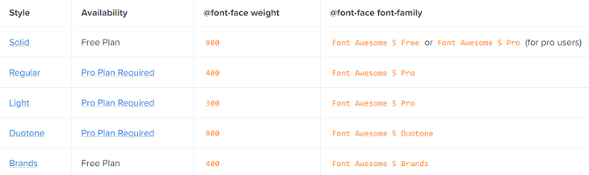

## Description

In the following article, you will find how to use Font Awesome icons with the embedded buttons in RadGrid used for firing functional commands like Delete, Insert, Edit, Refresh, etc.

## Solution

Subjects of the following solution are **RadGrid** in **Lightweight Render mode** and **FontAwesome 5**

*Find information about RadGrid Render Modes - [here](https://docs.telerik.com/devtools/aspnet-ajax/controls/grid/mobile-support/render-modes).*

For the successful integration of the FontAwesome glyphs in RadGrid built-in buttons you need to follow a few simple steps:

1. First is to include Font Awesome on the page by using one of the following options:

- Get a personal Kit code - [Get started with FontAwesome](https://fontawesome.com/start)
- Download and host Font Awesome locally - [Hosting Font Awesome Yourself](https://fontawesome.com/how-to-use/on-the-web/setup/hosting-font-awesome-yourself)
- Using a Content Delivery Network (CDN)

For the implementation of samples in the article, a Kit code is placed in the \<head> tag.

````ASPX
<head runat="server">
    <title></title>
    <script type="text/javascript" src="https://kit.fontawesome.com/xxxxxxxxxx.js"></script>
</head>
````

2. Define the button which appearance we will modify and the CSS selectors needed for overriding the default appearance. This can be achieved by inspecting the respective HTML element with its applied CSS styles.

As a sample scenario lets change the icon of RadGrid Delete button.

Appearance by default (Skin="Default") 


The Browser's DevTools helps us to find out that icon used by default is a font-icon included as content in pseudo *:before* element of a \<span>

To be able to replace it with a Font Awesome you need to introduce the new font-icon using the [CSS Pseudo-elements](https://fontawesome.com/how-to-use/on-the-web/advanced/css-pseudo-elements).

3. The next step is to get the font-family, font-weight, and the code of the desired font-icon.
- Copy the font-family and font-weight according to the used Font Awesome plan



- Copy the code of the desired icon


4. Finally, apply CSS to override the built-in icon:

````CSS
.RadGrid .t-font-icon.rgIcon.rgDelIcon:before {
    font-family: "Font Awesome 5 Free";
    font-weight: 900;
    content: "\f146";
    color: red;
}
````

And the result is:


**Following the same approach you can change all desired font-icons with Font Awesome ones like Delete, Insert, Edit, Refresh, etc.**

**Sample CSS**

````CSS
.RadGrid .t-font-icon.rgIcon.rgAddIcon:before,
.RadGrid .t-font-icon.rgIcon.rgRefreshIcon:before,
.RadGrid .t-font-icon.rgIcon.rgEditIcon:before,
.RadGrid .t-font-icon.rgIcon.rgDelIcon:before {
    font-family: "Font Awesome 5 Free";
    font-weight: 900;
}

.RadGrid .t-font-icon.rgIcon.rgDelIcon:before {
    content: "\f146";
    color: red;
}

.RadGrid .t-font-icon.rgIcon.rgEditIcon:before {
    content: "\f044";
    color: orange;
}

.RadGrid .t-font-icon.rgIcon.rgRefreshIcon:before {
    content: "\f01e";
    color: orangered;
}

.RadGrid .t-font-icon.rgIcon.rgAddIcon:before {
    content: "\f0fe";
    color: green;
}
````

**Result**


### Alternative approach: Using Template column with RadButton

Changing the appearance of the Delete and Edit button can also be achieved by using a RadButton inside a GridTemplateColumn.

That way you can introduce the Font Awesome icons using predefined class names, see [Font Awesome - Basic Use](https://fontawesome.com/how-to-use/on-the-web/referencing-icons/basic-use).

*Note: This approach is not applicable for buttons out of the column*

1. Declare a RadButton with the respective command name ("Delete", "Edit") inside a Template column.
2. Follow the instructions for using FontAwesome with RadButton from the [Using Font Awesome Icons with RadButton](https://www.telerik.com/support/code-library/using-font-awesome-icons-with-radbutton) Code-library sample.

**Sample declaration**

````ASPX
<telerik:GridTemplateColumn>
    <ItemTemplate>
        <telerik:RadButton ID="RadButton1" runat="server" CommandName="Delete" Text="Delete" ButtonType="StandardButton" style="background:none; border:none; color:red;">
            <ContentTemplate>
                <i class="fas fa-minus-square"></i>
            </ContentTemplate>
        </telerik:RadButton>
    </ItemTemplate>
</telerik:GridTemplateColumn>
````

**Result**


 
