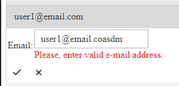

## Environment

<table>
    <tr>
        <td>Product</td>
        <td>Telerik WebForms Grid for ASP.NET AJAX</td>
    </tr>
</table>

## Description



Sometimes, one might want to validate certain text fields to check if proper values have been typed (email, phone number, etc), while editing.

## Solution

To do so, add a `RegularExpressionValidator` inside the **EditItemTemplate** of the **GridTemplateColumn**

````ASP.NET
<Columns>
    <telerik:GridTemplateColumn HeaderText="Email" SortExpression="Email" UniqueName="Email">
        <EditItemTemplate>
            <telerik:RadTextBox ID="editTextBox" runat="server" Text='<%# Bind("Email") %>' />
            <asp:RegularExpressionValidator ID="emailValidator2" runat="server" Display="Static" ControlToValidate="editTextBox" CssClass="textColor"
                ErrorMessage="Please, enter valid e-mail address." ValidationExpression="^[\w\.\-]+@[a-zA-Z0-9\-]+(\.[a-zA-Z0-9\-]{1,})*(\.[a-zA-Z]{2,3}){1,2}$">
            </asp:RegularExpressionValidator>
        </EditItemTemplate>
        <ItemTemplate>
            <telerik:RadLabel ID="txtBox" runat="server" Text='<%# Bind("Email") %>' />
        </ItemTemplate>
    </telerik:GridTemplateColumn>
</Columns>
````
````CSS
<style>
    .textColor {
        color: red;
    }
</style>
````
  
   