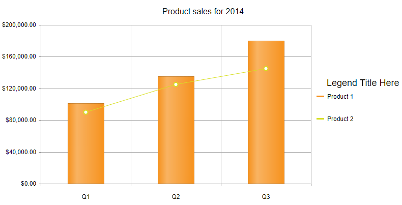

### DESCRIPTION
 In some scenarios it is useful to have a title specific to the Series names listed in the RadHtmlChart Legend. You can add such by implementing a Visual Template for the chart’s legend, drawing some additional elements before the first series utilizing the [Kendo UI Drawing API](https://docs.telerik.com/kendo-ui/framework/drawing/overview).  
  



### SOLUTION

As the Legend template of the Chart is called for each legend item, we will add the title as a part to the first item (or before it, to be precise). In order to cancel the default show/hide series functionality of the legend items, we will also need to prevent the click and hover logic of the added element. Below are the main steps we will go through in order to achieve the target result:

1. Implement a [Visual Template](https://docs.telerik.com/devtools/aspnet-ajax/controls/htmlchart/functionality/visual-template)for RadHtmlChart’s Legend, and draw (and style) the additional title element by using the Kendo UI Drawing API:
    - [kendo.drawing.Layout](https://docs.telerik.com/kendo-ui/api/javascript/drawing/layout)
    - [kendo.geometry.Rect](https://docs.telerik.com/kendo-ui/api/javascript/geometry/rect)
    - [kendo.drawing.Text](https://docs.telerik.com/kendo-ui/api/javascript/drawing/text)
1. Attach handlers to the client-side [LegendItemClick](https://docs.telerik.com/kendo-ui/api/javascript/dataviz/ui/chart/events/legenditemclick)and [LegendItemHover](https://docs.telerik.com/kendo-ui/api/javascript/dataviz/ui/chart/events/legenditemhover)events of the chart to prevent their default behavior when the added title is clicked/hovered


You can see the implementation of the above steps below, as well to directly test the result of applying the same code to a Kendo Chart widget here: [https://dojo.telerik.com/uKIGiNEx](https://dojo.telerik.com/uKIGiNEx)

```ASP.NET
<telerik:RadHtmlChart runat="server" ID="RadHtmlChart1" Width="800px" Height="400px">
    <ClientEvents OnLegendItemClick="legendItemClickOrHover" OnLegendItemHover="legendItemClickOrHover" />
    <Legend>
        <Appearance Position="right" />
        <Item Visual="legendVisual" />
    </Legend>
    <PlotArea>
        <Series>
            <telerik:ColumnSeries Name="Product 1">
                <LabelsAppearance Visible="false"></LabelsAppearance>
                <TooltipsAppearance DataFormatString="{0:c}"></TooltipsAppearance>
                <SeriesItems>
                    <telerik:CategorySeriesItem Y="101022" />
                    <telerik:CategorySeriesItem Y="135005" />
                    <telerik:CategorySeriesItem Y="180004" />
                </SeriesItems>
            </telerik:ColumnSeries>
            <telerik:LineSeries Name="Product 2">
                <LabelsAppearance Visible="false"></LabelsAppearance>
                <TooltipsAppearance DataFormatString="{0:c}"></TooltipsAppearance>
                <SeriesItems>
                    <telerik:CategorySeriesItem Y="90000" />
                    <telerik:CategorySeriesItem Y="125000" />
                    <telerik:CategorySeriesItem Y="145000" />
                </SeriesItems>
            </telerik:LineSeries>
        </Series>
        <YAxis Step="40000">
            <LabelsAppearance DataFormatString="{0:c}" />
            <MinorGridLines Visible="false" />
        </YAxis>
        <XAxis>
            <MinorGridLines Visible="false" />
            <LabelsAppearance>
                <TextStyle Margin="10 0 0 0" />
            </LabelsAppearance>
            <Items>
                <telerik:AxisItem LabelText="Q1" />
                <telerik:AxisItem LabelText="Q2" />
                <telerik:AxisItem LabelText="Q3" />
            </Items>
        </XAxis>
    </PlotArea>
    <ChartTitle Text="Product sales for 2014">
    </ChartTitle>
</telerik:RadHtmlChart>
```


```JavaScript
function legendVisual(e) {
    var title = e.series.index == 0 ? "Legend Title Here" : " "; //there has to be whitespace so it gets rendered

    // Define the target dimensions for the legend item
    var rect = new kendo.geometry.Rect([0, 200], [100, 50]);

    var layout = new kendo.drawing.Layout(rect, {
        spacing: 5,
        alignItems: "left"
    });

    var innerRect = new kendo.geometry.Rect([0, 200], [100, 50]);
    var innerLayout = new kendo.drawing.Layout(innerRect, {
        spacing: 5,
        orientation: "vertical"
    });

    //Position and style the title in the prefered way
    var txt = new kendo.drawing.Text(title, [20, -30], {
        font: "18px sans-serif"
    });

    //add the legend title to the legend item
    innerLayout.append(txt);

    // This will give us the default box + text
    innerLayout.append(e.createVisual());
    
    layout.append(innerLayout);
    return layout;
}

function legendItemClickOrHover(e) {
    if (e.element.nodeName == "text") {
        e.preventDefault();
    }
}
```


### SEE ALSO

[RadHtmlChart Client-side Events](https://docs.telerik.com/devtools/aspnet-ajax/controls/htmlchart/client-side-programming/events/overview)

[RadHtmlChart Visual Templates](https://docs.telerik.com/devtools/aspnet-ajax/controls/htmlchart/functionality/visual-template)

[Kendo UI Drawing API](https://docs.telerik.com/kendo-ui/framework/drawing/overview)


