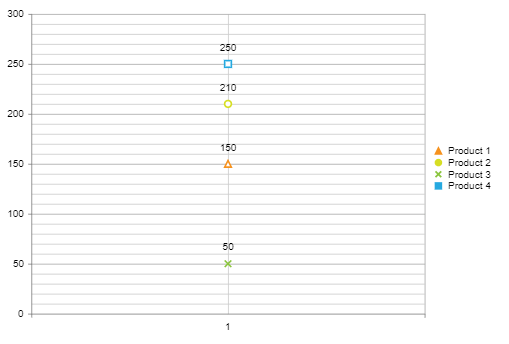

## HOW TO

There are a couple of options to control the shape and size of the Legend's markers:

1. With Visual Templates as described in the [Legend Settings - Legend Marker Settings](#legend-marker-shapes) article. 
2. By overwriting part of the internal functionality. This will help the legend items to get the shape of the series, if applicable. 

This article will show the second solution which will allow the Legend item shape to be the same as the related series' marker shape. 

Here is the result the code in this article will produce:



## SOLUTION

The JavaScript code shared below will extend the internal function and take into account the marker options configured for the Series. Just placing the script near the end of the `<form>` tag will enable this functionality and would require you only to configure the `MarkersAppearance`'s `MarkersType` of the series. 


````ASP.NET
<telerik:RadHtmlChart runat="server" ID="RadHtmlChart1" Font-Size="14px" Width="600px" Height="400px">
    <PlotArea>
        <Series>
            <telerik:LineSeries Name="Product 1">
                <MarkersAppearance MarkersType="Triangle" />
                <SeriesItems>
                    <telerik:CategorySeriesItem Y="150" />
                </SeriesItems>
            </telerik:LineSeries>
            <telerik:LineSeries Name="Product 2">
                <MarkersAppearance MarkersType="Circle" />
                <SeriesItems>
                    <telerik:CategorySeriesItem Y="210" />
                </SeriesItems>
            </telerik:LineSeries>
            <telerik:LineSeries Name="Product 3">
                <MarkersAppearance MarkersType="Cross" />
                <SeriesItems>
                    <telerik:CategorySeriesItem Y="50" />
                </SeriesItems>
            </telerik:LineSeries>
            <telerik:LineSeries Name="Product 4">
                <MarkersAppearance MarkersType="Square" />
                <SeriesItems>
                    <telerik:CategorySeriesItem Y="250" />
                </SeriesItems>
            </telerik:LineSeries>
        </Series>
        <XAxis>
            <Items>
                <telerik:AxisItem LabelText="1" />
            </Items>
        </XAxis>
    </PlotArea>
</telerik:RadHtmlChart>
````

````JavaScript
<script>
    // Place somewhere after the ScriptManager
    // Ideally, near the closing tag of the FORM or BODY element
    if (kendo && kendo.dataviz && kendo.dataviz.LegendItem) {
        var __markerOptions = kendo.dataviz.LegendItem.fn.markerOptions;
        kendo.dataviz.LegendItem.fn.markerOptions = function () {
            var resultOptions = __markerOptions.call(this);

            var dataviz = kendo.dataviz;
            var deepExtend = kendo.deepExtend;
            var ShapeElement = dataviz.ShapeElement;
            var options = this.options;
            var item = this,
                options = item.options,
                markerColor = options.markerColor,
                markerType = "circle",
                markerWidth = 7,
                markerHeight = 7,
                markerMargin = { top: 0, left: 0, right: 0, bottom: 0 };

            if (options.series.legend) {
                if (options.series.legend.marker) {
                    if (options.series.legend.marker.type) {
                        markerType = options.series.legend.marker.type;
                    }
                    if (options.series.legend.marker.width) {
                        markerWidth = options.series.legend.marker.width;
                    }
                    if (options.series.legend.marker.height) {
                        markerHeight = options.series.legend.marker.height;
                    }
                    if (options.series.legend.marker.margin) {
                        markerMargin = options.series.legend.marker.margin;
                    }
                }
            } else if (options.series.markers) {

                if (options.series.markers.type) {
                    markerType = options.series.markers.type;
                }
                if (options.series.markers.width) {
                    markerWidth = options.series.markers.width;
                }
                if (options.series.markers.height) {
                    markerHeight = options.series.markers.height;
                }
                if (options.series.markers.margin) {
                    markerMargin = options.series.markers.margin;
                }
            }

            var markerOptions = deepExtend({}, resultOptions, {
                background: markerColor,
                border: {
                    width: 2,
                    opacity: 1,
                    color: markerColor
                },
                type: markerType,
                width: markerWidth,
                height: markerHeight,
                margin: markerMargin
            });

            return markerOptions;
        }
    }
</script>
````

