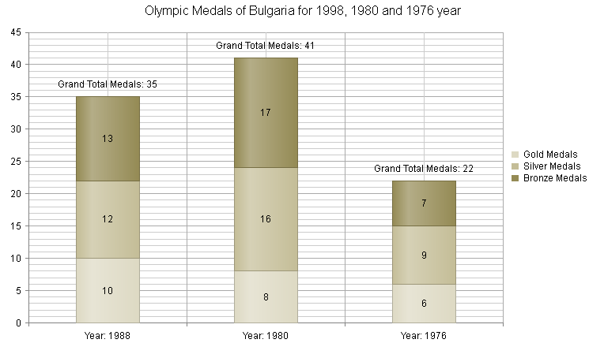
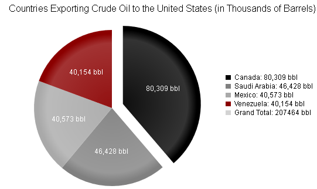

## HOW-TO 
 Display Grand Total In Stacked Series Labels And Pie Series Legend  
  
## DESCRIPTION 
The RadHtmlChart controls doesn't support grand total label for stacked series and pie series legend out of the box.  
  
## SOLUTION  
This KB article illustrates how to display grand total in the labels of stacked Column series (**Figure 1**) and in the legend of Pie series (**Figure 2**).

### Display Grand Total in the Labels of Stacked Column Series  

Since R1 2017 the [stackValue property](https://docs.telerik.com/kendo-ui/api/javascript/dataviz/ui/chart/configuration/series.labels.template) can be used to get the [total of the stack in a label](https://docs.telerik.com/kendo-ui/controls/charts/how-to/various/show-stack-total).

For older versions, in order to display grand total in the labels of stacked Column series you can do the following steps:

1. Bind the chart to a data source.
1. Create an additional field in the data source with relatively small values (e.g., values about 100 times smaller than the expected values shown in the chart).
1. Create an additional "Grand Total" series in the chart and bind it to the data source field, created in the previous step.
1. Do not set the `Name` property of the "Grand Total" series, so that it is not visible in the legend.
1. Hide the border of the "Grand Total" series, so that there aren't any visual glitches in the chart resulting from the relatively small values of this series.
2. Use a [template for the labels]() in the "Grand Total" series in order to calculate the sum of the stacked items over the x-axis categories.

You can see how looks a data bound stacked Column series that has a grand total label displayed for each category in **Figure 1**. You can also use this approach for other category series that can be stacked (e.g., Bar series).

**Figure 1**: Displaying grand total labels for a data bound stacked series.   
  

### Display Grand Total in the Legend of Pie Series

In order to display grand total in the legend of Pie series you can use the following steps:

1. Add an additional Pie series item in the chart that will have a `0` value and will be used for displaying the grand total.
2. Create a JavaScript function that does the following: 
    - Iterates through the Pie items and sums their values up in a variable.
    - Configures a legend template to display the calculated sum for the newly create Pie item.
    - Redraws the chart.
3. Call the newly created JavaScript function on the initial page load as well as on each legend item click.

You can find an image of a declaratively created Pie series that has a grand total label in their legend in **Figure 2**. You can also use this approach for a data bound Pie series as well as other one-dimensional series like Donut and Funnel.

**Figure 2**: Displaying grand total in the legend of Pie series.  
  

You can review the projects demonstrating the described approaches here:

* [PieSeries-GrandTotalLegend.zip](files/htmlchart-pieseries-grandtotallegend.zip)

* [StackedSeries-GrandTotalLabelsCS](files/htmlchart-stackedseries-grandtotallabelscs.zip)

* [StackedSeries-GrandTotalLabelsVB](files/htmlchart-stackedseries-grandtotallabelsvb.zip)
