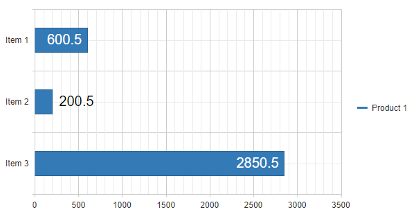
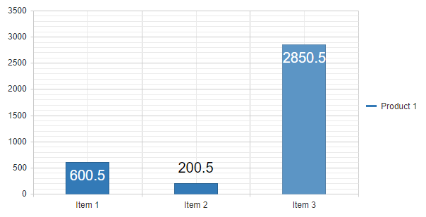

## Environment
<table>
	<tbody>
		<tr>
			<td>Product Version</td>
			<td>2018.3.910</td>
		</tr>
		<tr>
			<td>Product</td>
			<td>RadHtmlChart for ASP.NET AJAX</td>
		</tr>
	</tbody>
</table>


## Description
When the labels of the bar/column series and shown inside the series might become truncated in case the valuen of the series item is too small. In this article you will see how to change the [series.lables.visual](https://docs.telerik.com/kendo-ui/api/javascript/dataviz/ui/chart/configuration/series.labels.visual#serieslabelsvisual) in order to move the labels outside the series if there is not enough space for them inside the items.

## Dynamic Labels for BarChart
Dynamic labels position calculated for BarSeries items.

>caption Figure 1: Dynamic labels in BarChart:



````ASP.NET
<telerik:RadHtmlChart runat="server" ID="RadHtmlChart1" Transitions="true" Width="600px" Height="300px">
    <PlotArea>
        <Series>
            <telerik:BarSeries Name="Product 1" DataFieldY="valuesField">
                <LabelsAppearance Visual="dynamicLabelsVisual" Position="InsideEnd" Visible="true" Color="White">
                    <TextStyle FontSize="20" />
                </LabelsAppearance>
            </telerik:BarSeries>
        </Series>
        <XAxis DataLabelsField="labelsField"></XAxis>
    </PlotArea>
</telerik:RadHtmlChart>
<script>
    function dynamicLabelsVisual(e) {
        var original = e.createVisual();
        var textBox = original.children[1];
        var seriesItemWidth = e.rect.width();
        var labelWidth = textBox.bbox().width() + 10;
        var low = seriesItemWidth < labelWidth; // whether height of chart element is lower than the height of the label

        if (seriesItemWidth >= labelWidth) {
            return original
        };

        var y = textBox.position().y; //keep the same alignment of y
        var x = e.rect.origin.x + seriesItemWidth + 10; //wide enough to fit the label
        var layout = new kendo.drawing.Layout(e.rect);
        var txt = new kendo.drawing.Text(e.text, [x, y], {
            fill: { color: "#000" },
            font: e.options.font
        });

        layout.append(txt);
        return layout;
    }
</script>
````

````C#
protected void Page_Load(object sender, EventArgs e)
{
    if (!IsPostBack)
    {
        RadHtmlChart1.DataSource = GetData();
        RadHtmlChart1.DataBind();
    }
}

private object GetData()
{
    DataTable dt = new DataTable();
    dt.Columns.Add("valuesField");
    dt.Columns.Add("labelsField");

    dt.Rows.Add(600.50, "Item 1");
    dt.Rows.Add(200.50, "Item 2");
    dt.Rows.Add(2850.50, "Item 3");

    return dt;
}
````
````VB
Protected Sub Page_Load(ByVal sender As Object, ByVal e As EventArgs) Handles Me.Load
    If Not IsPostBack Then
        RadHtmlChart1.DataSource = GetData()
        RadHtmlChart1.DataBind()
    End If
End Sub

Private Function GetData() As Object
    Dim dt As DataTable = New DataTable()
    dt.Columns.Add("valuesField")
    dt.Columns.Add("labelsField")
    dt.Rows.Add(600.5, "Item 1")
    dt.Rows.Add(200.5, "Item 2")
    dt.Rows.Add(2850.5, "Item 3")
    Return dt
End Function
````

## Dynamic Labels for ColumnChart
Dynamic labels position calculated for ColumnSeries items.

>caption Figure 1: Dynamic labels in ColumnChart:



````ASP.NET
<telerik:RadHtmlChart runat="server" ID="RadHtmlChart1" Transitions="true" Width="600px" Height="300px">
    <PlotArea>
        <Series>
            <telerik:ColumnSeries Name="Product 1" DataFieldY="valuesField">
                <LabelsAppearance Visual="dynamicLabelsVisual" Position="InsideEnd" Visible="true" Color="White">
                    <TextStyle FontSize="20" />
                </LabelsAppearance>
            </telerik:ColumnSeries>
        </Series>
        <XAxis DataLabelsField="labelsField"></XAxis>
    </PlotArea>
</telerik:RadHtmlChart>
<script>
    function dynamicLabelsVisual(e) {
        var original = e.createVisual();
        var textBox = original.children[1];
        var seriesItemHeight = e.rect.height();
        var labelHeight = textBox.bbox().height() + 10;

        if (seriesItemHeight >= labelHeight) {
            return original
        };

        var y = e.rect.origin.y - labelHeight; //high enough to fit the label 
        var x = textBox.position().x; //keep the same alignment of x
        var layout = new kendo.drawing.Layout(e.rect);
        var txt = new kendo.drawing.Text(e.text, [x, y], {
            fill: { color: "#000" },
            font: e.options.font
        });

        layout.append(txt);
        return layout;
    }
</script>
````

````C#
protected void Page_Load(object sender, EventArgs e)
{
    if (!IsPostBack)
    {
        RadHtmlChart1.DataSource = GetData();
        RadHtmlChart1.DataBind();
    }
}

private object GetData()
{
    DataTable dt = new DataTable();
    dt.Columns.Add("valuesField");
    dt.Columns.Add("labelsField");

    dt.Rows.Add(600.50, "Item 1");
    dt.Rows.Add(200.50, "Item 2");
    dt.Rows.Add(2850.50, "Item 3");

    return dt;
}
````
````VB
Protected Sub Page_Load(ByVal sender As Object, ByVal e As EventArgs) Handles Me.Load
    If Not IsPostBack Then
        RadHtmlChart1.DataSource = GetData()
        RadHtmlChart1.DataBind()
    End If
End Sub

Private Function GetData() As Object
    Dim dt As DataTable = New DataTable()
    dt.Columns.Add("valuesField")
    dt.Columns.Add("labelsField")
    dt.Rows.Add(600.5, "Item 1")
    dt.Rows.Add(200.5, "Item 2")
    dt.Rows.Add(2850.5, "Item 3")
    Return dt
End Function
````

## See Also
* [HtmlChart Client-side Overview]()

* [HtmlChart Visual Template]()
* [Kendo UI Diagram Widget API](https://docs.telerik.com/kendo-ui/api/javascript/dataviz/ui/diagram)
