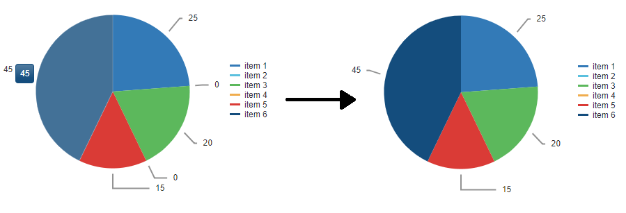

### DESCRIPTION

You can configure the [ClientTemplate]() of RadHtmlChart to render the series labels only for specific items, e.g. when their value is bigger than 0.  
  
 Before and After:  



### SOLUTION

Returning null for the labels you want to hide inside the `LabelsAppearance.ClientTemplate` of the series will skip the rendering both of the text and the stroke for these labels:


```ASP.NET
<telerik:RadHtmlChart runat="server" ID="PieChart1" Width="400px">
    <PlotArea>
        <Series>
            <telerik:PieSeries StartAngle="90" DataFieldY="valueField" NameField="namesField">
                <LabelsAppearance>
                    <ClientTemplate>
                        #if(dataItem.valueField == 0){
                            return null;
                        }
                        else {#
                            #= dataItem.valueField #
                        #}#
                    </ClientTemplate>
                </LabelsAppearance>
            </telerik:PieSeries>
        </Series>
    </PlotArea>
    <ClientEvents OnLoad="OnLoad" />
</telerik:RadHtmlChart>
```

Sample data:

```C#
protected void Page_Load(object sender, EventArgs e)
    {
        if (!IsPostBack)
        {
            PieChart1.DataSource = GetData();
            PieChart1.DataBind();
        }
    }
 
    private DataTable GetData()
    {
        DataTable dt = new DataTable();
        dt.Columns.Add("valueField");
        dt.Columns.Add("namesField");
 
        dt.Rows.Add(25, "item 1");
        dt.Rows.Add(0, "item 2");
        dt.Rows.Add(20, "item 3");
        dt.Rows.Add(0, "item 4");
        dt.Rows.Add(15, "item 5");
        dt.Rows.Add(45, "item 6");
 
        return dt;
    }
}
```
```VB
Protected Sub Page_Load(ByVal sender As Object, ByVal e As EventArgs)
    If Not IsPostBack Then
        PieChart1.DataSource = GetData()
        PieChart1.DataBind()
    End If
End Sub

Private Function GetData() As DataTable
    Dim dt As DataTable = New DataTable()
    dt.Columns.Add("valueField")
    dt.Columns.Add("namesField")
    dt.Rows.Add(25, "item 1")
    dt.Rows.Add(0, "item 2")
    dt.Rows.Add(20, "item 3")
    dt.Rows.Add(0, "item 4")
    dt.Rows.Add(15, "item 5")
    dt.Rows.Add(45, "item 6")
    Return dt
End Function
```


