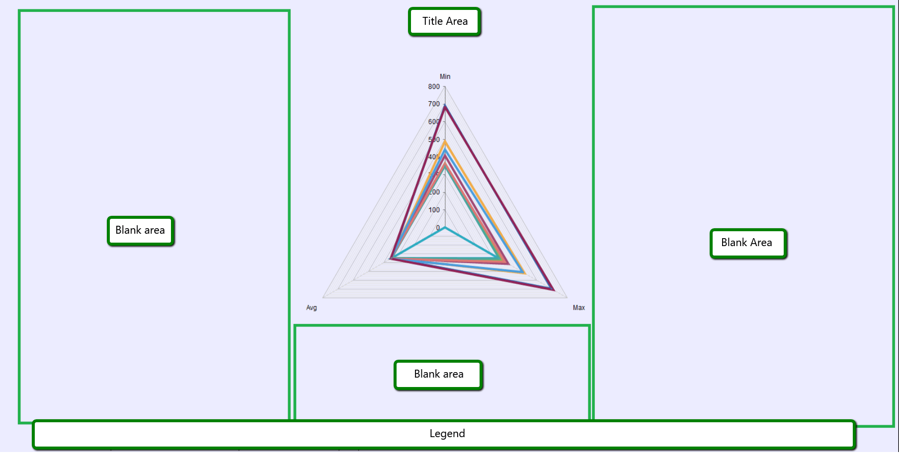

## HOW-TO

- Increase the chart plotted area to utilize the blank space
- Decrease the available empty space inside the plotted area
- Is there anyway to make the chart use all the wasted white space?

     
## DESCRIPTION

The Width and Height properties of RadHtmlChart do resize not only the chart itself, but also the chart wrapper, which could cause big gap and empty spaces inside the plot area:  




## SOLUTION

You can control the chart plot area dimensions via the provided `Margin` setting of the `PlotArea.Appearance.TextStyle` option:

* Code behind: 

````C#
RadHtmlChart1.PlotArea.Appearance.TextStyle.Margin = String.Format(``"{0} {1} {2} {3}"``, marginTop.Value, marginRight.Value, marginBottom.Value, marginLeft.Value);
````
````VB
RadHtmlChart1.PlotArea.Appearance.TextStyle.Margin = String.Format("{0} {1} {2} {3}", marginTop.Value, marginRight.Value, marginBottom.Value, marginLeft.Value)
````


* or inline:

````ASP.NET
<telerik:RadHtmlChart runat="server" ID="RadarAreaChart" Width="400" Height="400" Transitions="true" Skin="Silk">
    <PlotArea>
        <Appearance>
            <TextStyle Margin="-170 -150 -150 -100" />
        </Appearance>
    </PlotArea>
</telerik:RadHtmlChart>
````


