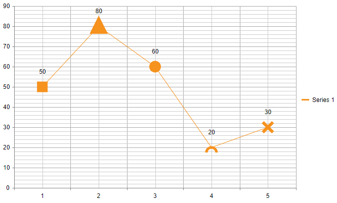

## Environment
<table>
	<tbody>
		<tr>
			<td>Product</td>
			<td>RadHtmlChart for ASP.NET AJAX</td>
		</tr>
	</tbody>
</table>


## Description
If you need to show different markers depending on the series item value/category, you can do it by implementing a Visual template for the series markers.

>caption Figure 1: Different markers in one series



## Solution

````ASP.NET
        <telerik:RadHtmlChart runat="server" ID="RadHtmlChart1">
            <PlotArea>
                <Series>
                    <telerik:LineSeries Name="Series 1">
                        <MarkersAppearance Visual="markersVisual" MarkersType="Cross" Size="20" BorderWidth="6" />
                        <SeriesItems>
                            <telerik:CategorySeriesItem Y="50" />
                            <telerik:CategorySeriesItem Y="80" />
                            <telerik:CategorySeriesItem Y="60" />
                            <telerik:CategorySeriesItem Y="20" />
                            <telerik:CategorySeriesItem Y="30" />

                        </SeriesItems>
                    </telerik:LineSeries>
                </Series>
                <XAxis>
                    <Items>
                        <telerik:AxisItem LabelText="1" />
                        <telerik:AxisItem LabelText="2" />
                        <telerik:AxisItem LabelText="3" />
                        <telerik:AxisItem LabelText="4" />
                        <telerik:AxisItem LabelText="5" />
                    </Items>
                </XAxis>
            </PlotArea>
        </telerik:RadHtmlChart>
        <script>
            function markersVisual(e) {
                var geom = kendo.geometry;
                var draw = kendo.drawing;
                var origin = e.rect.origin;
                var center = e.rect.center();
                var bottomRight = e.rect.bottomRight();
                var category = e.category;

                var currColor = e.options.border.color;
                                
                if (category == 1) {
                    //draw rect
                    var rectGeometry = new geom.Rect([center.x - 10, center.y - 10], [20, 20]);
                    var path = new draw.Rect(rectGeometry,
                        {
                            stroke: { color: currColor, width: 1 },
                            fill: { color: currColor }
                        }
                    );

                    return path;
                }
                else if (category == 2) {
                    //draw triangle
                    var path = new draw.Path({
                        stroke: { color: currColor, width: 10 },
                        fill: { color: currColor }
                    })
                        .moveTo(origin.x, bottomRight.y)
                        .lineTo(bottomRight.x, bottomRight.y)
                        .lineTo(center.x, origin.y)
                        .close();
                }

                else if (category == 3) {
                    var CircGeometry = new geom.Circle([center.x, center.y], 10);

                    var path = new kendo.drawing.Circle(CircGeometry, {
                        stroke: { color: currColor, width: 3 },
                        fill: { color: currColor }
                    });
                }
                else if (category == 4) {

                    //or draw any desired custom shape lice arc
                    var radius = 10;
                    var path = new kendo.drawing.Path({
                        stroke: {
                            color: currColor,
                            width: 5,
                        }
                    }).moveTo(center.x + radius, center.y + radius)
                        .arc(0, 180, radius, 10, true);
                }
                else {
                    //or return the default visual
                    return e.createVisual();
                }

                return path;
            }
        </script>
````


## See Also

* [RadHtmlChart Visual Template](https://docs.telerik.com/devtools/aspnet-ajax/controls/htmlchart/functionality/visual-template)

* [Kendo Drawing API Overview](https://docs.telerik.com/kendo-ui/framework/drawing/overview)

