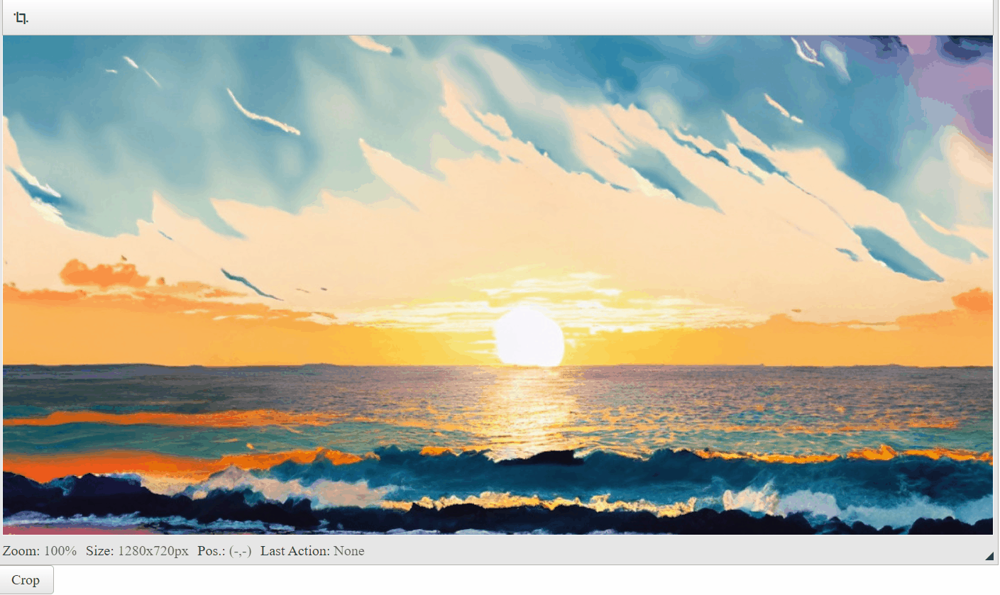

## Environment

<table>
	<tbody>
		<tr>
			<td>Product</td>
			<td>Telerik WebForms ImageEditor for ASP.NET AJAX</td>
		</tr>
	</tbody>
</table>

## Description

Sometimes, you might want to crop an image directly without showing the crop popup window



## Solution

You can achieve the desired behavior by attaching the `OnClientClicked` event to a **button**. In the event handler, get a reference to the **ImageEditor** and the resizable rectangle that is responsible for setting the crop dimensions to the image.

Additionally, you can remove the crop popup window by setting it's ***display*** CSS property to false.

>warning By removing the popup window, you will also remove other ImageEditor related popup windows as well, so use with caution.

````ASP.NET
<telerik:RadImageEditor ID="RadImageEditor1" runat="server" ImageUrl="images.jpg">
    <Tools>
        <telerik:ImageEditorToolGroup>
            <telerik:ImageEditorTool CommandName="Crop" />
        </telerik:ImageEditorToolGroup>
    </Tools>
</telerik:RadImageEditor>

<telerik:RadButton runat="server" ID="RadButton1" Text="Crop" AutoPostBack="false" OnClientClicked="OnClientClicked" />
````
````CSS
#RadImageEditor1_ToolsPanel {
    display: none !important;
}
````

````JavaScript
function OnClientClicked(sender, args) {
    var imgEditor = $find("<%= RadImageEditor1.ClientID %>");
    imgEditor.getEditableImage().crop(collectBounds());
}

function collectBounds() {
    var imgEditor = $find("<%= RadImageEditor1.ClientID %>");
    var draggableResizeBox = document.querySelector(".rieDraggableResizeBox")

    if (draggableResizeBox) { // Crop only if the crop box is selected
        var xPos = parseInt(draggableResizeBox.style.left.replace("px", "")); // Parse the values to numbers
        var yPos = parseInt(draggableResizeBox.style.top.replace("px", ""));
        var width = parseInt(draggableResizeBox.style.width.replace("px", ""));
        var height = parseInt(draggableResizeBox.style.height.replace("px", ""));

        if (isNaN(xPos) || isNaN(yPos) || isNaN(width) || isNaN(height)) {
            return false;
        }

        return new Sys.UI.Bounds(xPos, yPos, width, height); // The ImageEditor expects certain bounds to be applied when attempting to crop, and the values are from the draggableResizeBox itself
    }
}
````
 
   
