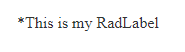

### HOW TO

How can I move the `RequiredMark` from the right side of the RadLabel to before the text? 
  

### DESCRIPTION
 The RadLabel can easily be customized to allow different styles using CSS.  By default, the `RequiredMark` is positioned to the right of the RadLabel's text. 
 
 
    
  

### SOLUTION  

In order to move the RequiredMark from the right to left side of the RadLabel, use the following CSS:

````CSS
<style type="text/css">
    .RadLabel .rlRequiredMark {
        float: left;
    }
</style>
````

````ASP.NET
<telerik:RadLabel ID="MyRadLabelID" runat="server" RequiredMark="*" MarkDisplayMode="Required" Text="This is my RadLabel"></telerik:RadLabel>
````  

### SEE ALSO

* [RadLabel - Overview Demo](https://demos.telerik.com/aspnet-ajax/label/overview/defaultcs.aspx)

* [RadLabel - Documentation and API Reference]()


