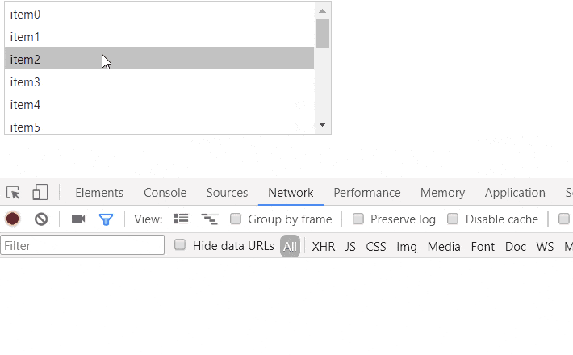

## Description

Dragging an item fires item selection (the OnSelectedIndexChanged event).

When the listbox is AJAX-enabled and set to postback on item selection, this can cause double postbacks and a loading panel that does not hide because of the error in the first (cancelled) request.




When an item is dragged slightly, the code in the listbox that monitors mouse movement has to select that item in order for later code to know what item to work with. This is used for reordering, transfer, external drag-and-drop. So, the item will always be selected when a drag action occurs on it and changing that behavior would require rewriting the control logic.

## Solution

You can, however, avoid the double (cancelled) postbacks issue. When the listbox is used only for item selection, you can enable the drag-and-drop actions so the corresponding client events fire, and cancel the [OnClientDragStart]() event. Note that this will disable the rest of the drag-and-drop features like reordering and transferring.

The alternative is to disable automatic postbacks by setting AutoPostBack="false", but this will also disable other postbacks, and the item will still be selected upon drag.

Here is an example that shows how you can avoid the double postbacks and unexpected drag queue, in case item selection with postbacks is all you need from the listbox.

````ASPX
<telerik:RadAjaxPanel runat="server" ID="RadAjaxPanel1" LoadingPanelID="RadAjaxLoadingPanel1">
    <telerik:RadListBox ID="RadListBox1" runat="server"
        AutoPostBack="true" OnSelectedIndexChanged="RadListBox1_SelectedIndexChanged"
        OnClientDragStart="OnClientDragStart" EnableDragAndDrop="true"
        Width="325px" Height="133px">
    </telerik:RadListBox>
    <asp:Label Text="" ID="Label1" runat="server" />
</telerik:RadAjaxPanel>
<telerik:RadAjaxLoadingPanel runat="server" ID="RadAjaxLoadingPanel1" Skin="Black"></telerik:RadAjaxLoadingPanel>
<script>
    function OnClientDragStart(sender, args) {
        args.set_cancel(true);
    }
</script>
````

and some sample server code to generate items and respond to the selection

````C#
protected void Page_Load(object sender, EventArgs e)
{
    if (!Page.IsPostBack)
    {
        for (int i = 0; i < 20; i++)
        {
            RadListBox1.Items.Add(new Telerik.Web.UI.RadListBoxItem("item" + i));
        }
    }
}
 
protected void RadListBox1_SelectedIndexChanged(object sender, EventArgs e)
{
    Label1.Text = "item selection at " + DateTime.Now.Second;
}
````

 
