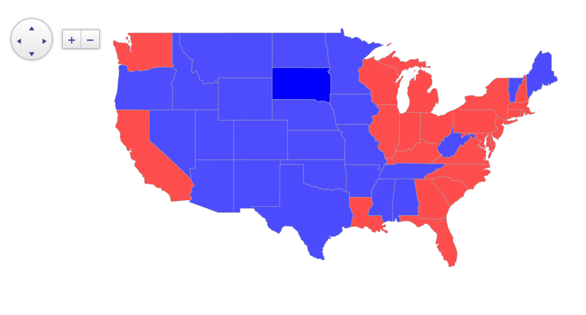
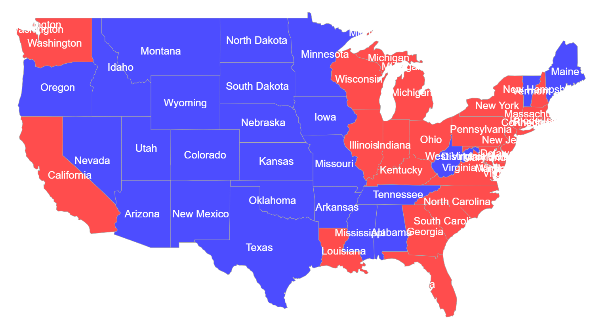

## Environment

<table>
	<tbody>
		<tr>
			<td>Product</td>
			<td>Telerik WebForms Map for ASP.NET AJAX</td>
		</tr>
	</tbody>
</table>

## Description

In this article you will learn how to display country specific data, using [GeoJSON](https://geojson.org/).



## Solution

The following example demonstrates the density of the USA per state, with the assosciated [GeoJSON data](https://raw.githubusercontent.com/PublicaMundi/MappingAPI/master/data/geojson/us-states.json).
For this scenario, we're binding the GeoJSON to the Map by using the [RadClientDataSource](): 

````ASP.NET
<telerik:RadMap ID="RadMap1" runat="server" Zoom="3" LayersDataSourceID="RadClientDataSource1">
    <CenterSettings Latitude="30.2681" Longitude="-97.7448" />
    <ClientEvents OnShapeCreated="onShapeCreated" OnShapeFeatureCreated="onShapeFeatureCreated"
        OnShapeMouseEnter="onShapeMouseEnter" OnShapeMouseLeave="onShapeMouseLeave" />
    <LayersCollection>
        <telerik:MapLayer Type="Shape" ClientDataSourceID="RadClientDataSource1">
            <StyleSettings>
                <FillSettings Opacity="0.7" />
            </StyleSettings>
        </telerik:MapLayer>
    </LayersCollection>
</telerik:RadMap>

<telerik:RadClientDataSource ID="RadClientDataSource1" runat="server">
    <DataSource>
        <WebServiceDataSourceSettings ServiceType="GeoJSON">
            <Select Url="states.json" DataType="JSON" />
        </WebServiceDataSourceSettings>
    </DataSource>
</telerik:RadClientDataSource>
````

For creating the shapes and displaying their associated data, we'll use the [`OnShapeCreated`](https://docs.telerik.com/kendo-ui/api/javascript/dataviz/ui/map/events/shapecreated) and [`OnShapeFeatureCreated`](https://docs.telerik.com/kendo-ui/api/javascript/dataviz/ui/map/events/shapefeaturecreated) events of the Kendo jQuery map (remember that the RadMap is actually a wrapper of its jQuery counterpart, and we can utilize its API).

Coloring the states based on their values is achievied inside the **OnShapeCreated** event handler: 

````JavaScript
var scale = chroma
    .scale(["white", "green"])
    .domain([1, 300]); // For the chroma you'll need the chroma.min.js scriopt referenced in the <head> tag of your project

function onShapeCreated(e) {
    var shape = e.shape;
    var customValue = shape.dataItem.properties.density; // Assuming 'density' is part of your data
    if (customValue > 100) {
        shape.options.fill.set("color", "red"); // Red for values greater than 100
    } else {
        shape.options.fill.set("color", "blue"); // Blue otherwise
    }
}

function onShapeFeatureCreated(e) {
    e.group.options.tooltip = {
        content: e.properties.name + "<br/>Density: " + e.properties.density,
        position: "cursor",
        offset: 10,
        width: 120
    };
}

function onShapeMouseEnter(e) {
    e.shape.options.set("fill.opacity", 1);
}

function onShapeMouseLeave(e) {
    e.shape.options.set("fill.opacity", 0.7);
}
````

If you wish to display the text on the state itself, you can do that by creating a label with the name of the state. To do that, you can utilize a si  milar approach as the one shown in the [Add Titles to Map ShapesAdd Titles to Map Shapes](https://docs.telerik.com/kendo-ui/knowledge-base/add-shape-title) article.

````JavaScript
function onShapeCreated(e) {
    var bbox = e.shape.bbox(); // Get the "box" of each of the states
    var center = bbox.center(); // We need the center, in order to later display the label exactly on it.

    var labelText = e.shape.dataItem.properties.name; // The JSON file with the states has their corresponding name, so the label text will be the name of each state
    var label = new kendo.drawing.Text(labelText);
    label.options.fill.color = "#FFFFFF"; // Set the color to white
    var labelCenter = label.bbox().center(); 

    label.position([ // Position the label
        center.x - labelCenter.x,
        center.y - labelCenter.y
    ]);

    e.layer.surface.draw(label); // Render the label on the layer surface
    
    // Ommited for clearance
}
````

Result



     
      