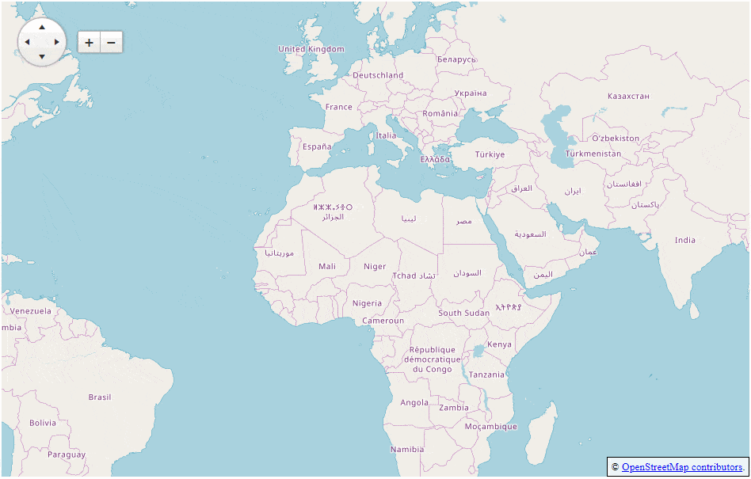

### HOW TO

Move a Map marker to the clicked location or create a new one.  


[

### SOLUTION

Changing the `Location` of the marker in the `OnClick` client-side event can achieve the movement of the marker to the clicked position.

````ASP.NET
<script type="text/javascript">
    function onClick(args) {
        var clickedLocation = args.location;
        var lat = args.location.lat;
        var lng = args.location.lng;
        if (args.sender.markers.items.length == 0) {
            args.sender.markers.add({ location: clickedLocation })
        } else {
            var marker = args.sender.markers.items[0];
            marker.location(clickedLocation);
        }
    }
</script>
<telerik:RadMap RenderMode="Lightweight" runat="server" ID="RadMap1" Zoom="3" CssClass="MyMap">
    <ClientEvents  OnClick="onClick"/>
    <CenterSettings Latitude="23" Longitude="10" />
    <LayersCollection>
        <telerik:MapLayer Type="Tile" Subdomains="a,b,c"
            UrlTemplate="http://#= subdomain #.tile.openstreetmap.org/#= zoom #/#= x #/#= y #.png"
            Attribution="© <a href='http://osm.org/copyright' title='OpenStreetMap contributors' target='_blank'>OpenStreetMap contributors</a>.">
        </telerik:MapLayer>
    </LayersCollection>          
</telerik:RadMap>
````

### TIP

If you need to create a marker on a different event (e.g., from the [browser geolocation](https://developer.mozilla.org/en-US/docs/Web/API/Geolocation/Using_geolocation)), you must [create a Kendo Location object](https://docs.telerik.com/kendo-ui/api/javascript/dataviz/map/location) from the coordinates you receive:

````JavaScript
var myLat = 1;
var myLng = 2;
var clickedLocation = new kendo.dataviz.map.Location(myLat, myLng);
if (map.markers.items.length == 0) {
    map.markers.add({ location: clickedLocation })
} else {
    var marker = map.markers.items[0];
    marker.location(clickedLocation);
}

````

Here is an example that puts the current location on the map:

````ASP.NET
<telerik:RadMap RenderMode="Lightweight" runat="server" ID="RadMap1" Zoom="1" CssClass="MyMap" Width="500px" Height="300px">
    <ClientEvents OnLoad="OnLoad" />
    <CenterSettings Latitude="23" Longitude="10" />
    <LayersCollection>
        <telerik:MapLayer Type="Tile" Subdomains="a,b,c"
            UrlTemplate="http://#= subdomain #.tile.openstreetmap.org/#= zoom #/#= x #/#= y #.png"
            Attribution="© <a href='http://osm.org/copyright' title='OpenStreetMap contributors' target='_blank'>OpenStreetMap contributors</a>.">
        </telerik:MapLayer>
    </LayersCollection>
</telerik:RadMap>
<script type="text/javascript">
    function OnLoad(map, args) {
        if ("geolocation" in navigator) {
            //note: this will show a browser prompt asking for location
            //you may not want this to hapen when the page is loading to avoid deteriorating the UX
            //so you may want to move the logic to a different event
            navigator.geolocation.getCurrentPosition(function (position) {
                map = map.get_kendoWidget();
                var currLocation = new kendo.dataviz.map.Location(position.coords.latitude, position.coords.longitude);
                if (map.markers.items.length == 0) {
                    map.markers.add({ location: currLocation })
                } else {
                    var marker = map.markers.items[0];
                    marker.location(currLocation);
                }
            });
        }
    }
</script>
````


