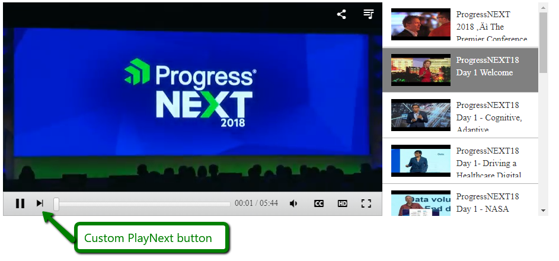

## Description

AutoPlay next video and implement a **PlayNext** video button.  



## Solution

The following example shows how to implement the logic for playing the next video and how to add and style the play next button.

````CSS
<style>
    .RadMediaPlayer .rmpNextButton {
        width: 26px;
        height: 30px;
    }
 
    .RadMediaPlayer .rmpNextIcon:before {
        content: "\e009";
        font-size: x-large;
        padding-top: 7px;
    }
 
    .rmpLeftControlsSet .rmpActionButton {
        margin-right: 0;
    }
 
        .rmpLeftControlsSet .rmpActionButton:nth-last-of-type(.rmpActionButton) {
            margin-right: 1em;
        }
 
    html .RadMediaPlayer .rmpSeekBar {
        padding-left: 35px;
    }
</style>
````

````JavaScript
function playNextVideo(mediaPlayer) {
    var ACTIVE = "rmpActive";
    var nextIndex = mediaPlayer.mediaFiles.indexOf(mediaPlayer.currentFile) + 1
    if (nextIndex < mediaPlayer.mediaFiles.length) {
        var nextVideo = mediaPlayer.mediaFiles[nextIndex];
        mediaPlayer.currentPlayer.loadFile(nextVideo);
        mediaPlayer.currentFile = nextVideo;
        // update the highlighted item in the playlist
        mediaPlayer.playlist._$list
          .children()
          .removeClass(ACTIVE)
          .eq(nextIndex)
          .addClass(ACTIVE);
    }
}
 
function OnClientEnded(sender, args) {
    playNextVideo(sender);
}
 
function OnClientReady(sender, args) {
    // add the play next video button
    var $leftControlsSet = $telerik.$(sender.get_element()).find(".rmpLeftControlsSet");
    var $button = $telerik.$('<button id="' + sender.get_id() + '_Toolbar_NextButton" type="button" class="rmpActionButton rmpNextButton" title="Next"><span class="rmpIcon rmpNextIcon"></span></button>');
    $leftControlsSet.append($button);
    $button.on("click", function () {
        playNextVideo(sender);
    })
}
````

````ASP.NET
<telerik:RadMediaPlayer RenderMode="Lightweight" ID="RadMediaPlayer1" runat="server"
    OnClientEnded="OnClientEnded" OnClientReady="OnClientReady"
    Height="360px" Width="640px" ToolbarDocked="true" AutoPlay="true">
    <PlaylistSettings YouTubePlaylist="PLC679RvCan2CLAR4zqTm-8QDMir5CRKNN" />
</telerik:RadMediaPlayer>
````


