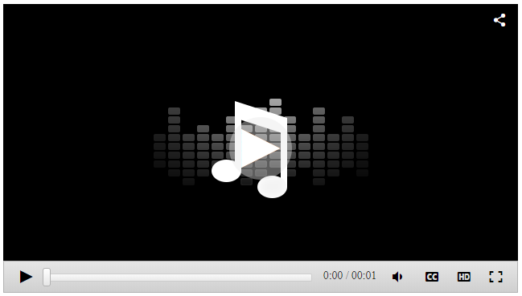

## Problem

How-To Remove buttons and title bar to create a minimalistic RadMediaPlayer


## Description

One would like to use RadMediaPlayer for playing only audio files and the default player size takes up quite a space.



## Solution

Since this control was designed for multi-purpose, transforming it into a minimal player would require some tricks:

````CSS
.minimalistic.RadMediaPlayer .rmpSeekBar {
        margin-right: 145px;
    }
 
.minimalistic .rmpRightControlsSet .rmpProgressText {
    top: 4px;
    position: relative;
}

.minimalistic .rmpHDButton,
.minimalistic .rmpSubtitlesButton,
.minimalistic .rmpFullScrButton,
.minimalistic .rmpAudioWrapper {
    display: none;
}

.minimalistic .rmpBigPlayButton {
    display: none !important;
}
````

````ASPX
<telerik:RadMediaPlayer CssClass="minimalistic" RenderMode="Lightweight" ID="RadMediaPlayer2" runat="server" AutoPlay="false"
    Height="41px" Width="250px" ToolbarDocked="true">
    <Sources>
        <telerik:MediaPlayerSource Path="Yamaha-V50-Rock-Beat-120bpm.wav" />
    </Sources>
</telerik:RadMediaPlayer>
````

````C#
protected void Page_Load(object sender, EventArgs e)
{
    RadMediaPlayer2.TitleBar.Visible = false;
}
````


 