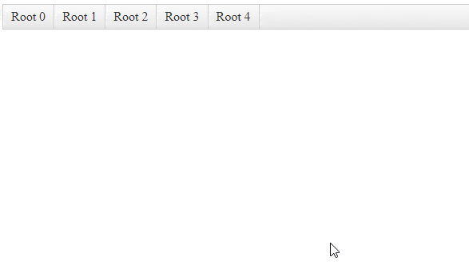

## How to

Apply ClickToOpen functionality for child items.  
  


## Description

The [ClickToOpen]() functionality is applicable only for the Root items of the RadMenu. To apply the same functionality for the sub-items, a custom implementation is required.

## Solution

````ASPX
<telerik:RadMenu runat="server" ID="RadMenu1"
    OnClientItemClicking="OnClientItemClicking"
    OnClientMouseOver="OnClientMouseOverHandler"
    ClickToOpen="true">
</telerik:RadMenu> 
````

````JavaScript
function OnClientMouseOverHandler(sender, args) {
    sender.set_clicked(false);
}
function OnClientItemClicking(sender, args) {
    var item = args.get_item()

    if (item.get_parent() !== sender) {
        item._toggleState();
    } else {
        if (item.get_isOpen()) {
            sender.close(true);
            args.set_cancel(true)
        }
    }
    if (item.get_items().get_count() == 0) {
        sender.close(true);
    }
}
````

````C#
protected void Page_Load(object sender, EventArgs e)
{
    if (!IsPostBack)
    {
        for (int i = 0; i < 5; i++)
        {
            var item = new RadMenuItem("Root " + i);
            for (int j = 0; j < 5; j++)
            {
                var child = new RadMenuItem(String.Format("Child {0}.{1}", i, j));
                for (int k = 0; k < 5; k++)
                {
                    var grandchild = new RadMenuItem(String.Format("GrandChild {0}.{1}.{2}", i, j, k));
                    child.Items.Add(grandchild);
                }
                item.Items.Add(child);
            }
            RadMenu1.Items.Add(item);
        }
    }
}
````


 