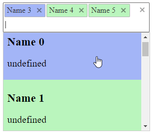

In RadMultiSelect component, modifying the background color of tags and items based on colors stored in the datasource involves utilizing the ItemDataBound event and a combination of custom attributes and JavaScript. Follow these steps to achieve the desired visual result:



## Solution

Set up your RadMultiSelect component within your ASPX markup. Make sure to include the TagTemplate and ItemTemplate elements as follows:

````ASPX
<telerik:RadMultiSelect ID="RadMultiSelect2" runat="server" DataTextField="Name" DataValueField="Id" Skin="Default" Width="300px"
    OnItemDataBound="RadMultiSelect2_ItemDataBound">
    <ClientEvents OnChange="change" OnLoad="clientLoad" />
    <TagTemplate>
        <span class="styledTag" style="background-color:#= attributes.Color #; font-size:10px">#:data.Name#</span>
    </TagTemplate>
    <ItemTemplate>
    <span class="styledTag" style="background-color:#= attributes.Color #; font-size:10px; color:black">
        <h3>#: data.Name #</h3>
        <p>#: attributes.Title #</p>
    </span>
    </ItemTemplate>
</telerik:RadMultiSelect>
````

Bind the Control to its DataSource and use the ItemDataBound event to add a custom attribute that will hold the color value:
````C#
public class MyClass
{
    public int Id { get; set; }
    public string Name { get; set; }
    public string Color { get; set; }
}

protected void Page_Load(object sender, EventArgs e)
{
    if (!IsPostBack)
    {
        var items = Enumerable.Range(0, 10).Select(x => new MyClass()
        {
            Id = x,
            Name = "Name " + x,
            Color = x % 3 == 0 ? "#a3b5f7" : "#baf5bd"
        });
        RadMultiSelect2.DataSource = items;
        RadMultiSelect2.DataBind();
        RadMultiSelect2.Value = new object[] { 3, 4, 5 };
    }
}

protected void RadMultiSelect2_ItemDataBound(object sender, RadMultiSelectItemEventArgs e)
{
    var color = (e.Item.DataItem as MyClass).Color;
    e.Item.Attributes.Add("Color", color);
}
````
````VB
Public Class [MyClass]
    Public Property Id As Integer
    Public Property Name As String
    Public Property Color As String
End Class

Protected Sub Page_Load(ByVal sender As Object, ByVal e As EventArgs) Handles Me.Load
    If Not Page.IsPostBack Then
        Dim items = Enumerable.Range(0, 10).[Select](Function(x) New [MyClass]() With {
    .Id = x,
    .Name = "Name " & x,
    .Color = IIf(x Mod 3 = 0, "#a3b5f7", "#baf5bd")
})
        RadMultiSelect2.DataSource = items
        RadMultiSelect2.DataBind()
        RadMultiSelect2.Value = New Object() {1, 2, 3, 4, 5}

    End If
End Sub

Protected Sub RadMultiSelect2_ItemDataBound(sender As Object, e As RadMultiSelectItemEventArgs)
    Dim color = CType(e.Item.DataItem, [MyClass]).Color
    e.Item.Attributes.Add("Color", color)
End Sub
````

Enhance the functionality with JavaScript to dynamically adjust the tag and item background colors based on the color information stored in the custom attributes:

````JavaScript
function change(sender, args) {
    colorizeTagsAndItems();
}
function clientLoad(sender, args) {
    colorizeTagsAndItems();
}

function colorizeTagsAndItems() {
    $telerik.$('.styledTag').each(function () {
        $tag = $(this);
        var backColor = $tag.css('background-color');
        $tag.parents('.k-button,.k-item').css('background-color', backColor);
        //remove background-image as some Telerik skins apply such
        $tag.parents('.k-button').css('background-image', 'none');
    });
}
````

 