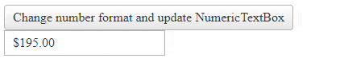

## HOW TO

Update displayed text after changing some number format options.  


## DESCRIPTION

When you change the properties of the [NumberFormat client-side object](https://docs.telerik.com/devtools/aspnet-ajax/controls/numerictextbox/client-side-programming/numberformat-client-object), the text of the NumericTextBox is not updated to respect the new number formatting options.

## SOLUTION

#### IMPORTANT NOTES

If you need to change settings dynamically on the client, Telerik recommends that you consider using a Kendo NumericTextBox: [https://demos.telerik.com/kendo-ui/numerictextbox/api](https://demos.telerik.com/kendo-ui/numerictextbox/api) and avoid changing the number format of a RadNumericTextBox on the client.   

 If setting new values for the Kendo widget options is not sufficient for you, you can always .destroy() the widget and re-create it with new settings. A Kendo widget is created over a standard `<input>`, which includes an `<asp:TextBox>` control whose `Text` you can easily use in the server code. Note that server validation must still be performed, as with any other user input.

**Changing the number format on the client is not supported** and can only be used for display purposes. Doing that can result in the server-side `Value` of the numeric textbox becoming `null`(`Nothing`).

The server checks the format it receives and, for security purposes, invalidates the value if it is different than the format it sent to the client, because this indicates that the value or POST data has been tampered with. Thus, a change in the number format is only supported on the server.

#### EXAMPLE

Construct the new display value with the private `_constructDisplayText()` method and use the `set_displayValue()` method of the NumericTextBox.


````JavaScript
<script type="text/javascript">
    function OnClientClicked() {
        var numeric = $find("<%= RadNumericTextBox1.ClientID%>");
        var numberFormat = numeric.get_numberFormat();
        numberFormat.DecimalSeparator = ",";
        numberFormat.DecimalDigits = 4;
        numeric.set_displayValue(numeric._constructDisplayText(numeric.get_value()))
    }
</script>
````

````ASP.NET
<telerik:RadButton runat="server" Text="Change number format and update NumericTextBox" AutoPostBack="false"
    OnClientClicked="OnClientClicked" />
<br />
<telerik:RadNumericTextBox RenderMode="Lightweight" ID="RadNumericTextBox1" runat="server" EmptyMessage="Enter some value"
    Width="200px" Type="Currency" Value="195">
</telerik:RadNumericTextBox>
````


