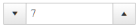

## Environment
<table>
	<tbody>
		<tr>
			<td>Product</td>
			<td>RadNumericTextBox for ASP.NET AJAX</td>
		</tr>
	</tbody>
</table>


## Description
This article shows how with JavaScript and CSS the button for decreasing the value can be placed on the left side of the input as demonstrated below.



## Solution

````ASPNET
<telerik:RadNumericTextBox RenderMode="Lightweight" WrapperCssClass="custom-buttons" runat="server" 
ID="RadNumericTextBox1" Width="190px" Value="1" EmptyMessage="Enter units count" 
MinValue="0" ShowSpinButtons="true" NumberFormat-DecimalDigits="0">
    <ClientEvents OnLoad="OnLoad" />
</telerik:RadNumericTextBox>
````

````JavaScript
function OnLoad(sender, args) {
	var $ = $ || $telerik.$;
	var spanFake = $("<span>").addClass("riSelect fake-riSelect").append($(sender.SpinDownButton))
	$(sender.get_wrapperElement()).prepend(spanFake)
}
````

````CSS
.RadInput.riContSpinButtons.custom-buttons input {
	padding-left: 38px;
}

.RadInput.riContSpinButtons.custom-buttons .riUp,
.RadInput.riContSpinButtons.custom-buttons .riDown {
	height: 100%;
}

	.RadInput.riContSpinButtons.custom-buttons .riUp:before,
	.RadInput.riContSpinButtons.custom-buttons .riDown:before {
		vertical-align: middle;
	}


.RadInput.custom-buttons .riSelect.fake-riSelect {
	width: 30px;
	left: 0;
}

	.RadInput.custom-buttons .riSelect.fake-riSelect .riDown {
		border-right-width: 1px;
		border-right-style: solid;
	}
````


