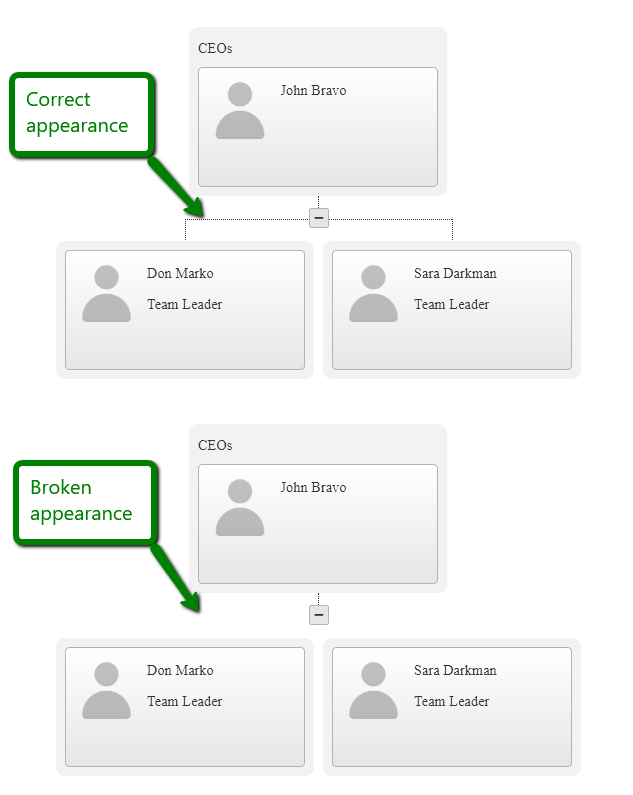

### PROBLEM

When changing the zoom level of the browser, the connecting lines of the OrgChart are missing.   


### DESCRIPTION

The lines are styled `:before` and `:after` pseudo-elements which are with height or width of `1px`. This makes the browser render them as invisible in certain zoom levels.

### SOLUTION
The solution is to increase this width with the following styles: 

````CSS
<style>
    .RadOrgChart .rocGroup:after,
    .RadOrgChart .rocGroup:before,
    .RadOrgChart.rocSimple .rocNode:after,
    .RadOrgChart.rocSimple .rocItem:after {
        width: 2px;
    }
 
 
    .RadOrgChart .rocNode:before {
        height: 2px;
    }
</style>
````


