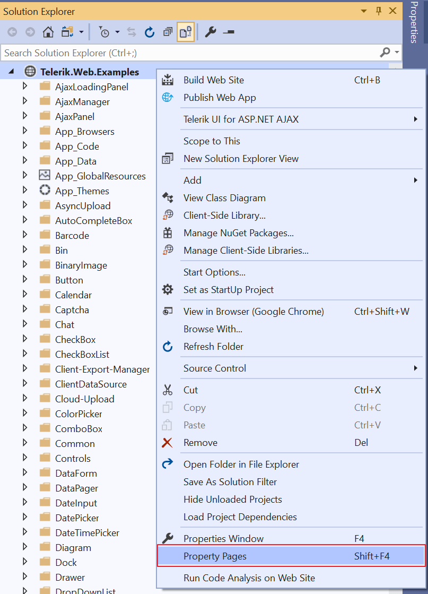
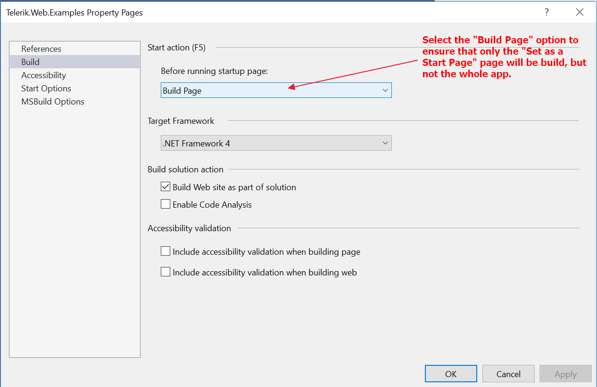

## Environment
<table>
	<tbody>
		<tr>
			<td>Product</td>
			<td>Telerik UI for ASP.NET AJAX</td>
		</tr>
	</tbody>
</table>

## Description
I am trying to build the Live Demos solution (Telerik_UI_for_ASP.NET_AJAX_20xx_x_xxxx_Dev.zip), however the build process is taking a very long time.  
After an hour I had to use the Task Manager to force Visual Studio to stop because it was unresponsive during the build of the solution.

Is there anything I need to do to improve the build process? Right now I'm only interested in the AsyncUpload examples.

## Solution
There is one pretty useful performance feature of Visual Studio, which allows to build only the page your are working on and to debug/build it, but not the whole site. Once turned on, this setting will resolve the performance issue since the studio will not build the whole solution, but only the selected start page and you can concentrate only on it.

Here are the steps:
* Right click on the Web Site
* Choose Property pages (see the VS_Property_Pages.png screenshot)
* Go to Build (check out the VS_Build_Page_Only.png image below) 
* Inside the Before running startup page folder select Build page
* Press OK to save your preference.

