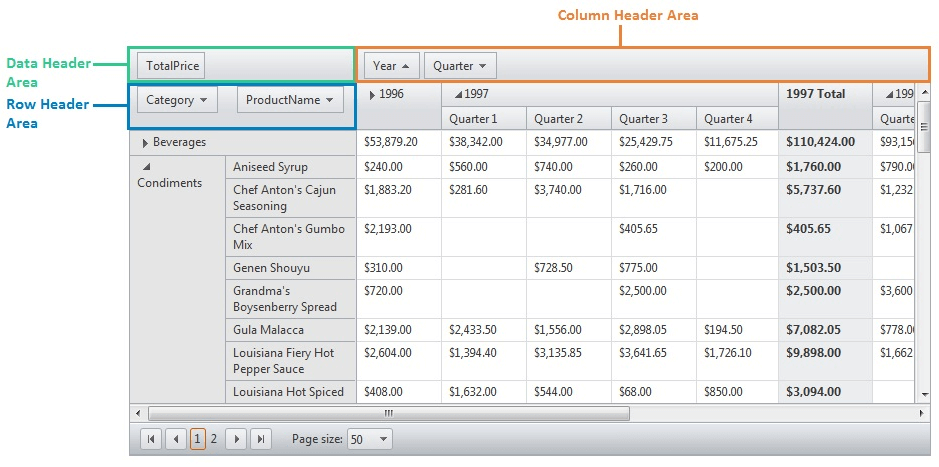

## Description

By default when exporting a **RadPivotGrid** to excel the Fields in the Data Header Area, the Column Header Area, and the ones in the Row Header Area are not included in the exported file. Check out below how you can include them to the Excel export.



## Solution

A convenient way to add the Row, Data, and Column headers to the Excel export is to use the [PivotGridInfrastructureExporting event](#modifying-exported-excel-cells-formatting-and-applying-styles-to-them) to manipulate the ExportStructure before generating the output file.

````C#
protected void RadPivotGrid1_PivotGridInfrastructureExporting(object sender, PivotGridInfrastructureExportingEventArgs e)
{
    e.ExportStructure.Tables[0].ShiftRowsDown(1, 1);
  
    foreach (var field in RadPivotGrid1.Fields)
    {
        if (!field.IsHidden)
        {
            switch (field.FieldType)
            {
                case "PivotGridRowField":
                    e.ExportStructure.Tables[0].Cells[1, 2].Value += field.DataField + " ";
                    break;
                case "PivotGridColumnField":
                    e.ExportStructure.Tables[0].Cells[2, 1].Value += field.DataField + " ";
                    break;
                case "PivotGridAggregateField":
                    e.ExportStructure.Tables[0].Cells[1, 1].Value += field.DataField + " ";
                    break;
                default:
                    break;
            }
        }
    }
}
````


### Export HeaderFields considering RowField reordering

As this is a custom approach based on filling cells manually it may need some adjustments for specific scenarios. For instance, if the user changes the order of the PivotGridRowField(s), the field name order will not match the column order in the exported file. Referring to the [PivotGrid Export to Excel/Word demo](https://demos.telerik.com/aspnet-ajax/pivotgrid/examples/exporting/defaultcs.aspx) where the user can change the column order Country, City, TransportType and export the PivotGrid that way. As a result of the approach shown above, the additional headers will not match the actual RowHeaders order.

To overcome the discrepancy we can keep track of the current position with the help of the `ZoneIndex` property exposed by the PivotGrid Field.

For instance, you can store the PivotGridFields in a List<PivotGridField> and sort it by `ZoneIndex` before filling in the export cells:

````C#
protected void RadPivotGrid1_PivotGridInfrastructureExporting(object sender, PivotGridInfrastructureExportingEventArgs e)
{
    e.ExportStructure.Tables[0].ShiftRowsDown(1, 1);

    var rowFields = new List<PivotGridField>();

    foreach (var field in RadPivotGrid1.Fields)
    {
        if (!field.IsHidden)
        {
            switch (field.FieldType)
            {
                case "PivotGridRowField":
                    rowFields.Add(field);
                    break;
                case "PivotGridColumnField":
                    e.ExportStructure.Tables[0].Cells[2, 1].Value += field.DataField + " ";
                    break;
                case "PivotGridAggregateField":
                    e.ExportStructure.Tables[0].Cells[1, 1].Value += field.DataField + " ";
                    break;
                default:
                    break;
            }

        }
    }

    if (rowFields.Count > 0)
    {
        var sortedRowFields = rowFields.OrderBy(x => x.ZoneIndex).ToList();
        var index = 0;
        foreach (var rowField in sortedRowFields)
        {
            e.ExportStructure.Tables[0].Cells[1 +index , 2].Value += rowField.DataField;
            index++;
        }
    }
}
````

