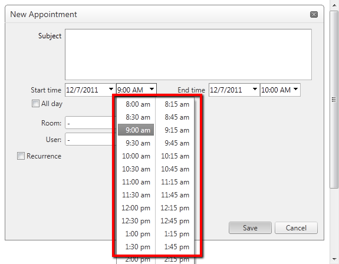

   
### HOW TO  

Adjust the RadTimePicker settings of the advanced form.   
   
   
### DESCRIPTION  
 

The Start and End RadTimePicker controls can be found in [FormCreated]() and their default settings can be overriden. For the changes to take effect, however, you need to set the `TimeView.DataList.DataSource` of the control to *null* and call `.DataBind()`:  
   
````C#
startTime.TimeView.DataList.DataSource = null;  
startTime.DataBind();
````

### SOLUTION  
  
````C#
protected void RadScheduler1_FormCreated(object sender, SchedulerFormCreatedEventArgs e)
{
      if ((e.Container.Mode == SchedulerFormMode.AdvancedEdit) || (e.Container.Mode == SchedulerFormMode.AdvancedInsert))
      {
         RadTimePicker startTime = e.Container.FindControl("StartTime") as RadTimePicker;
         startTime.TimeView.StartTime = RadScheduler1.DayStartTime;
         startTime.TimeView.EndTime = RadScheduler1.DayEndTime;
         startTime.TimeView.Interval = new TimeSpan(0, 15, 0);
         startTime.TimeView.DataList.DataSource = null;
         startTime.DataBind();

         RadTimePicker endTime = e.Container.FindControl("EndTime") as RadTimePicker;
         endTime.TimeView.StartTime = RadScheduler1.DayStartTime;
         endTime.TimeView.EndTime = RadScheduler1.DayEndTime;
         endTime.TimeView.Interval = new TimeSpan(0, 15, 0);
         endTime.TimeView.DataList.DataSource = null;
         endTime.DataBind();
      }
}
````
````VB.NET
Protected Sub RadScheduler1_FormCreated(sender As Object, e As SchedulerFormCreatedEventArgs)
    If (e.Container.Mode = SchedulerFormMode.AdvancedEdit) OrElse (e.Container.Mode = SchedulerFormMode.AdvancedInsert) Then
        Dim startTime As RadTimePicker = TryCast(e.Container.FindControl("StartTime"), RadTimePicker)
        startTime.TimeView.StartTime = RadScheduler1.DayStartTime
        startTime.TimeView.EndTime = RadScheduler1.DayEndTime
        startTime.TimeView.Interval = New TimeSpan(0, 15, 0)
        startTime.TimeView.DataList.DataSource = Nothing
        startTime.DataBind()
 
        Dim endTime As RadTimePicker = TryCast(e.Container.FindControl("EndTime"), RadTimePicker)
        endTime.TimeView.StartTime = RadScheduler1.DayStartTime
        endTime.TimeView.EndTime = RadScheduler1.DayEndTime
        endTime.TimeView.Interval = New TimeSpan(0, 15, 0)
        endTime.TimeView.DataList.DataSource = Nothing
        endTime.DataBind()
    End If
End Sub
````
 
   
### See Also
 
* [Handling FormCreated event]()


