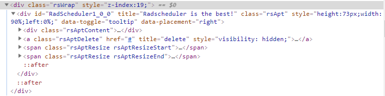

### HOW TO

Apply custom HTML attributes to the HTML element generated by the appointment.    



### SOLUTION

Using "title" as a key for the Attributes collection of the appointment is not allowed and in order to manipulate the "title" attribute of the rendered appointment, you should set the .ToolTip property.

For the other attributes, you can use the following JavaScript executed in the [Sys.Application.Load](https://msdn.microsoft.com/en-us/library/bb383829.aspx) event.

````ASP.NET
<%-- https://docs.telerik.com --%>
<telerik:RadCodeBlock runat="server">
    <script>
        function pageLoadHandler() {
            var scheduler = $find("<%= RadScheduler1.ClientID %>");
            scheduler.get_appointments().forEach(function (apt) {
                var attributes = apt.get_attributes();
                attributes.forEach(function (key, value) {
                    apt.get_element().setAttribute(key, value);
                });
            })
            // Sys.Application.remove_load(pageLoadHandler); 
        }
        Sys.Application.add_load(pageLoadHandler);
    </script>
</telerik:RadCodeBlock>

<telerik:RadScheduler RenderMode="Lightweight" Font-Size="14px" SelectedDate="2018-11-21" runat="server" ID="RadScheduler1"
    OnAppointmentDataBound="RadScheduler1_AppointmentDataBound">
</telerik:RadScheduler>
````

````C#
protected void Page_Init(object sender, EventArgs e)
{     
    RadScheduler1.Provider = new Telerik.Web.UI.XmlSchedulerProvider(Server.MapPath("~/App_Data/Appointments.xml"), true);
}
 
protected void RadScheduler1_AppointmentDataBound(object sender, SchedulerEventArgs e)
{
    e.Appointment.Attributes.Add("data-toggle", "tooltip");
    e.Appointment.Attributes.Add("data-placement", "right");
    e.Appointment.ToolTip = "Radscheduler is the best!";
}
````

````XML
<?xml version="1.0" encoding="utf-8"?>
<Appointments>
  <NextID>2</NextID>
  <Appointment>
    <ID>1</ID>
    <Subject>Breakfast</Subject>
    <Start>2018-11-21T08:30Z</Start>
    <End>2018-11-21T10:00Z</End>
  </Appointment> 
</Appointments>
````

### See Also

* [Executing JavaScript Code from Server-side in Web Forms and ASP.NET AJAX]()
 