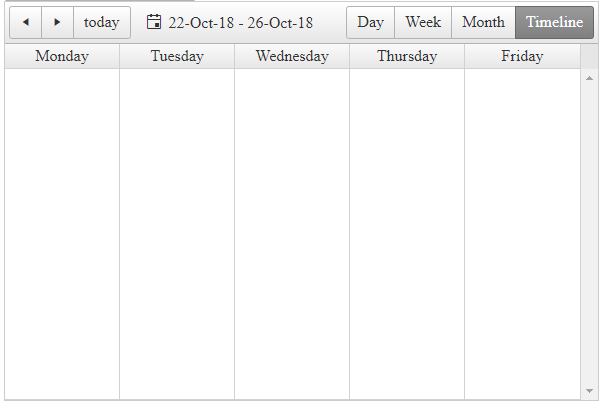

## How-to

Configure Timeline View of RadScheduler to behave and appear as WeekView.

## Description

By configuring the TimelineView to look as the WeekView, you can use it as a table with tasks for various days, without the hour rows of the WeekView.



## Solution

The solution is to set the NumberOfTimeslots for the TimelineView to 5, the duration of the timeslot to be the default 1 day and configure the following SelectedDate logic in the PreRender event:

````ASPX
<telerik:RadScheduler RenderMode="Lightweight" runat="server" ID="RadScheduler1"
    SelectedView="TimelineView">
    <TimelineView NumberOfSlots="5" ColumnHeaderDateFormat="dddd" />
</telerik:RadScheduler>
````

````C#
protected void Page_Init(object sender, EventArgs e)
{
    RadScheduler1.Provider = new Telerik.Web.UI.XmlSchedulerProvider(Server.MapPath("~/App_Data/Appointments.xml"), true); ;
}

protected void Page_PreRender(object sender, EventArgs e)
{
    var selectedDate = RadScheduler1.SelectedDate;
    if (selectedDate.DayOfWeek != DayOfWeek.Monday)
    {
        if ((int)selectedDate.DayOfWeek > 5)
        {
            RadScheduler1.SelectedDate = selectedDate.AddDays(7 + 1 - (int)selectedDate.DayOfWeek);
        }
        else
        {
            RadScheduler1.SelectedDate = selectedDate.AddDays(1 - (int)selectedDate.DayOfWeek);
        }
    }
}
````

````Appointments.xml
<?xml version="1.0" encoding="utf-8"?>
<Appointments>
  <NextID>1</NextID>
  <Resources>
    <Room>
      <Key>1</Key>
      <Text>Meeting room 101</Text>
    </Room>
    <Room>
      <Key>2</Key>
      <Text>Meeting room 201</Text>
    </Room>
    <User>
      <Key>1</Key>
      <Text>Alex</Text>
    </User>
    <User>
      <Key>2</Key>
      <Text>Bob</Text>
    </User>
    <User>
      <Key>3</Key>
      <Text>Charlie</Text>
    </User>
  </Resources> 
</Appointments>
````

 