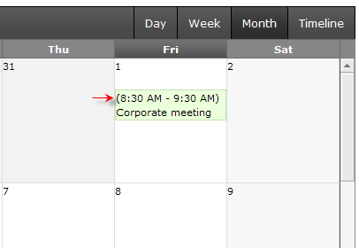
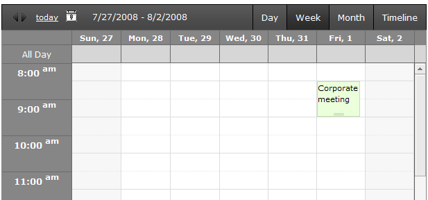

## HOW-TO  
   
 Create and add a RadScheduler apopintment template dynamically and acess the appoitment object in the template class
   
## DESCRIPTION 
   
 This KB article shows how to display the time of the appointments in MonthView, while in all other views only the Subject text is displayed. Also, the appointment object is accessed in the template class and its AllowEdit property is set to false.   
   
 **Month View**  
   
   
 **Week View**

   
   
## SOLUTION  
   
Define the appointment template in **aspx** like this:  
 
````ASPX
<AppointmentTemplate> 
    (<asp:Literal ID="AppointmentStartTime" runat="server" Text='<%# Eval("Start", "{0:t}") %>'></asp:Literal> 
    -  
    <asp:Literal ID="AppoitmentEndTime" runat="server" Text='<%# Eval("End", "{0:t}") %>'></asp:Literal>)  
    <asp:Literal ID="AppointmentSubject" runat="server" Text='<%# Eval("Subject") %>'></asp:Literal> 
</AppointmentTemplate>
````
  
 
   
 In **code-behind**, create a template class to show just the Subject and use the **NavigationComplete** event to set RadScheduler's AppointmentTemplate for views other than MonthView:  
 
````C#

public class AppTemplate : ITemplate  
{  
    public void InstantiateIn(Control container)  
    {  
        Literal subject = new Literal();  
        subject.DataBinding += subject_DataBinding;  
        container.Controls.Add(subject);  
    }  
 
    private void subject_DataBinding(object sender, EventArgs e)  
    {  
        Literal subject = (Literal)sender;  
        IDataItemContainer aptContainer = (IDataItemContainer)subject.BindingContainer;  
 
        //Access the appointment object and set its AllowEdit property:  
        SchedulerAppointmentContainer aptCont = (SchedulerAppointmentContainer)subject.Parent;  
        Appointment app = aptCont.Appointment;  
        app.AllowEdit = false;  
 
        string strSubject = HttpUtility.HtmlEncode((string)DataBinder.Eval(aptContainer.DataItem, "Subject"));  
        subject.Text = strSubject;  
    }  
}  
protected void RadScheduler1_NavigationComplete(object sender, Telerik.Web.UI.SchedulerNavigationCompleteEventArgs e)  
{  
    if (e.Command != SchedulerNavigationCommand.SwitchToMonthView)  
    {  
        RadScheduler1.AppointmentTemplate = new AppTemplate();  
    }  
} 
````
  
 
   
 This way the appointment template set in aspx will be overriden from code-behind.   
   
 Attached is a [demo project](files/scheduler-dynamic-templates.zip).   
   
      