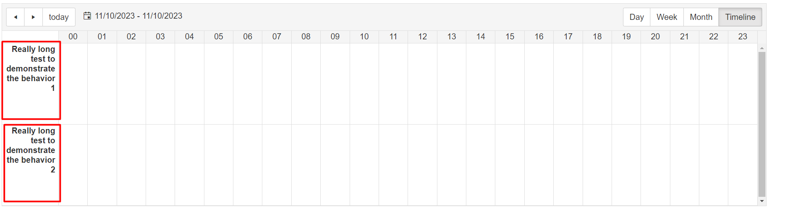

## Description

Display the RadScheduler header text in multiple lines by wrapping the text using the white-space CSS property. 



## Solution

The solution is to allow text wrap inside the  `.rsMainHeader` class:

````CSS
<style>
    html body .rsMainHeader {
        white-space: normal; /* Allow text to wrap */
    }
</style>
````

Additional resources: 

- [overflow-wrap](https://developer.mozilla.org/en-US/docs/Web/CSS/overflow-wrap)
- [word-break](https://developer.mozilla.org/en-US/docs/Web/CSS/word-break)
- [hyphens](https://developer.mozilla.org/en-US/docs/Web/CSS/hyphens)

  