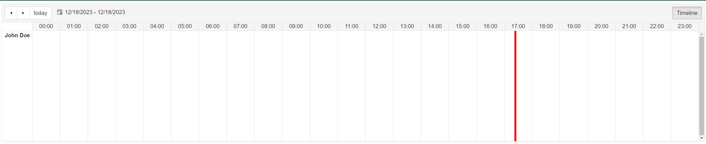

## ENVIRONMENT

<table>
    <tr>
        <td>Product</td>
        <td>Telerik WebForms Scheduler for ASP.NET AJAX</td>
    </tr>
</table>

## DESCRIPTION

Using JavaScript to display an indicator at the current time when the Scheduler is configured to represent a 24 hours Timeline view.

 

## SOLUTION  

First, configure the Scheduler to have 24 time slots in the Timeline view:

- Set the **NumberOfSlots** property to **24**.
- Set the **ColumnHeaderDateFormat** property to **HH:mm** and the **SlotDuration** to **01:00:00**

Example 

````ASPX
<telerik:RadScheduler runat="server" ID="RadScheduler1" GroupBy="Speaker" GroupingDirection="Vertical" DataSourceID="EventsDataSource"  
    DataKeyField="ID" DataSubjectField="Description" DataStartField="StartDate" DataEndField="EndDate" DataRecurrenceField="RecurrenceRule"
    DataRecurrenceParentKeyField="RecurrenceParentID" OnResourceHeaderCreated="RadScheduler1_ResourceHeaderCreated">
    <TimelineView ColumnHeaderDateFormat="HH:mm" SlotDuration="01:00:00" NumberOfSlots="24" EnableExactTimeRendering="true" />
    <ResourceTypes>
        <telerik:ResourceType KeyField="SpeakerID" Name="Speaker" TextField="FullName" ForeignKeyField="SpeakerID"
            DataSourceID="SpeakersDataSource"></telerik:ResourceType>
    </ResourceTypes>
    <TimeSlotContextMenuSettings EnableDefault="true"></TimeSlotContextMenuSettings>
    <AppointmentContextMenuSettings EnableDefault="true"></AppointmentContextMenuSettings>
</telerik:RadScheduler>
````

Create an event listener using the [Sys.Application.load Event](https://learn.microsoft.com/en-us/previous-versions/bb383829(v=vs.100)?redirectedfrom=MSDN) and run the following JS code in the event handler, which creates a vertical line at the current time.

Example

````JS
function markCurrentTime() {
    var scheduler = $find("<%= RadScheduler1.ClientID %>"); // Find your RadScheduler control
    var schedulerTable = $(scheduler.get_element()).find('.rsAllDayTable'); // Find the scheduler table
    var schedulerOffset = schedulerTable.offset().left; // Get the offset of the scheduler table
    var schedulerWidth = schedulerTable.width(); // Get the width of the scheduler table

    var currentTime = new Date(); // Get the current time

    var minutesSinceStartOfDay = currentTime.getHours() * 60 + currentTime.getMinutes(); // Calculate the position of the current time within the scheduler
    var pixelsPerMinute = schedulerWidth / (24 * 60); // Assuming your scheduler shows a full 24-hour day
    var currentPosition = minutesSinceStartOfDay * pixelsPerMinute;

    $(".current-time-indicator").remove(); // Remove the class so that it doesn't create multiple instances of lines 

    var schedulerDate = scheduler.get_selectedDate(); // Get the selected date

    var verticalHeader = $(".rsVerticalHeaderWrapper")[0].getBoundingClientRect() // Get the information about the size of the element
    var width = verticalHeader.width; // Get the width of the Resource Header

    if (schedulerDate.getDate() === currentTime.getDate() &&
        schedulerDate.getMonth() === currentTime.getMonth() &&
        schedulerDate.getFullYear() === currentTime.getFullYear()) { // Check to see if it's for today's date
        var $currentTimeIndicator = $('<div></div>') // Create the vertical line element
            .addClass('current-time-indicator')
            .css({
                'position': 'absolute',
                'top': 0,
                'left': schedulerOffset + currentPosition - width, // Subtract the widthn of the vertical header
                'height': schedulerTable.height(),
                'width': '5px',
                'background-color': 'red'
            });

        schedulerTable.append($currentTimeIndicator); // Append the line to the scheduler
        setTimeout(markCurrentTime, 60000);
    }
}
    Sys.Application.add_load(markCurrentTime); // Call the function on  when the page is fully loaded
````

  